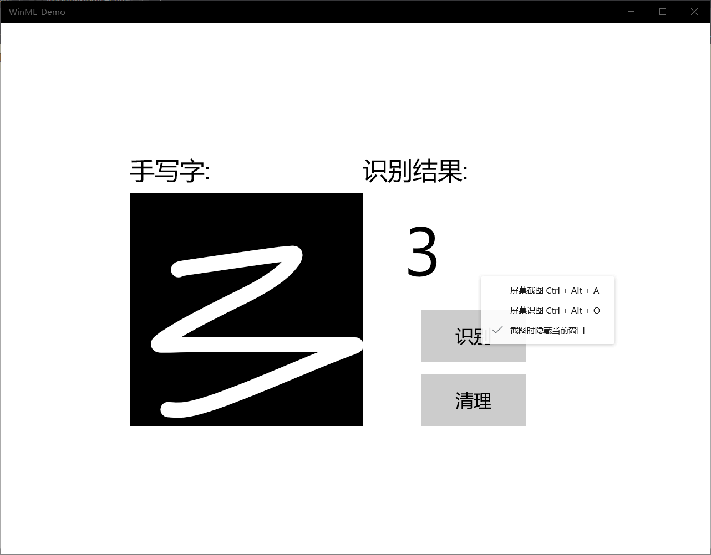
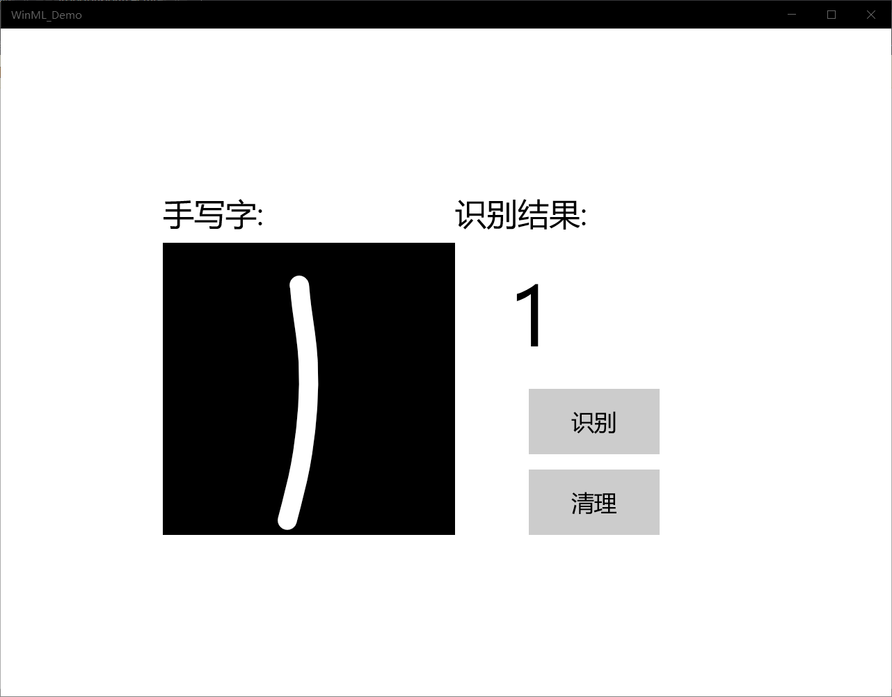
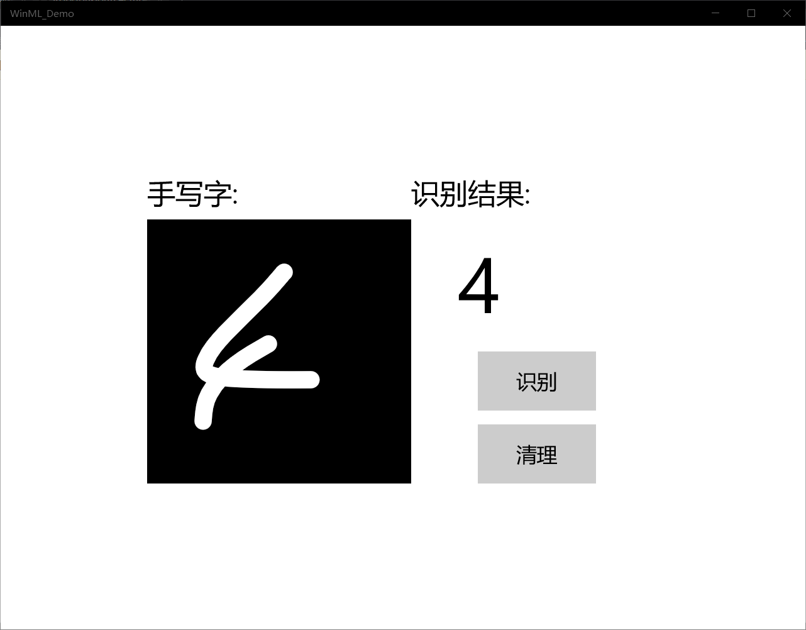
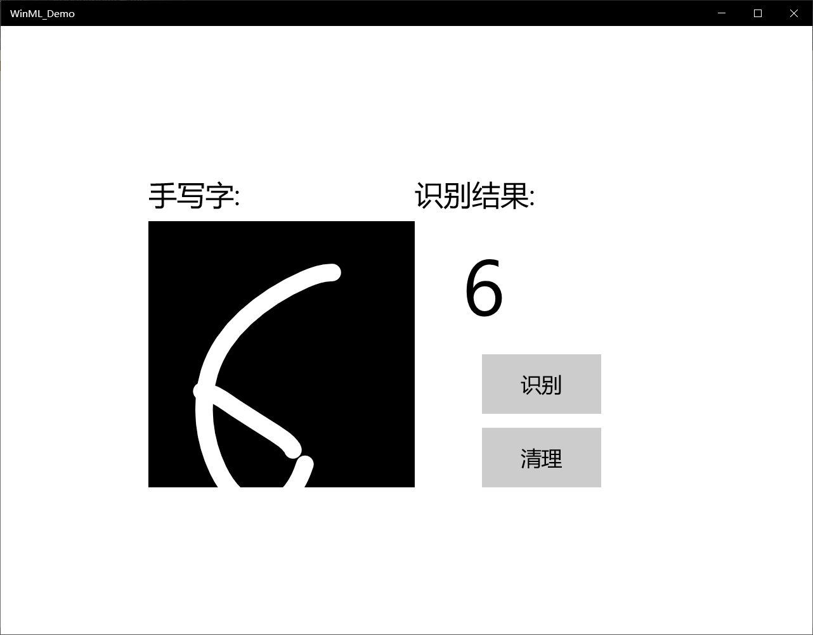

# 一 基于mnist模型的手写数字识别应用开发案例

   步骤一：获取手写的数字

1、选择文件->新建->项目。

在弹出的窗口里选择Visual C#->Windows窗体应用。

2、设计窗口，此部分可以用代码实现

3、添加模型

右键单击解决方案资源管理器中的Assets文件夹，然后选择“ 

添加” >“ 现有项”。将文件选择器指向ONNX模型的位置，然后

单击添加。

该项目现在应该有两个新文件： mnist.onnx-训练的模型，

mnist.cs -Windows ML生成的代码。

* 导入 mnist数据集

    mnist数据集里面包含各种手写数字图片 

    利用TensorFlow代码下载mnist数据集

    通过TensorFlow所提供的库mnist ，进行下载minst数据集：

* mnst数据集的组成

在MNIST训练数据集中，mnist.train.images是一个形状为

[55000，784]的张量。其中，第1个维度数字用来索引图片，

第2个维度数字用来索引每张图片中的像素点。此张量里的每一

个元素，都表示某张图片里的某个像素的强度值，值介于

0～255之间。

运行结果

# 二、基于ONNX Runtime的手写数字推理识别
1、界面设计
创建Windows窗体应用(.NET Framework)项目，这里给项目起名Mnistwf。
在解决方案资源管理器中找到Form1.cs，双击，打开界面设计器。从工具箱中向Form中依次拖入控件并调整

控件依次是：

- Label控件，将内容改为“ 手写字：”
- pictureBox 写字的面板。
- TextBox控件，为空。
- Button控件，将内容改为“清理”。  
   2、添加模型文件到项目中

  打开解决方案资源管理器中，在项目上点右键->添加->现有项，在弹出的对话框中，将文件类型过滤器改为所有文件，然后导航到模型所在目录，选择模型文件并添加，使用的模型文件是mnist.onnx。
  模型是在应用运行期间加载的，所以在编译时需要将模型复制到运行目录下。在模型文件上点右键，属性，然后在属性面板上，将生成操作属性改为内容，将复制到输出目录属性改为如果较新则复制。  
 3、添加OnnxRuntime库

  微软开源的OnnxRuntime库提供了NuGet包，可以很方便的集成到Visual Studio项目中。
打开解决方案资源管理器，在引用上点右键，管理NuGet程序包。
在打开的NuGet包管理器中，切换到浏览选项卡，搜索onnxruntime，找到Microsoft.ML.OnnxRuntime包，当前版本是0.5.1，点击安装，稍等片刻，按提示即可完成安装。
当前NuGet发布的OnnxRuntime库支持x64及x86架构的运行库，建议使用x64的，所以这里将项目的目标架构改为x64。
在解决方案上点右键，选择配置管理器。在配置管理器对话框中，将活动解决方案平台切换为x64。如果没有x64，在下拉框中选择新建，按提示新建x64平台。  

# 总结  
上次是用onnxruntime库来进行看图识熊，此次是手写字的识别，从原理上有些许相同，都是利用一个封装的库来存储模型，通过和这个库对比来识别，此外还有一个基于mnist模型的手写数字识别应用，我遇到了和上次一样的问题，不能自己生成cs文件，最后我自己添加了这个文件。windows ml需要我们训练学习，才能更加准确的识别数字。在调试代码的时候也遇到了一些错误，我觉得我的代码能力有待提高。
 
通过此次学习我知道了很多关于ai的解决方案是具有某些共通性的，学习其中一个可以从中学到另外一个的知识，同时对于ai的学习我还算不上入门，以后案例要更加的学会去理解运用。对于学过的知识要及时总结，温故知新，多加练习。