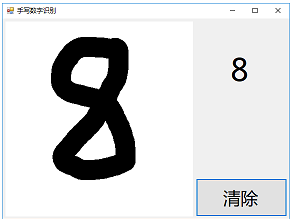
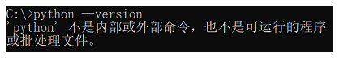
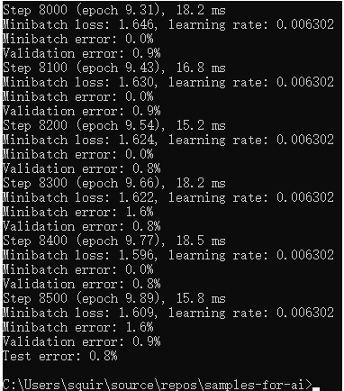
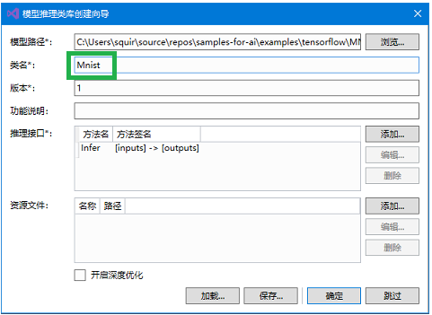
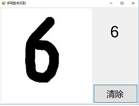
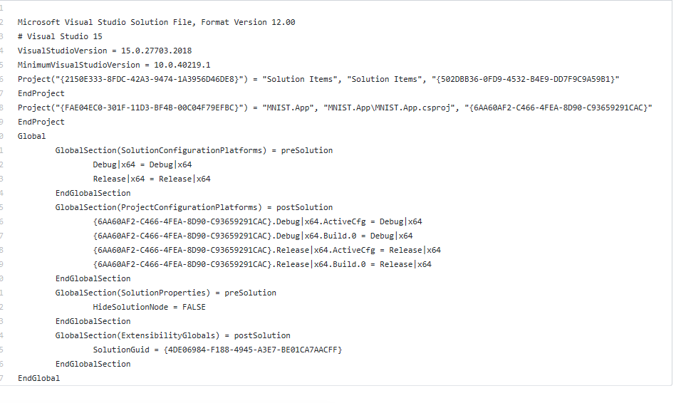

## 使用Visual Studio Tools for AI加速桌面智能应用开发
## 主要知识点
典型的AI应用的代码结构和功能，如处理输入；

使用Visual Studio Tools for AI进行TensorFlow模型到.Net Framework应用环境的快速集成。
## 简介
本文将介绍一例“手写数字识别应用”的开发过程。本文将通过这一入门级案例展示人工智能应用开发中的典型元素，如准备人工智能应用开发所需的软件环境，使用Visual Studio Tools for AI快速集成模型、加速人工智能应用开发，以及在代码中处理用户输入，以便人工智能模型能正确地接受输入的数据等等。本文将对这些工作和该应用的主要代码逻辑进行分析、讲解。此外，本文还将解答手写数字识别应用开发的一些常见问题，并介绍现实场景中的一些可能需求。开发将基于桌面.Net Framework环境和训练好的MNIST手写数字分类模型完成。
## 目标应用介绍
## 背景
在移动硬件得到高度发展的今天，手写输入已经成为了一种非常常见的输入方式。然而手写输入和传统的鼠标、键盘输入方式有很大的不同，相对于传统输入方式生产的数据，手写输入的内容——也即数据——在很多场景下都不是计算机能直接处理的。
传统的输入方式里，鼠标的点击可以对应到屏幕上精确的一点，进而对应到某一特定的UI控件；键盘的敲击可以产生一个特定的字符数据。这些都是计算机可以很容易处理的。而通过手写输入，计算机得到的只是一块具有“特别的形状”的图形，但这图形中蕴含着的用户真正的意图，计算机却不能识别。而这些蕴含其中的意图，才是很多应用场景的核心价值所在。比如用户希望设备上的手写输入法，可以将手写的字转换成传统的字符数据；笔记应用应能识别用户手写的笔记，并进行索引以便查询或计算一些数学表达式的结果……然而我们都有所了解，用传统的技术手段，很难高质量地达成这一识别任务。
不过近年来人工智能领域取得了很多令世人瞩目的成果，其中图像识别方面的很多成果，非常值得我们借鉴。那么这些人工智能领域的成果，能否助力我们广大应用开发者解决上述这些手写输入相关的难题呢？答案是肯定的。
本文将介绍一款“手写数字识别应用”的开发和其代码结构。这款应用通过借力MNIST数据集，具备了最基本的手写输入功能和图像识别功能，能将用户手写的0，1，2，…，9数字单个地识别出来。
# 该应用使用效果如图：

麻雀虽小，五脏俱全。这款入门级应用涵盖很多了人工智能应用开发中的典型问题。本文将以这些基本问题为出发点，为读者展开人工智能应用开发的画卷。
## 开发环境
本文采取.Net Framework桌面环境作为开发环境，基于WPF框架实现用户界面，并依赖TensorFlow和VS Tools for AI等组件来完成人工智能模型的创建和集成。
后文将介绍的开发中需要用到人工智能模型的训练环境，请确保已经按照【引用：课程1 – 环境准备】中所述在本地机器上下载（Git的术语叫“克隆”）了微软AI样例库（即命令git clone https://github.com/Microsoft/samples-for-ai.git），并已成功安装了相关工具（即CUDA、cuDNN，若硬件允许）并成功运行了安装脚本（即installer\install.py）。
## 训练模型
## 模型介绍
之前下载的samples-for-ai样例库中包含了大量的机器学习训练和应用的示例，其中就有针对MNIST数据集的人工智能模型（下称MNIST模型）训练程序，这正是我们需要的。
MNIST数据集包含了大量单个手写数字的位图数据，包含各种手写风格，并且这些位图数据都已经被很好地标记过了。即每一张手写数字的位图都存在一个对应的数字，并且这个数字是可以以数据的形式被访问的。这极大地简化了我们的准备工作。
MNIST数据集为本文中识别手写数字的问题提供了大量素材，利用这些素材我们可以训练出专门用于识别单个手写数字的人工智能模型。
同时，我们选择使用TensorFlow来训练MNIST模型。TensorFlow是一款使用非常普遍、很有代表性的机器学习框架。
## 实际训练
打开“命令提示符”，再同cd命令进入samples-for-ai样例库中，TensorFlow示例集中的MNIST目录，如：
cd D:\Users\squir\source\repos\samples-for-ai\examples\tensorflow\MNIST
小提示
如果最初下载（即克隆）samples-for-ai的磁盘并非C盘（命令提示符默认的初始磁盘），如D盘，那么执行完cd命令后还需再执行D:命令将当前命令行切换到其他磁盘。
此时可以通过 python –-version 命令检查一下我们在命令行下能否访问到Python。
# 如果出现下图的情况：

则还需要执行下面的命令，将通过Visual Studio 2017 Installer安装的Python 3.6（也就是【课程1】中执行 install.py 脚本的Python）所在的目录加入 PATH 环境变量，以便我们接下来能正确执行Python：
set PATH=C:\Program Files (x86)\Microsoft Visual Studio\Shared\Python36_64;%PATH%
注意
此处的真正目的是将通过 install.py 脚本安装了机器学习工具的Python.exe引入命令行，而非引入任意的Python.exe。如果Python不是通过Visual Studio 2017 Installer安装的，或者执行 install.py 脚本的是别的环境下的Python.exe，那么上述 set PATH 命令将不适用，需要根据实际情况调整环境变量PATH。
然后我们执行下面的命令来启动MNIST模型的训练：
python mnist.py
运行过程中会打印出一些 error 字样。别担心，这都是AI训练过程中正常的错误率信息。随着训练过程的进行，模型在训练时的错误率会逐步下降，这表示 AI 模型推理预测出的结果越来越准确了。
# 模型训练的最终结果如下图：

训练结束后，我们可以在samples-for-ai样例库下的 examples\tensorflow\MNIST\export 文件夹内看到 saved_model.pb 文件和 variables 文件夹，它们即是我们训练出的MNIST模型。
# 小提示
如果用来训练的机器没有配备高性能的GPU，训练MNIST可能会花费很长时间。如上图所示，需要8500个Step才能完成训练，我们可以靠观察Step数量的增量来判断训练速度。如果训练速度很慢（特别是没有高性能GPU的情况下），我们可以先进行下一章节的学习。之后需要用到训练出的MNIST模型时，再确保训练完成即可。
## 应用的构建和理解
本文已经为读者准备好了该手写数字识别应用的主体代码，但仍需要完成对MNIST模型的集成工作，才算完成整个人工智能应用的开发。接下来本文将介绍模型的集成工作和对整个项目内的重点代码片段进行分析讲解。
## 完成应用
## 克隆代码
本文所需的主体代码就在这个仓库中，可以通过 git clone 当前仓库来获取代码。
# 注意
由于本教程使用的工具对中文路径的支持不好，请务必将 sample-mnist 文件夹复制到 没有中文字符的路径 下，再从那里打开解决方案。
成功获取代码后，可以双击打开本文件下的 sample-mnist\MnistDemo.sln 解决方案文件，以启动 Visual Studio 2017 并加载包含应用主体代码的解决方案。
## 引用模型
# 注意
这一步骤需要用到我们在实际训练章节中训练出的模型。如果尚未训练完成，请等待训练完成后再继续阅读。
1、首先创建模型项目。在解决方案资源管理器中，右击解决方案，指向添加，再点击新建项目.

2、在弹出的添加新项目的对话框里，选择 AI Tools 下的 Inference 后，在右边选择 模型推理类库(.NET Framework)。然后在下面的 名称 处改为 Model，并点击确定。
# 注意
名称（即“Model”）一定要保持一致（包括大小写），这是生成代码的命名空间。已有的代码会按照预设的名称来访问模型相关的代码。

3、点击确定后，Visual Studio 会提示正在 检查环境。完成后会显示创建向导对话框。红色的框先不用担心，点击 浏览。

4、找到之前训练出的 saved_model.pb 文件（一般在samples-for-ai样例库下的 examples\tensorflow\MNIST\export 文件夹内），并点击 打开。

5、点击打开后，会出现 分析模型 的过程，等待分析完成。分析完成后，再如图所示在类名中输入 Mnist，最后点击 确定。第一次导入模型会下载所依赖的库，因此，正在创建项目"Model"... 的对话框会显示较长时间。

# 注意
类名（即“Mnist”）一定要保持一致（包括大小写），这是生成的模型访问类的类名。已有的代码会按照预设的名称来访问模型相关的代码。
# 小提示
分析模型 会调用 TensorFlow 来分析模型文件的输入输出等信息，以便生成相应的代码，有时会花一两分钟。

创建项目完成后，先检查一下是不是如图中高亮区域1所示产生了 Model 项目，并且里面有 packages.config 文件（高亮区域1）。如果没有看到此文件，通常是由于网速过慢，下载超时造成的。请参考5.2创建模型项目时出现错误。
推理类库创建成功后，我们还需要调整一个依赖项的版本，否则会出现不兼容的错误。要调整依赖项版本，请在解决方案管理器中，于 Model 项目下的 引用 上右键，选择 管理NuGet包，
然后在弹出的NuGet包管理页面里，找到 Microsoft.ML.Scoring 项（已经被自动安装了，我们需要将它换成其他版本。)选择 1.0.3 版本并安装。之后等待安装完备。这样就设置好可以运行本教程的软件环境了。
完成NuGet包的版本替换之后，我们需要在主体界面的项目上，引用我们的模型推理类库。
在解决方案资源管理器中，右击 MNIST.App 项目的 引用，并点击 添加引用。

7、在弹出的对话框中，点击 项目，并在右侧将 Model 勾上。这样就能在窗体项目MNIST.App中引用 Model 项目中用于访问MNIST模型的代码了。

8、现在按下 CTRL+F5，或者点击工具栏上的 启动 按钮。之后便会如下图一样，我们的手写数字识别应用运行起来了！

# 代码展示

https://github.com/microsoft/ai-edu/blob/master/B-%E6%95%99%E5%AD%A6%E6%A1%88%E4%BE%8B%E4%B8%8E%E5%AE%9E%E8%B7%B5/B7-%E8%87%AA%E6%9E%84%E5%BB%BA%EF%BC%8D%E5%9B%BE%E5%83%8F%E8%AF%86%E5%88%AB%E5%BA%94%E7%94%A8%E6%A1%88%E4%BE%8B-%E6%89%8B%E5%86%99%E6%95%B0%E5%AD%97%E8%AF%86%E5%88%AB/%E5%BE%AE%E8%BD%AF-%E6%96%B9%E6%A1%881/sample-mnist/.gitignore

https://github.com/microsoft/ai-edu/tree/master/B-%E6%95%99%E5%AD%A6%E6%A1%88%E4%BE%8B%E4%B8%8E%E5%AE%9E%E8%B7%B5/B7-%E8%87%AA%E6%9E%84%E5%BB%BA%EF%BC%8D%E5%9B%BE%E5%83%8F%E8%AF%86%E5%88%AB%E5%BA%94%E7%94%A8%E6%A1%88%E4%BE%8B-%E6%89%8B%E5%86%99%E6%95%B0%E5%AD%97%E8%AF%86%E5%88%AB/%E5%BE%AE%E8%BD%AF-%E6%96%B9%E6%A1%881/sample-mnist/MNIST.App