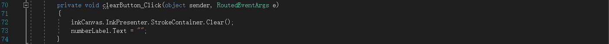

# **MNIST 手写字**
>## **实验内容**
>>## 对环境的要求
>>这一步需注意，和同学刚开始一直不能运行就是组件工具的欠缺。
>>- Windows 10（版本1809或更高版本）
>>- Windows 10 SDK（内部版本17763或更高版本）
>>- Visual Studio 2019（或Visual Studio 2017 15.7.4版或更高版本）
>>- 适用于Visual Studio 2019或2017的 Windows Machine Learning Code Generator扩展
>>- 一些基本的UWP和C＃知识
>>## 对应用窗口的设计
>>
>>## 对事件响应识别数字
>>
>>## 应用重置清除内容
>>
>>## 练习结果
>>
>>
># **小结**
>在做看图识熊的时候老师为我们做过数字识别的展示，这算是对看图识熊的一个拓展，其实验步骤过程也是设计界面和对代码的熟悉，其中mnist。onnx为识别数字的库，其中有识别手写数字的算法。这次实验的代码中新加入两个重要的方法“recognizeButton_Click”它是将我们手写的数字跟模型反复对照得出相似概率最多得一个数字；“InkCanvas”则是将已经写出的内容及识别结果清除掉，使得其重置，使用户可以重新写想要的数字进行识别。
