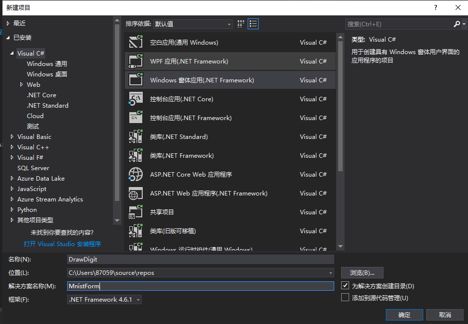
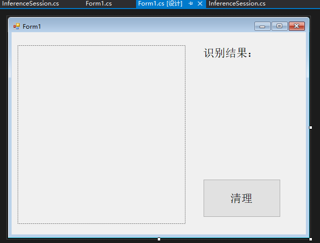
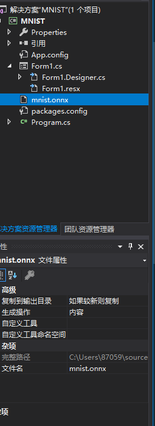
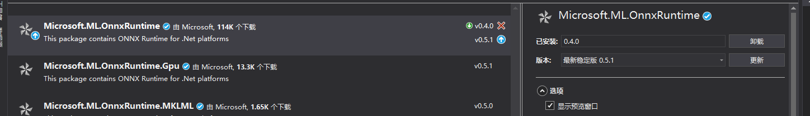
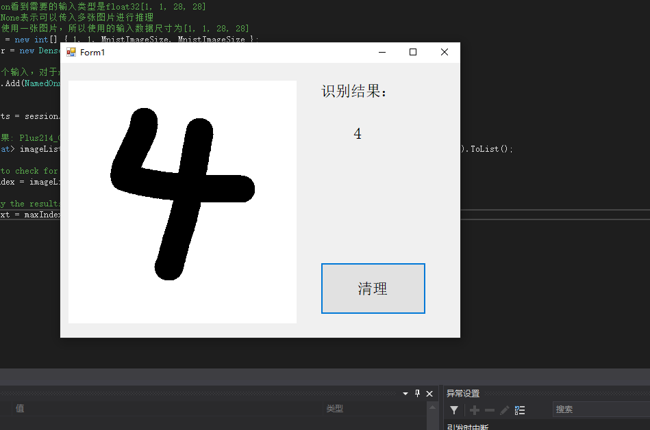
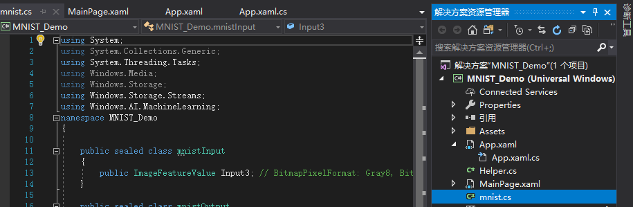
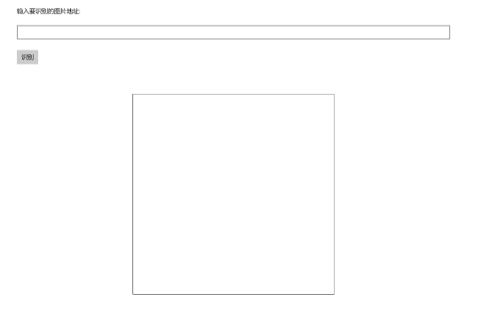
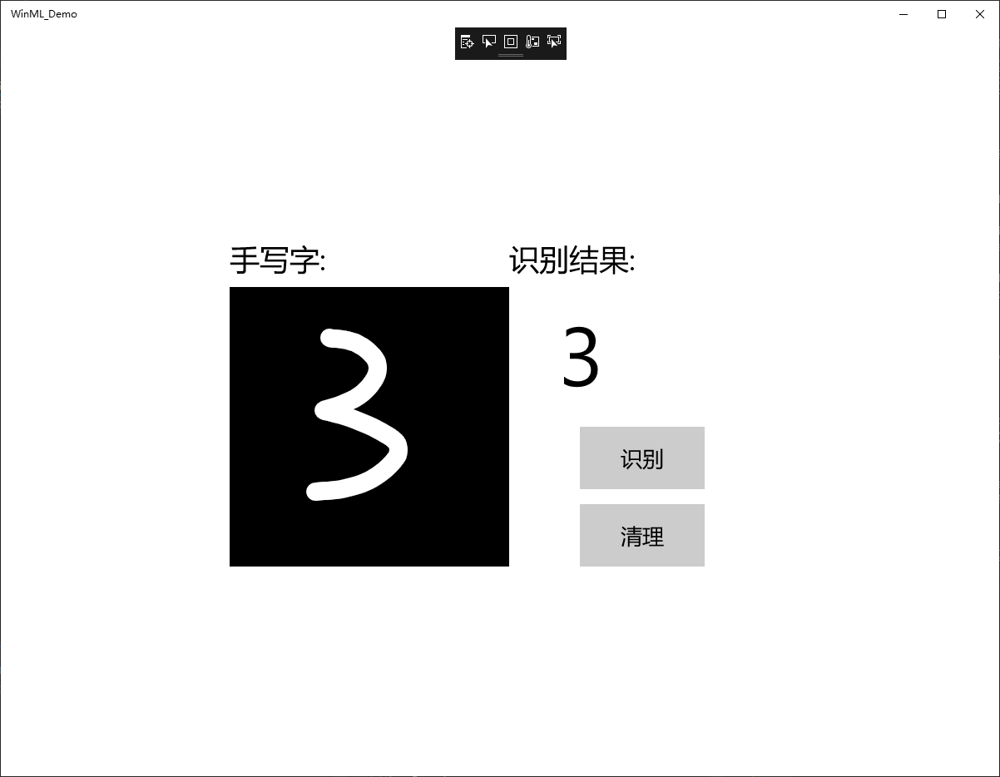

# **第六次课堂总结**
> ## 基于ONNX Runtime的手写数字推理识别
## **简介**
* 实现简单的界面，将用户用鼠标或者触屏的输入变成图片。  
* 将生成的模型包装起来，添加onnx模型文件  
* 输入的图片进行规范化，成为模型文件能够识别的  
* 最后通过模型来得出图片应该是哪个数字，并显示出来  
## 步骤一：获取手写的数字
首先新建项目，**Visual C#->Windows**窗体应用，项目名**DrawDigit**，解决方案名称不妨叫做**MnistForm**


## 步骤二：处理平台兼容问题
* 在**DrawDigit**项目上点击右键，选择属性，在生成一栏将平台目标从**Any CPU**改为**x64**。
* 否则，**DrawDigit**（首选32位）与它引用的**MnistForm**（64位）的编译平台不一致会引发**System.BadImageFormatException**的异常。
* 在设计图左边的工具箱中添加需要的组件，**label**（标签），**button**（按钮），**picturebox**（识别手写数字的区域）
修改属性得到想要的效果即可


## 步骤三：添加模型文件到项目中
* 打开解决方案资源管理器中，在项目上点**右键->添加->现有项**，在弹出的对话框中，将文件类型过滤器改为所有文件，然后导航到模型所在目录，选择模型文件并添加。本示例中使用的模型文件是**mnist.onnx**
* 在模型文件上点右键，属性，然后在属性面板上，将生成操作属性改为内容，将复制到输出目录属性改为如果较新则复制


## 步骤四：添加OnnxRuntime库
打开解决方案资源管理器，在引用上点右键，管理**NuGet**程序包。
在打开的NuGet包管理器中，切换到浏览选项卡，搜索**onnxruntime**，找到**Microsoft.ML.OnnxRuntime**包，当前版本是**0.4.0**，点击安装，稍等片刻，按提示即可完成安装，结果如图


## 步骤五：处理输入并加载模型进行推理
右键Form1.csD打开代码页面，写入基础代码

> container.Add(NamedOnnxValue.CreateFromTensor<float>("Input3", tensor));  
 //推理
      var results = session.Run(container);
//输出结果: Plus214_Output_0
   IList<float> imageList = results.FirstOrDefault(item => item.Name == "Plus214_Output_0").AsTensor<float>().ToList();


对于此处的的输入和输出，给出NETRON的模型图，从图中可以很清楚的看出输入与输出的显示


## 步骤六：测试


> ## 基于Windows-Machine-Learning的手写数字推理识别

## **简介**
* 在Windows ML平台下，开发人员能够将不同的AI平台导入现有的学习模型，并在安装了Windows10系统的PC设备上使用预先培训的ML模型，并利用CPU和GPU（AMD，Intel，NVIDIA、Qualcomm）硬件进行加速，而非云端。  
* 从而加快对本地图像及视频数据的实时分析，甚至是后台任务的改进。  
* 此外该技术支持ONNX格式的ML模型行业标准，开发者能够添加ONNX文件至UWP应用中，在并项目中生成模型界面

## **构建项目**
新建项目，**Visual C**分类中选择空白应用(通用 Windows)，填写项目名称为MNIST_DEMO
设置最低版本都为17763

## **添加模型文件到项目中**
* 打开解决方案资源管理器中，在项目中的**Assets**目录上点右键->添加->现有项，添加模型文件**MNIST_DEMO.onnx**中 
* 然后在属性面板上，将生成操作属性改为内容，将复制到输出目录属性改为如果较新则复制  
* 打开解决方案资源管理器，应该可以看到在项目根目录自动生成了和模型同名的代码文件**BearModel.cs**，里面就是对该模型的一层封装，包括了输入输出的定义、加载模型的方法以及推理的方法。


## **页面设计**

* 在Mainpage页面中，修改识别页面模板效果如图

* 输入框tbImageUrl中用来输入要识别的图片的URL
* 按钮tbRun用来触发加载图片
* 文本框tbBearType用来显示识别的结果
* 图片控件imgBear用来预览要识别的图片

## **加载模型**
```
  private async void RecognizeBear()
{
    // 加载模型
    StorageFile modelFile = await StorageFile.GetFileFromApplicationUriAsync(new Uri($"ms-appx:///Assets/BearModel.onnx"));
    BearModelModel model = await BearModelModel.CreateFromStreamAsync(modelFile);

    // 构建输入数据
    BearModelInput bearModelInput = await GetInputData();

    // 推理
    BearModelOutput output = await model.EvaluateAsync(bearModelInput);

    tbBearType.Text = output.classLabel.GetAsVectorView().ToList().FirstOrDefault();
}
```
通过onnx训练模型加载并输入数据进行分析，从而进行推理，将图形用output输出出来，效果如下


## **测试**


> ## 总结

通过这两节课对机器学习有了更深层次的了解，到目前为止能熟练掌握Tools for AI,onnxruntime,windows machine learning三种方法进行机器学习训练。在人工智能又又又迈出了一大步。同时对VS的调试也有了更深层次的了解，希望能在之后的额openmv以及汽车虚拟仿真中可以得到实际施展。