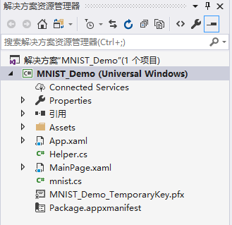
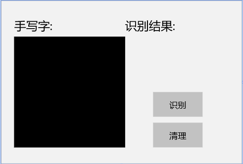
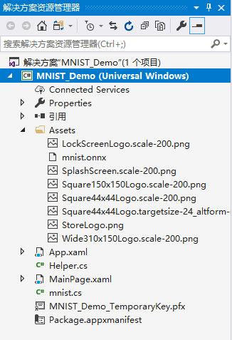
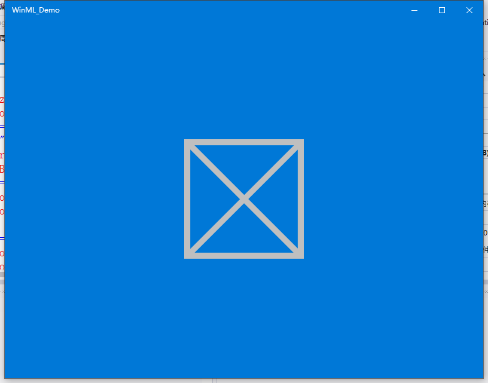
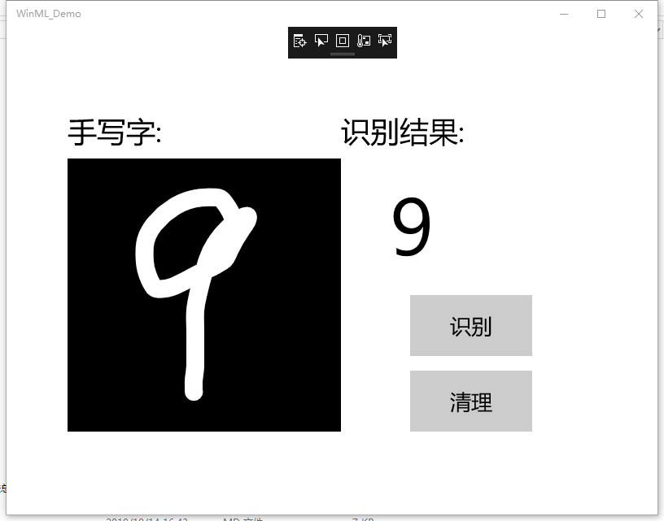
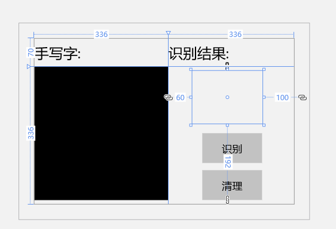

RobotVision
-----
# 第七次总结
## 第七次课题：手写数字识别的两种方式
### 一、MNIST手写数字

先决条件：

>+ Windows 10（版本1809或更高版本）

>+ Windows 10 SDK（内部版本17763或更高版本）

>+ Visual Studio 2019（或Visual Studio 2017 15.7.4版或更高版本）

>+ 适用于Visual Studio 2019或2017的 Windows Machine Learning Code Generator扩展

>+ 一些基本的UWP和C＃知识

## uwp简介：

UWP即Windows 10中的Universal Windows Platform简称。即Windows通用应用平台，在Windows 10 Mobile/Surface（Windows平板电脑）/PC/Xbox/HoloLens等平台上运行，uwp不同于传统pc上的exe应用，也跟只适用于手机端的app有本质区别。它并不是为某一个终端而设计，而是可以在所有windows10设备上运行。

## C#简介：

C#是微软公司发布的一种面向对象的、运行于.NET Framework和.NET Core(完全开源，跨平台)之上的高级程序设计语言。并定于在微软职业开发者论坛(PDC)上登台亮相。C#是微软公司研究员Anders Hejlsberg的最新成果。C#看起来与Java有着惊人的相似；它包括了诸如单一继承、接口、与Java几乎同样的语法和编译成中间代码再运行的过程。但是C#与Java有着明显的不同，它借鉴了Delphi的一个特点，与COM（组件对象模型）是直接集成的，而且它是微软公司 .NET windows网络框架的主角。

C#是一种安全的、稳定的、简单的、优雅的，由C和C++衍生出来的面向对象的编程语言。它在继承C和C++强大功能的同时去掉了一些它们的复杂特性（例如没有宏以及不允许多重继承）。C#综合了VB简单的可视化操作和C++的高运行效率，以其强大的操作能力、优雅的语法风格、创新的语言特性和便捷的面向组件编程的支持成为.NET开发的首选语言。

C#是面向对象的编程语言。它使得程序员可以快速地编写各种基于MICROSOFT .NET平台的应用程序，MICROSOFT .NET提供了一系列的工具和服务来最大程度地开发利用计算与通讯领域。

C#使得C++程序员可以高效的开发程序，且因可调用由 C/C++ 编写的本机原生函数，而绝不损失C/C++原有的强大的功能。因为这种继承关系，C#与C/C++具有极大的相似性，熟悉类似语言的开发者可以很快的转向C#。

1.首先我们采用微软提供的带有已实现的XAML控件和事件的模板，其中包括：

>+ InkCanvas绘制数字。 用于解释数字并清除画布的按钮。 帮助程序将InkCanvas输出转换为VideoFrame的例程。 在解决方案资源管理器内部，该项目具有三个主要代码文件：

>+ MainPage.xaml-我们所有的XAML代码都为InkCanvas，按钮和标签创建UI 。

>+ MainPage.xaml.cs-我们的应用程序代码所在的位置。

>+ Helper.cs-裁剪和转换图像格式的帮助程序例程。

2.构建并运行项目

    在Visual Studio工具栏中，将解决方案平台更改为x64，以我的设备为64位时在本地计算机上运行该项目。

    可以在Windows设置应用中检入：“ 系统”>“关于”>“设备规格”>“系统类型”。

    要运行项目，请单击工具栏上的“ 开始调试”按钮，或按F5键。该应用程序应该显示一个InkCanvas，用户可以在其中写一个数字，一个Recognize按钮来解释该数字，一个空标签字段，其中解释后的数字将以文本形式显示，以及一个Clear Digit按钮来清除InkCanvas。

3.添加模型

    右键单击解决方案资源管理器中的Assets文件夹，然后选择“ 添加” >“ 现有项”。将文件选择器指向ONNX模型的位置，然后单击添加。

    该项目现在应该有两个新文件：

    1.mnist.onnx-训练的模型。 
    
    2.mnist.cs -Windows ML生成的代码。

    为了确保在编译应用程序时能够构建模型，请右键单击mnist.onnx文件，然后选择Properties。对于Build Action，选择Content。

mnist.cs文件中新生成的代码，分为三类：

 >+ mnistModel创建机器学习模型表示，在系统默认设备上创建会话，将特定的输入和输出绑定到模型，并异步评估模型。

 >+ mnistInput初始化模型期望的输入类型。在这种情况下，输入需要一个ImageFeatureValue。 
 
 >+ mnistOutput初始化模型将输出的类型。在这种情况下，输出将是TensorFloat类型的名为Plus214_Output_0的列表。

 使用这些类在项目中加载，绑定和评估模型。

   
   
4.加载，绑定和评估模型

在自动生成的模型封装文件BearModel.cs中已经封装了加载模型的方法和推理的方法，直接调用就可以。

对于Windows ML应用程序，我们要遵循的模式是：“加载”>“绑定”>“求值”。

加载机器学习模型。 将输入和输出绑定到模型。 评估模型并查看结果。 我们将使用mnist.cs中生成的接口代码来加载，绑定和评估应用程序中的模型。

首先，在MainPage.xaml.cs中，我们实例化模型，输入和输出。将以下成员变量添加到**MainPage**类：

    private mnistModel ModelGen;
    private mnistInput ModelInput = new mnistInput();
    private mnistOutput ModelOutput;

然后，在LoadModelAsync中，我们将加载模型。我们使用任何模型的方法（也就是之前这个方法应该叫的MainPage的加载事件，在的OnNavigatedTo覆盖，或之前的任何地方recognizeButton_Click被调用）。该mnistModel类表示MNIST模式并创建系统默认设备上的会话。要加载模型，我们调用CreateFromStreamAsync方法，并传入ONNX文件作为参数。

    private async Task LoadModelAsync()
    {

        // Load a machine learning model

        StorageFile modelFile = await 
    
        StorageFile.GetFileFromApplicationUriAsync(new Uri($"ms-appx:///Assets/mnist.onnx"));
    
        ModelGen = await mnistModel.CreateFromStreamAsync(modelFile as IRandomAccessStreamReference);
    }

接下来，我们要将输入和输出绑定到模型。生成的代码还包括mnistInput和mnistOutput包装器类。所述mnistInput类表示该模型的预期输入，并且mnistOutput类表示该模型的预期的输出。

要初始化模型的输入对象，请调用mnistInput类构造函数，传入您的应用程序数据，并确保输入数据与模型期望的输入类型匹配。该mnistInput类期待一个ImageFeatureValue，所以我们使用一个辅助方法获取ImageFeatureValue为输入。

使用helper.cs中包含的帮助函数，复制InkCanvas的内容，将其转换为ImageFeatureValue类型，然后将其绑定到我们的模型。

    private async void recognizeButton_Click(object sender, RoutedEventArgs e)
    {
        // Bind model input with contents from InkCanvas
            
        VideoFrame vf = await helper.GetHandWrittenImage(inkGrid);

        ModelInput.Input3 = ImageFeatureValue.CreateFromVideoFrame(vf);
    }

对于输出，我们只需使用指定的输入调用EvaluateAsync。输入初始化后，调用模型的EvaluateAsync方法以根据输入数据评估模型。EvaluateAsync将您的输入和输出绑定到模型对象，并在输入上评估模型。

由于模型返回了输出张量，因此我们首先要将其转换为友好的数据类型，然后解析返回的列表以确定哪个数字具有最高的概率并显示该数字。

    private async void recognizeButton_Click(object sender, RoutedEventArgs e)
    {
        // Bind model input with contents from InkCanvas
        VideoFrame vf = await helper.GetHandWrittenImage(inkGrid);
        ModelInput.Input3 = ImageFeatureValue.CreateFromVideoFrame(vf);

        // Evaluate the model
        ModelOutput = await ModelGen.EvaluateAsync(ModelInput);

        // Convert output to datatype
        IReadOnlyList<float> vectorImage = ModelOutput.Plus214_Output_0.GetAsVectorView();
        IList<float> imageList = vectorImage.ToList();

        // Query to check for highest probability digit
        var maxIndex = imageList.IndexOf(imageList.Max());

        // Display the results
    numberLabel.Text = maxIndex.ToString();
    }

最后，要能清除InkCanvas，以允许用户绘制另一个数字

    private void clearButton_Click(object sender, RoutedEventArgs e)
    {
        inkCanvas.InkPresenter.StrokeContainer.Clear();
        numberLabel.Text = "";
    }

5.启动应用程序
构建并启动应用程序后（按F5键），我们将能够识别在InkCanvas上绘制的数字。

## **可以自行设计界面**：

先写xaml代码：类似于安卓界面的设计，添加哪些控件，则对应的自动生成相应的代码块，姑且将它称之为“块”。

然后对应需要添加对应功能的package，后台的代码。

比如：

using System.Windows.INK；

又比如：

using System.windows.Media;

补充说明：将Image和InkCanvas放到一个Grid里，并且将InkCanvas的长宽绑定到Image，这样Image和InkCanvas的位置就是对应的，方便后续在InkCanvas上提取Image的感兴趣区域；

InkCanvas里加了一个Label可以实现类似图片上添加文字说明的功能，要设置Label的IsHitTestVisible="False"，不然点击事件就没办法触发了。

参考博客：
<https://blog.csdn.net/u012366767/article/details/81265922>

### 二、采用OnnxWithRunTime来实现手写数字

先决条件：

确保已正确安装配置了Visual Studio 2017 和 C#开发环境

类似于**看图识熊**例程的方案，使用ONNX Runtime封装onnx

模型并推理。

### 优点：

1.可以自行设计功能并按照功能来设计界面模块

2.可以直接添加模型文件到项目中

3.ONNXRuntime库提供了NuGet包，便于集成

4.模型推理的过程并不复杂，相对友好

5.测试结果直观明了

## 总结

   实现手写数字识别现有三种方案，AI Tools、Onnx RunTime、MNIST三种方案。除了AI tools这种方案我未亲自尝试意外，其他两种方案均取得了不错的效果，达到了预期识别的目标，除了识别数字“9”比较困难，易识别出错以外，其余的都比较理想。其中ONNX方案更加友好，基于看图识熊案例，让我不陌生，上手更快。设计也更加简单。而MNIST需要有一些c#的开发基础，这样在设计的时候会更加有利一些。实际上两种方案各有千秋，都不算复杂。

   第一次接触AI 机器学习这块儿的知识。在这个知识付费的时代，每每想在现有知识上开拓一步，可能就需要付出大量的代价，或是经济层面、或是物质层面、或是精神层面的，亦或是宝贵的时间。知识也在不断地更新换代，在热潮退去留下的才是真爱。AI这几年非常hot，但真正支撑它持续发展的是数学、是算法、是对各种框架的不断扩充和更新。人有血液，有心跳。人工智能也是。现在的我，可能所学深浅，只能依着老师给出的现有的方案来实现它，来一窥门径。而越往后越需要自己去创新去发掘。
   
   希望能够把这份热情保留着，坚持下去。博观而约取，厚积而薄发。

  

