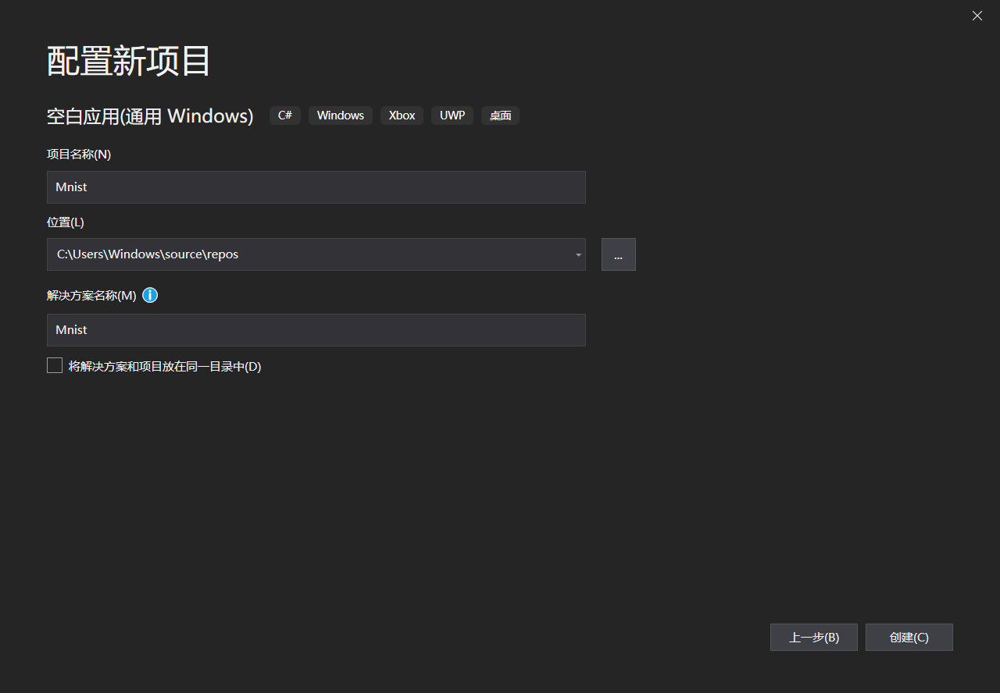
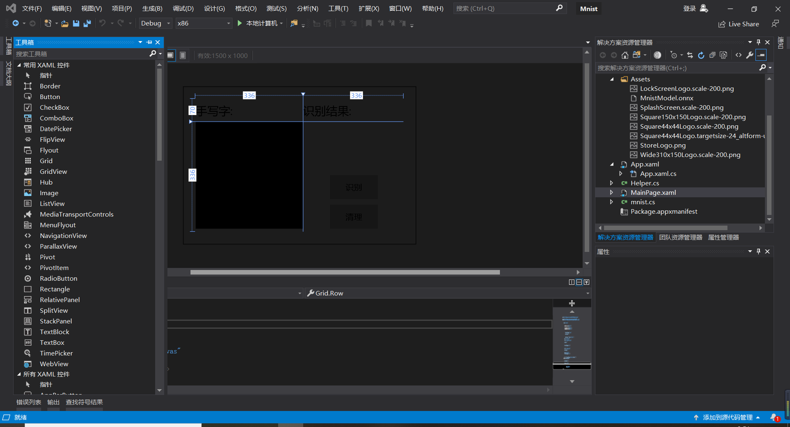
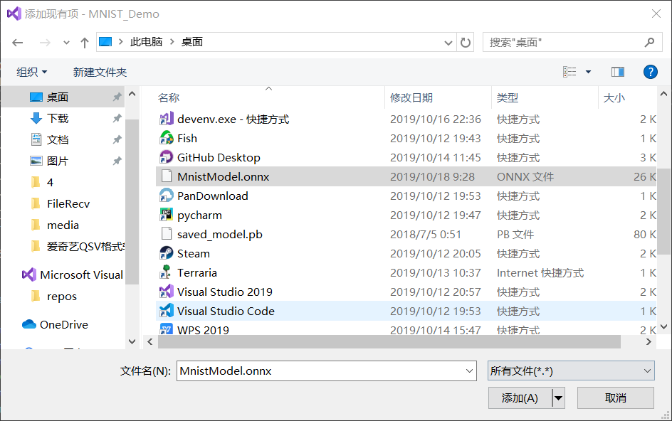
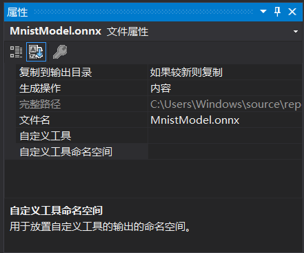
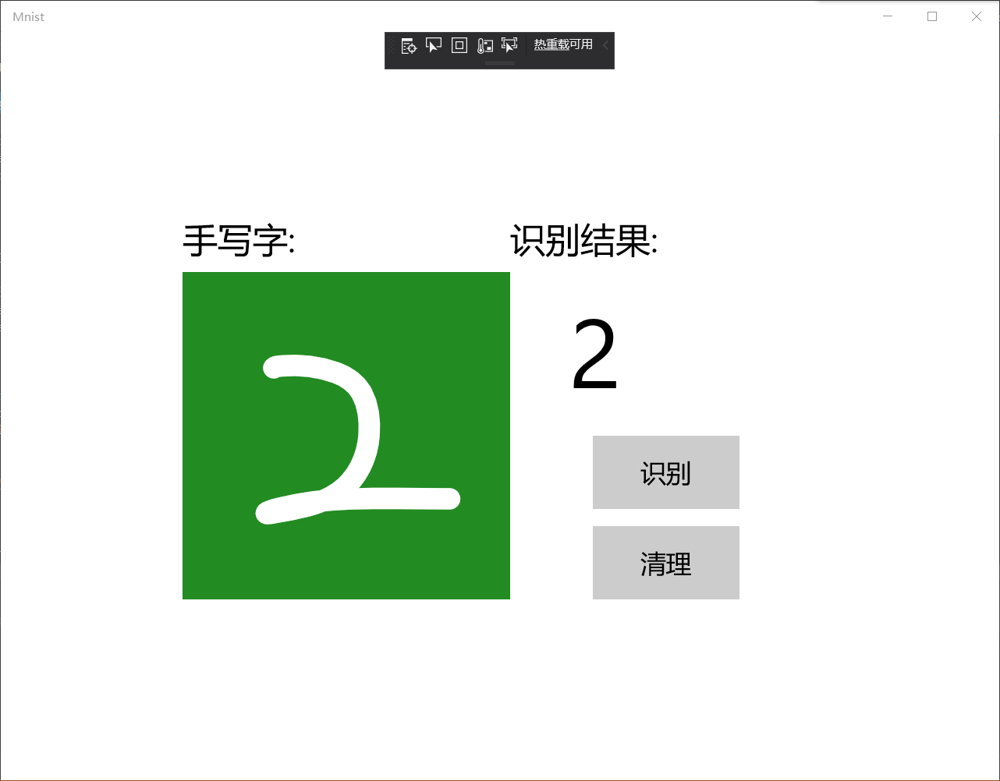
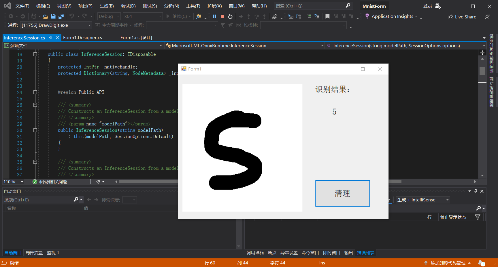
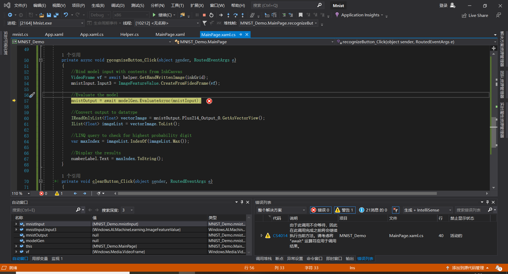
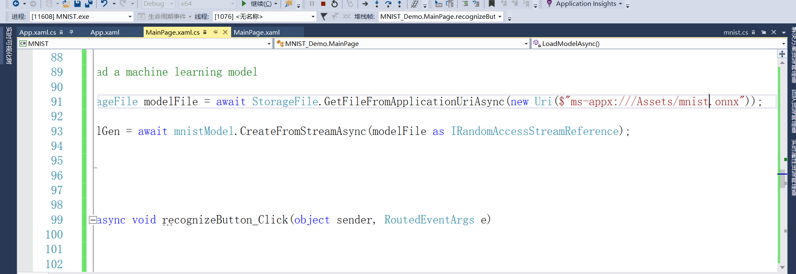

# 第六次课堂总结
&emsp;今天课上主要做了用WinML实现手写字识别及基于ONNX Runtime的手写数字推理识别，经过一段时间的调试成功运行了识别手写字程序,具体的操作步骤如下：
## 一.WinML
1. 下载模型
2. 新建空白应用
3. 设计XAML
4. 添加模型
5. 修改MnistModel属性
6. 加载，绑定和评估模型

在MainPage.xaml.cs中，我们实例化模型，输入和输出。

在LoadModelAsync中，我们将加载模型。我们使用任何模型的方法（也就是之前这个方法应该叫的MainPage的加载事件，在的OnNavigatedTo覆盖，或之前的任何地方recognizeButton_Click被调用）。该mnistModel类表示MNIST模式并创建系统默认设备上的会话。要加载模型，我们调用CreateFromStreamAsync方法，并传入ONNX文件作为参数。

接下来，我们要将输入和输出绑定到模型。生成的代码还包括mnistInput和mnistOutput包装器类。所述mnistInput类表示该模型的预期输入，并且mnistOutput类表示该模型的预期的输出。

要初始化模型的输入对象，请调用mnistInput类构造函数，传入您的应用程序数据，并确保输入数据与模型期望的输入类型匹配。该mnistInput类期待一个ImageFeatureValue，所以我们使用一个辅助方法获取ImageFeatureValue为输入。

使用helper.cs中包含的帮助函数，我们将复制InkCanvas的内容，将其转换为ImageFeatureValue类型，然后将其绑定到我们的模型。

对于输出，我们只需使用指定的输入调用EvaluateAsync。输入初始化后，调用模型的EvaluateAsync方法以根据输入数据评估模型。EvaluateAsync将您的输入和输出绑定到模型对象，并在输入上评估模型。

由于模型返回了输出张量，因此我们首先要将其转换为友好的数据类型，然后解析返回的列表以确定哪个数字具有最高的概率并显示该数字。

最后，我们要清除InkCanvas，以允许用户绘制另一个数字

7. 运行

## 二.ONNX Runtime
与之前识别熊的程序流程类似，在这里不做详细赘述，成功运行结果如下：

&emsp;心得体会:在之前的挑战中没有做出来，主要问题还是编程能力的不足，不是很了解C#的使用，看了老师给出的代码后，知道了之前出问题的地方，在调试代码时出现了这样的问题
后来发现需要将图中的mnist.onnx改为MnistModel.onnx
属性中也需要做出如下修改

通过今天的学习，我学会了通过WinML和基于ONNX Runtime实现识别手写字的方法，了解了C#语言的一些方法，进一步加深了与AI相关的知识，提高了自己编写代码的能力。