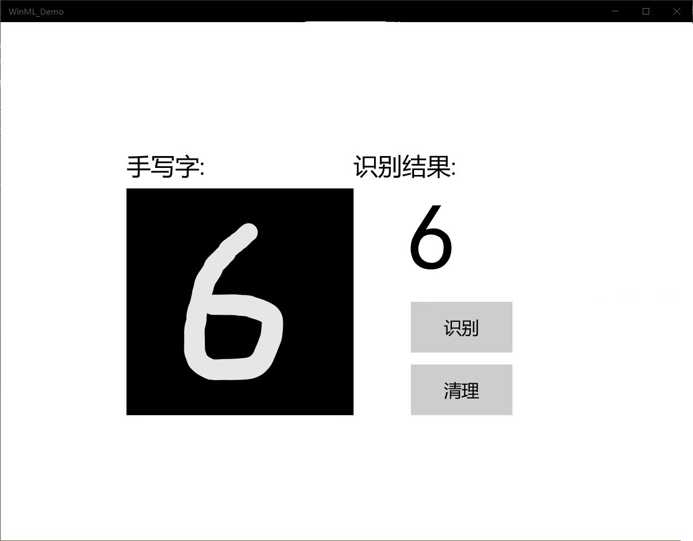

>>>>>>>># MNIST手写字
>>>>>>>>>>>### 1.先决条件
  * Windows 10（版本1809或更高版本）
  * Windows 10 SDK（内部版本17763或更高版本）
  * Visual Studio 2019（或Visual Studio 2017 15.7.4版或更高版本）
  * 适用于Visual Studio 2019的Windows Machine Learning Code Generator 扩展
  * 一些基本的 UWP 和 C# 知识

>>>>>>>>>>> ### 2.启动UWP
  #### 从GitHub下载项目后，启动Visual Studio并打开MNIST_Demo.sln文件。如
  * InkCanvas绘制数字。用于解释数字并清除画布的按钮。
  *  MainPage.xaml-我们所有的XAML代码都为InkCanvas，按钮和标签创建UI 。
  *  MainPage.xaml.cs-我们的应用程序代码所在的位置。
  *  Helper.cs-裁剪和转换图像格式的帮助程序例程.
  
>>>>>>>>>### 3.构建并运行项目
#### 在Visual Studio工具栏中，将解决方案平台更改为x64。
#### 要运行项目，请单击工具栏上的“ 开始调试”按钮，或按F5键。该应用程序应该显示一个InkCanvas，用户可以在其中写一个数字，一个Recognize按钮来解释该数字，一个空标签字段，其中解释后的数字将以文本形式显示，以及一个Clear Digit按钮来清除InkCanvas。

>>>>>>>>>>>### 4.添加模型
#### 右键单击解决方案资源管理器中的Assets文件夹，然后添加现有项，选择ONNX模型的位置，然后单击添加。该项目现在应该有两个新文件： mnist.onnx-训练的模型。 mnist.cs -Windows ML生成的代码。为了确保在编译应用程序时能够构建模型，请右键单击mnist.onnx文件，然后选择Properties。对于Build Action，选择Content。
#### 分为三类的mnist.cs文件中的新生成的代码：
  * MNISTModel创建机器学习模型：在系统默认设备上创建会话，将特定的输入和输出绑定到模型，并一步评估模型。
  * mnistInput初始化模型期望的输入类型：在这种情况下，输入需要一个ImageFeatureValue。
  * mnistOutput初始化模型将输出的类型：在这种情况下，输出将是TensorFloat类型的名为Plus214_Output_0的列表。

>>>>>>>### 5.加载，绑定和评估模型
  * 对于Windows ML应用程序，我们要遵循的模式是："加载">"绑定">"求值"
  * 加载机器学习模型：将输入和输出绑定到模型。评估模型并查看结果。
### (1)步骤
 1. 在MainPage.xaml.cs中，我们实例化模型，输入和输出。
 2. 在LoadModelAsync中，我们将加载模型：用之前那个方法MainPage的加载事件，在OnNavigateTo覆盖。该MNISTModle类表示MNIST模式并创建系统默认设备上的会话。要加载模型，我们调用CreateFromStreamAsync方法，并传入ONNX文件作为参数
 3. 
    + 我们将要输入和输出绑定到模型：生成的代码还包括MNISTInput（该模型的预期输入）和mnistOutput（该模型的预期输出）包装器类。（该mnistInput类期待一个ImageFeatureValue，所以我们使用一个辅助方法获取ImageFeatureValue为输入。）
    + 使用helper.cs中包含的帮助函数，我们将复制InkCanvas的内容，将其转换为ImageFeatureValue类型，并将其绑定到我们的模型。
    + 对于输出：我们只需使用指定的输入调用EvaluateAsync。输入初始化后，调用模型的EvaluateAsync方法一根据输入数据评估模型。EvaluateAsync将输入和输出绑定到模型对象并在输入上评估模型。
    + 由于模型返回了输出张量，因此我们首先要将其转换为友好的数据类型，然后解析返回的列表以确定哪个数字具有最高的概率并显示该数字。
 4. 我们要清除InkCanvas，以允许用户绘制另一个数字。
  >>>>>>>>>>#### 6.运行结果
  

>>>>### 总结 
  #### 今天遇到的问题比平常的都多。今天的做的都比之前的难一些，各个方面，就感觉之前的还不是很难的。今天这个中途也有很多问题，通过问同学，卢剑宇、陈少辉啊，他们帮我解决的。在代码匹配啊这方面除了问题，就很难嗷。在自己检查的时候总觉得没有出错，因为在检查的时候，自己检查自己就觉得自己是对的。所以一直不知道问题的所在。下载文件的时候特别慢，找了卢剑宇要他下载的，没有在上课的时候运行出来。希望下次再接再厉，自己流量多一些这样在网特别卡的时候可以自己下载，还是希望在上课的时候将作业写完。