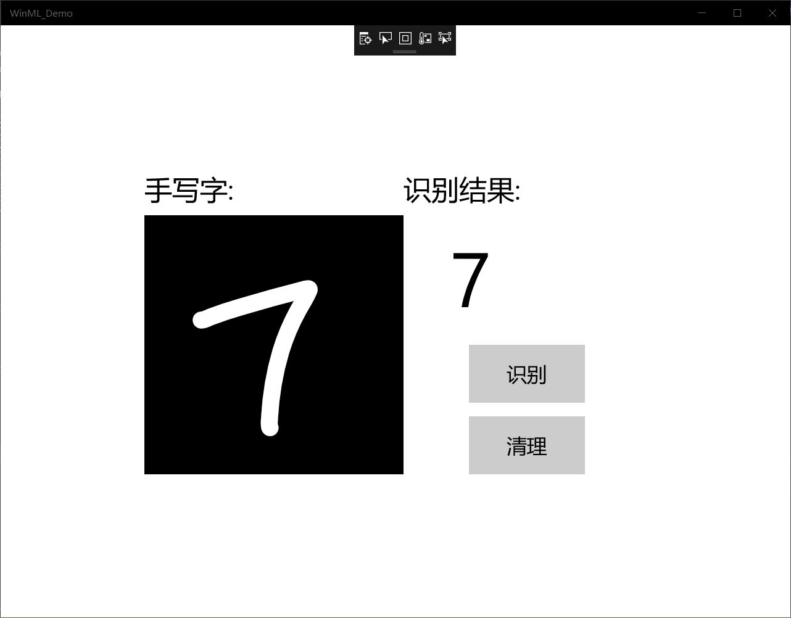

# MNIST 手写字
## UWP
UWP即Windows 10中的Universal Windows Platform简称。即Windows通用应用平台，在Windows 10 Mobile/Surface(Windows平板电脑)/PC/Xbox/HoloLens等平台上运行，uwp不同于传统pc上的exe应用，也跟只适用于手机端的app有本质区别。它并不是为某一个终端而设计，而是可以在所有windows10设备上运行。
简单的说，uwp就是通用应用的意思，可以在电脑端，手机端，或其他设备通用。不用分别为不同的平台设计不同的软件。即一个软件就可以通吃。
## 实验过程
1. 先检查电脑版本问题，电脑window10系统版本号需在1809以上的版本，操作系统的版本需在17763以上的版本。
2. 在githup中找到MNIST_Demo.sln文件，并打开它，找到里面mnist.onnx文件，选择属性，对生成操作，选择内容。
3. 对mmist.cs中生成的接口代码进行加载，绑定和评估。首先，在MainPage.xaml.cs中，将成员变量添加到MainPage类；然后，在LoadModelAsync中，加载模型：然后将输入和输出绑定到模型。最后，我们要清除InkCanvas。
代码如下：    
using System;
using System.Collections.Generic;  
using System.Linq;  
using Windows.Foundation;  
using Windows.UI.Xaml;  
using Windows.UI.Xaml.Controls;  
using Windows.Storage;  
using Windows.UI.Xaml.Media.Imaging;  
using Windows.AI.MachineLearning;  
using Windows.Media;  
using Windows.Storage.Streams;  
using System.Threading.Tasks;  
  
namespace MNIST_Demo  
{  
    public sealed partial class MainPage : Page  
    {  
        private mnistModel modelGen;  
        private mnistInput mnistInput = new mnistInput();  
        private mnistOutput mnistOutput;  
        //private LearningModelSession    session;  
        private Helper helper = new Helper();  
        RenderTargetBitmap renderBitmap = new RenderTargetBitmap();  

        public MainPage()  
        {  
            this.InitializeComponent();  

            inkCanvas.InkPresenter.InputDeviceTypes = Windows.UI.Core.CoreInputDeviceTypes.Mouse | Windows.UI.Core.CoreInputDeviceTypes.Pen | Windows.UI.Core.CoreInputDeviceTypes.Touch;  
            inkCanvas.InkPresenter.  UpdateDefaultDrawingAttributes(  
                new Windows.UI.Input.Inking.InkDrawingAttributes()  
                {  
                    Color = Windows.UI.Colors.White,  
                    Size = new Size(22, 22),  
                    IgnorePressure = true,  
                    IgnoreTilt = true,  
                }  
            );  
            LoadModelAsync();  
        }  

        private async Task LoadModelAsync()  
        {  
            StorageFile modelFile = await   StorageFile.GetFileFromApplicationUriAsync(new Uri($"ms-appx:///Assets/mnist.onnx"));  
            modelGen = await mnistModel.CreateFromStreamAsync(modelFile as IRandomAccessStreamReference);  
        }  

        private async void recognizeButton_Click(object sender, RoutedEventArgs e)  
        {  
            VideoFrame vf = await helper.GetHandWrittenImage(inkGrid);  
            mnistInput.Input3 = ImageFeatureValue.CreateFromVideoFrame(vf);  
            mnistOutput = await modelGen.EvaluateAsync(mnistInput);  
            IReadOnlyList<float> vectorImage = mnistOutput.Plus214_Output_0.GetAsVectorView();  
            IList<float> imageList = vectorImage.ToList();  
            var maxIndex = imageList.IndexOf(imageList.Max());  
            numberLabel.Text = maxIndex.ToString();  
        }  

        private void clearButton_Click(object sender, RoutedEventArgs e)  
        {  
            inkCanvas.InkPresenter.StrokeContainer.Clear();
            numberLabel.Text = "";  
        }  
    }
}
4. 启动应用程序，检查是否成功。
## 实验结果

MNIST中的数字手写体图片的label值在1到9之间,是图片所表示的真实数字。
## 实验总结
本次设计在vs2017的UWP上进行测试，了解到Mnist手写字的实现过程。但在这次实验中，由于对其基础知识理解还不够，所以在实验中有些停步，学习速度较慢，有时候即使问题简单，也要会时间。
今后，还需要加强基础知识的学习，期待在以后有更好的表现。
