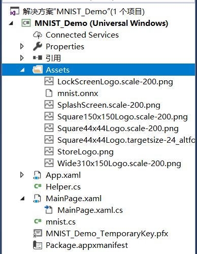
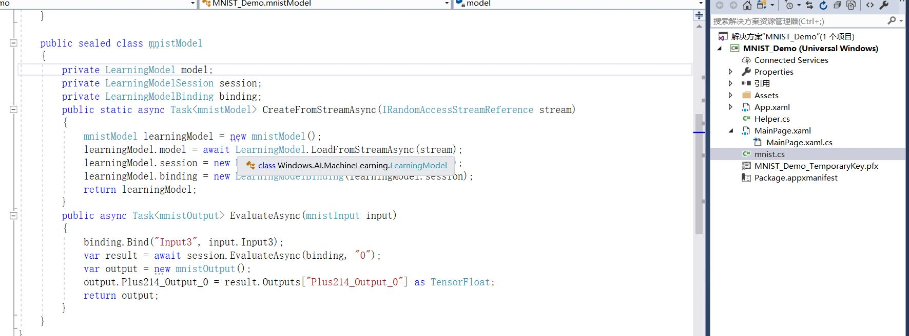
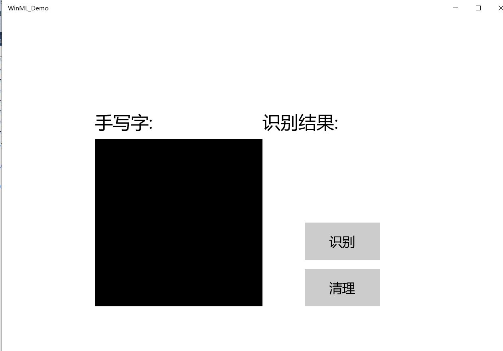
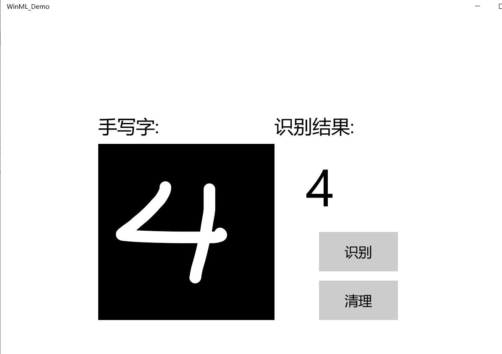

###   20191022 第六次作业
姓名：bxr   
学号：201702061

#####< 车载信息处理课程学习———基于 MNIST 数据集的手写数字识别应用开发实践>

     本次实验我做的是基于MNIST数据集和Windows Machine Learning实现。
     通过这次试验我学会了如何实现手写数字输入，手写数字输入在我们日常
     生活中运用十分广泛。接下来是我总结的实验过程的概括以及实验心得体会。

和求解机器学习问题的步骤（分成学习和推理两个阶段进行）一样，使用神经网络解决问题时，也需要首先使用训练数据（学习数据）进行权重参数的学习；进行推理时，使用参数，对输入数据进行分类。 

在进行试验前，首先要弄清楚什么是MNIST

 MNIST数据集是由0到9的数字图像构成的。训练图像有6万张，测试图像有1万张，这些图像可以用于学习和推理。MNIST数据集的一般使用方法是，先用训练图像进行学习，再用学习到的模型度量能在多大程度上对测试图像进行正确的分类。
 ### 实验步骤概括
#### 1.启动UWP

用vs studio打开github中的文件，一开始我发现打开遇到问题，我的文件显示文件损坏，解决方案显示为不可用，则需要在解决方案资源管理器中右键单击该项目，然后选择Reload Project。下载完成之后，生成调式，发现文件恢复正常。项目如图：

#### 2.构建并运行项目
首先将解决方案平台更改为x64，然后单击工具栏上的“ 开始调试”按钮，或按F5键。该应用程序应该显示一个InkCanvas，用户可以在其中写一个数字，一个Recognize按钮来解释该数字，一个空标签字段，其中解释后的数字将以文本形式显示，以及一个Clear Digit按钮来清除InkCanvas。

![] (./picture/051.jpg) 

#### 3.添加模型
右键单击解决方案资源管理器中的Assets文件夹，然后选择“ 添加” >“ 现有项”。将文件选择器指向ONNX模型的位置，然后单击添加。该项目现在应该有两个新文件： mnist.onnx-训练的模型。 mnist.cs -Windows ML生成的代码

mnist.cs文件中新生成的代码分为三类：
mnistModel创建机器学习模型表示，在系统默认设备上创建会话，将特定的输入和输出绑定到模型，并异步评估模型。 mnistInput初始化模型期望的输入类型。在这种情况下，输入需要一个ImageFeatureValue。 mnistOutput初始化模型将输出的类型。在这种情况下，输出将是TensorFloat类型的名为Plus214_Output_0的列表。
现在，将使用这些类在项目中加载，绑定和评估模型。

#### 4.加载，绑定和评估模型
    要理解这一步首先要明白 “加载”>“绑定”>“求值” 的原则

加载机器学习模型。 将输入和输出绑定到模型。 评估模型并查看结果。 我们将使用mnist.cs中生成的接口代码来加载，绑定和评估应用程序中的模型。

然后，在LoadModelAsync中，我们将加载模型。我们使用任何模型的方法（也就是之前这个方法应该叫的MainPage的加载事件，在的OnNavigatedTo覆盖，或之前的任何地方recognizeButton_Click被调用）。该mnistModel类表示MNIST模式并创建系统默认设备上的会话。要加载模型，我们调用CreateFromStreamAsync方法，并传入ONNX文件作为参数。

接下来，我们要将输入和输出绑定到模型。生成的代码还包括mnistInput和mnistOutput包装器类。所述mnistInput类表示该模型的预期输入，并且mnistOutput类表示该模型的预期的输出。
要初始化模型的输入对象，请调用mnistInput类构造函数，传入您的应用程序数据，并确保输入数据与模型期望的输入类型匹配。该mnistInput类期待一个ImageFeatureValue，所以我们使用一个辅助方法获取ImageFeatureValue为输入。

使用helper.cs中包含的帮助函数，我们将复制InkCanvas的内容，将其转换为ImageFeatureValue类型，然后将其绑定到我们的模型。
以下是我的代码：

分析代码：
x_data 是用来容纳训练数据的，它的 shape 形状在这里被莫名其妙的定义为 [None, 784]。其实这里是有学问的，且听 CoorChice 慢慢道来。
第一维定义为 None 表示不确定，后面会被实际的数值替代。这样做是因为我们一开始并不知道会有多少张图片数据会被输入。或者当我们采取 mini-batch 的梯度下降策略时，可以自由的设置 batch 的大小。
第二个维度定义为 784，这完全是因为我们数据集中的图片大小被统一为了 24 * 24 。
y_data 是用来容纳训练数据的标签的，它的 shape 之所以被定义为 [None, 10] ，是因为它的第一维为 None 与 x_data 具有相同理由，而第二维为 10 是因为我们总共有 0~9 共 10 种类别的数字。

#### 5.启动应用程序
构建并启动应用程序后（按F5键），我们将能够识别在InkCanvas上绘制的数字。

运行结果如下：

### 实验心得：
  
     本次实验我做的是基于MNIST数据集和Windows Machine Learning实现。
     通过这次试验我学会了如何实现手写数字输入，一开始我的文件无法打开，
     为此还很着急，然后在解决方案管理器中重新加载后系统提示我要下载一些
     需要的组件，完成后即可打开文件。手写输入的界面设计其实前几次课的
     其他实验已经练习了，今天对于页面没有进行美化，希望后几次课可以得到
     练习与改进。
