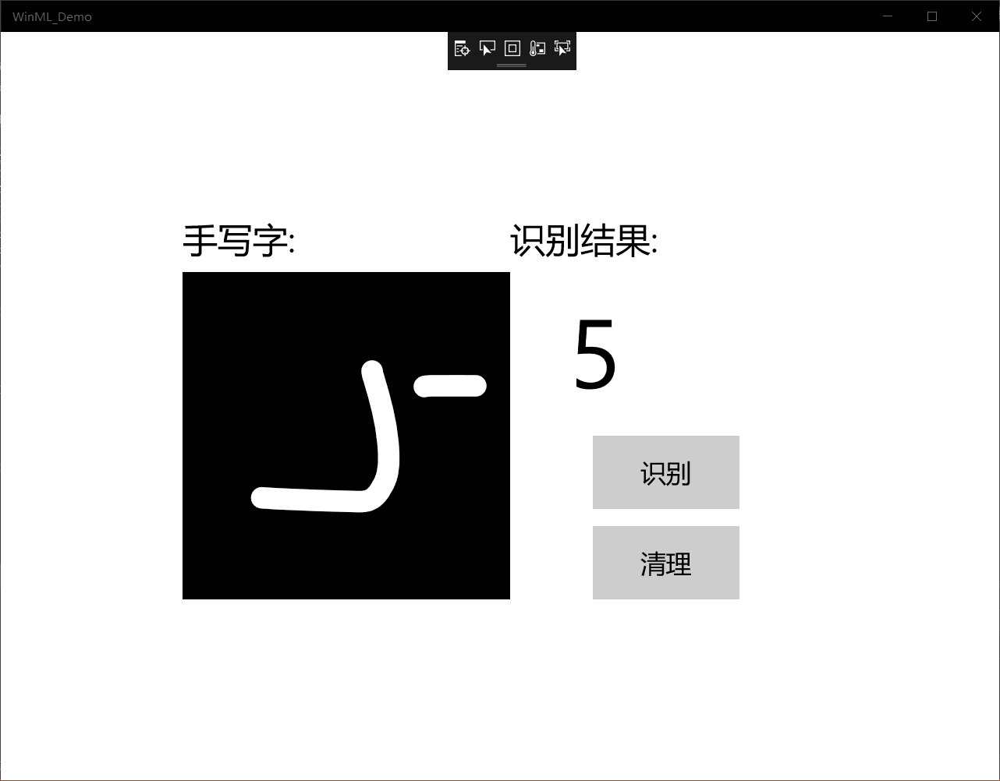

学习报告
今天利用MNIST启动UMP来实现手写字。
1. UMP：UWP即Windows 10中的Universal Windows Platform简称，全称为“Windows通用应用平台”，在Win 10 Mobile/Surface(Windows平板电脑）/PC/Xbox/HoloLens等平台上运行，UWP不同于传统pc上的exe应用,也跟只适用于手机端的app有本质区别。它并不是为某一个终端而设计，而是可以在所有Windows10设备上运行。
简单的说，UWP就是通用应用的意思，可以在电脑端，手机端，或其他设备通用。不用分别为不同的平台设计不同的软件。即一个软件就可以通吃。
2. UWP应用程序的特点：
   
   （1）. UWP应用安装卸载很方便，安装时和iOS和安卓app类似，直接通过应用商店获取，而且不会像exe软件一样误装一大堆恶意软件或是广告软件；卸载时不再需要打开控制面板，直接右击就可以快速卸载。

   （2）. 微软对于UWP的API接口有限制，用户可以通过 开始-设置-隐私 中的开关来给UWP应用程序设置权限，可以很好的保证数据不泄露。

   （3）. UWP应用更加节省电脑资源，无论是对硬盘存储空间的占用还是对电池电量的消耗，UWP应用程序因为可以被系统完全控制，所以系统会通过暂停运行你不用的UWP来节省资源或电量。
3. C#是一种安全的、稳定的、简单的、优雅的，由C和C++衍生出来的面向对象的编程语言。它在继承C和C++强大功能的同时去掉了一些它们的复杂特性（例如没有宏以及不允许多重继承）。C#综合了VB简单的可视化操作和C++的高运行效率，以其强大的操作能力、优雅的语法风格、创新的语言特性和便捷的面向组件编程的支持成为.NET开发的首选语言。
4. MNIST 手写字:
5. 
   启动uwp：从GitHub下载项目后，启动Visual Studio并打开MNIST_Demo.sln文件.如果解决方案显示为
           不可用，则需要在解决方案资源管理器中重新选择Reload Project。

   构建并运行项目：在Visual Studio工具栏中，将解决方案平台更改为x64，以在您的设备为64位时在本地         计算机上运行该项目，如果设备为32位，则在x86上运行。要运行项目，请单击工具栏上的“ 开始         调试”按钮。该应用程序应该显示一个InkCanvas，用户可以在其中写一个数字，一个Recognize         按钮来解释该数字，一个空标签字段，其中解释后的数字将以文本形式显示，以及一个Clear            Digit按钮来清除InkCanvas。

   添加模型：右键单击解决方案资源管理器中的Assets文件夹，然后选择“ 添加” >“ 现有项”。将文件选择           指向ONNX模型的位置，然后单击添加。

   加载，绑定和评估模型：对于Windows ML应用程序，我们要遵循的模式是：“加载”>“绑定”>“求值”。
            加载机器学习模型。 将输入和输出绑定到模型。 评估模型并查看结果。 我们将使用mnist.cs中生成的接口代码来加载，绑定和评估应用程序中的模型。
            FITST，在MainPage.xaml.cs中，我们实例化模型，输入和输出。将以下成员变量添加到MainPage类：
            SENCOD，在LoadModelAsync中，我们将加载模型。
            THIRD，我们要将输入和输出绑定到模型。
            对于输出，我们只需使用指定的输入调用EvaluateAsync
            LAST，我们要清除InkCanvas，以允许用户绘制另一个数字
6. 启动应用程序:(如图)
   

   总结：今天通过这个手写字识别实验让我们了解了ump和c#的相关知识，进一步丰富自己的见识，也更加熟悉MNIST的利用和使用。对vs使用的整个流程更加的熟悉和掌握，

