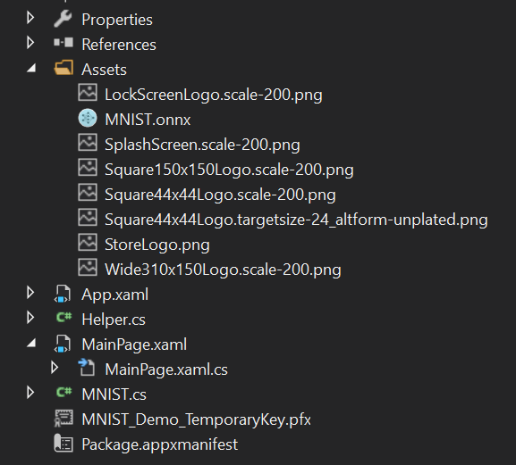
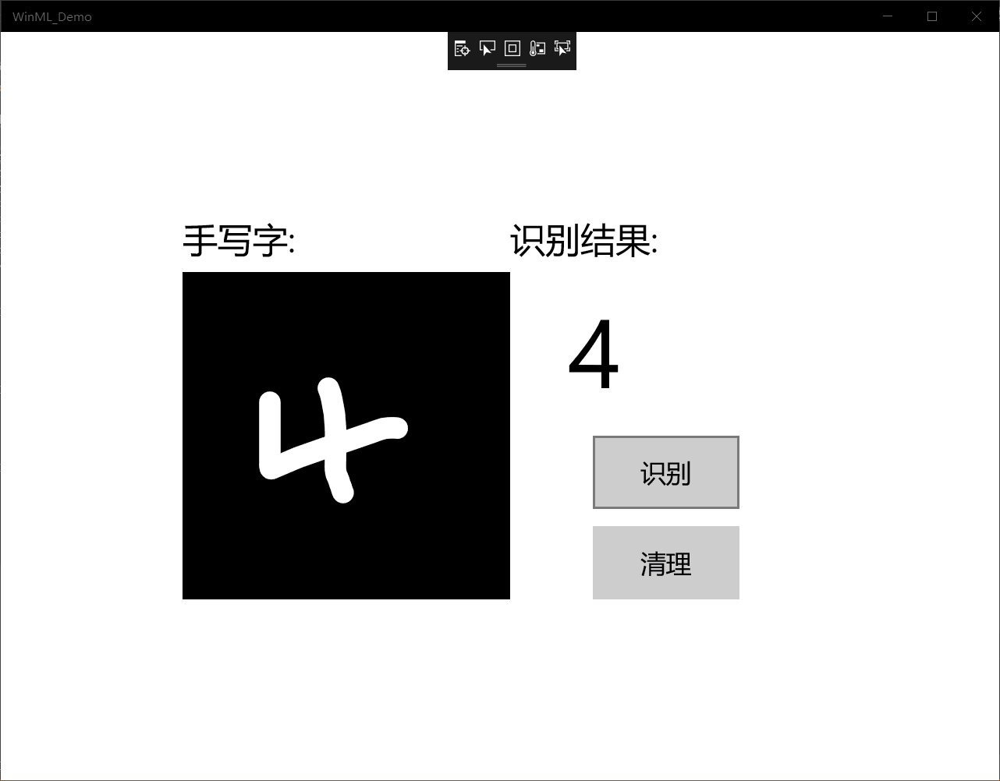

# MNIST 手写字学习报告

  实验的先决条件
  Windows 10（版本1809或更高版本）

  Windows 10 SDK（内部版本17763或更高版本）

  Visual Studio 2019（或Visual Studio 2017 15.7.4版或更高版本）

  适用于Visual Studio 2019或2017的 Windows Machine Learning Code Generator扩展

  一些基本的UWP和C＃知识

  实验步骤如下
  1. 启动UWP
   从github上下载项目文件，启动vs 2017 并打开MNIST_Demo.sln文件，如果解决方案显示为不可用，则需要在解决方案资源管理器中右键单击该项目，然后选择Reload Project。
  2. 构建并运行项目
    在Visual Studio工具栏中，将解决方案平台更改为x64，以在您的设备为64位时在本地计算机上运行该项目,点击开始调试，应用程序显示一个InkCanvas
  3. 添加模型
   
   右键单击解决方案资源管理器中的Assets文件夹，然后选择“ 添加” >“ 现有项”。将文件选择器指向ONNX模型的位置，然后单击添加。
   此时出现两个新文件： mnist.onnx-训练的模型。 mnist.cs -Windows ML生成的代码
   
   为了确保在编译应用程序时能够构建模型，请右键单击mnist.onnx文件，然后选择Properties。对于Build Action，选择Content。

   4. 加载，绑定和评估模型
   
  首先，在MainPage.xaml.cs中，我们实例化模型，输入和输出。将以下成员变量添加到MainPage类：

    private mnistModel ModelGen;
    private mnistInput ModelInput = new mnistInput();
    private mnistOutput ModelOutput;

    然后，在LoadModelAsync中，我们将加载模型。该mnistModel类表示MNIST模式并创建系统默认设备上的会话。要加载模型，我们调用CreateFromStreamAsync方法，并传入ONNX文件作为参数。

private async Task LoadModelAsync()
{

    // Load a machine learning model

    StorageFile modelFile = await StorageFile.GetFileFromApplicationUriAsync
    (new Uri($"ms-appx:///Assets/mnist.onnx"));

    ModelGen = await mnistModel.CreateFromStreamAsync(modelFile as IRandomAccessStreamReference);
}

使用helper.cs中包含的帮助函数，我们将复制InkCanvas的内容，将其转换为ImageFeatureValue类型，然后将其绑定到我们的模型。

private async void recognizeButton_Click(object sender, RoutedEventArgs e)
{

    // Bind model input with contents from InkCanvas

    VideoFrame vf = await helper.GetHandWrittenImage(inkGrid);

    ModelInput.Input3 = ImageFeatureValue.CreateFromVideoFrame(vf);
}

由于模型返回了输出张量，因此我们首先要将其转换为友好的数据类型，然后解析返回的列表以确定哪个数字具有最高的概率并显示该数字。

private async void recognizeButton_Click(object sender, RoutedEventArgs e)
{

    // Bind model input with contents from InkCanvas
    VideoFrame vf = await helper.GetHandWrittenImage(inkGrid);
    ModelInput.Input3 = ImageFeatureValue.CreateFromVideoFrame(vf);

    // Evaluate the model

    ModelOutput = await ModelGen.EvaluateAsync(ModelInput);

    // Convert output to datatype

    IReadOnlyList<float> vectorImage = ModelOutput.Plus214_Output_0.GetAsVectorView();
    IList<float> imageList = vectorImage.ToList();

    // Query to check for highest probability digit

    var maxIndex = imageList.IndexOf(imageList.Max());

    // Display the results

    numberLabel.Text = maxIndex.ToString();
}

最后，我们要清除InkCanvas，以允许用户绘制另一个数字

private void clearButton_Click(object sender, RoutedEventArgs e)
{

    inkCanvas.InkPresenter.StrokeContainer.Clear();
    numberLabel.Text = "";
}

5. 启动应用程序

    能够识别InkCanvas上绘制的数字

# 总结
  通过今天的MNIST 手写数字的实验，我学习到了一些基本的UWP和C＃知识，并且通过实验实际测试了这些代码，通过网页上的步骤，一步一步实现，整个过程要求细心认真，这样才不会出错。

