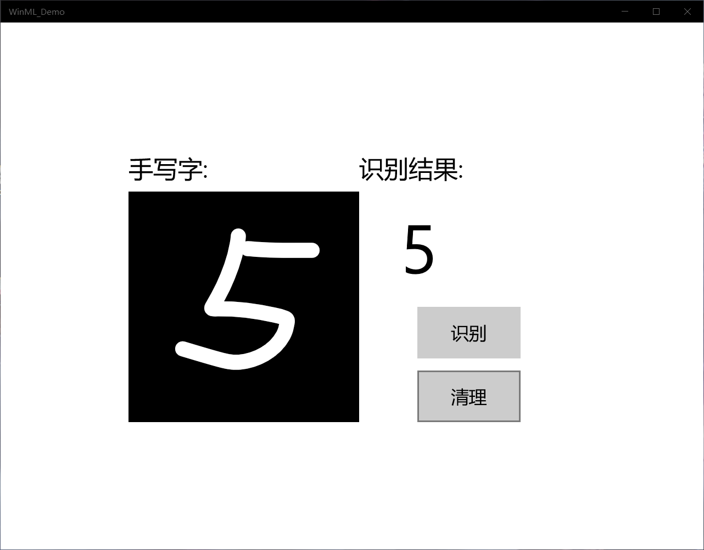
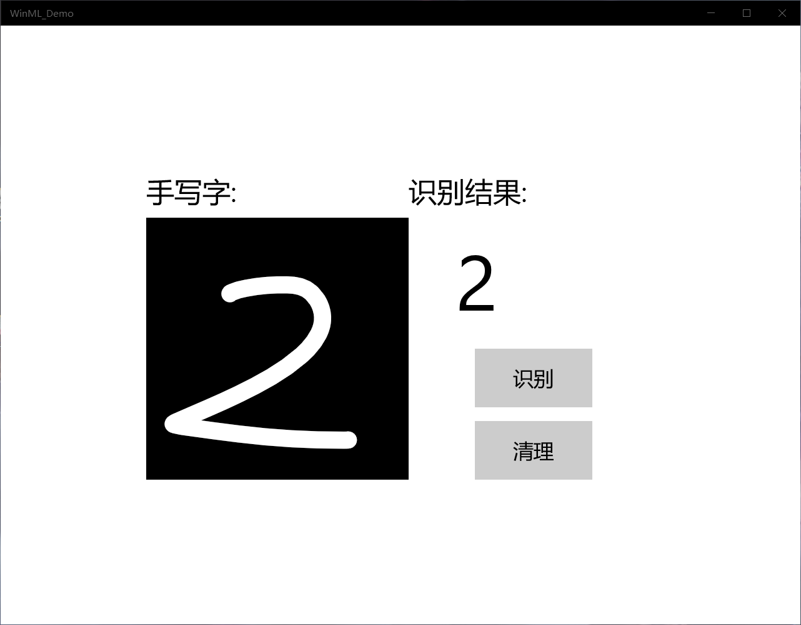

# MNIST手写字
***
一、配置条件
1.Windows 10（版本1809或更高版本）
2.Windows 10 SDK（内部版本17763或更高版本）
3.Visual Studio 2019（或Visual Studio 2017 15.7.4版或更高版本）
4.适用于Visual Studio 2019或2017的 Windows Machine Learning Code Generator扩展
5.一些基本的UWP和C＃知识

二、实验步骤

1.从GitHub下载项目后，启动Visual Studio并打开MNIST_Demo.sln文件（该文件应该位于 \ Windows-Machine-Learning \ Samples \ MNIST \ Tutorial \ cs）。

2.在Visual Studio工具栏中，将解决方案平台更改为x64，以在您的设备为64位时在本地计算机上运行该项目，如果设备为32位，则在x86上运行。

3.右键单击解决方案资源管理器中的Assets文件夹，然后选择“ 添加” >“ 现有项”。将文件选择器指向ONNX模型的位置，然后单击添加。

4.首先，在MainPage.xaml.cs中，实例化模型，输入和输出。
  然后，在LoadModelAsync中，将加载模型
  接下来，要将输入和输出绑定到模型
  最后，要清除InkCanvas，以允许用户绘制另一个数字
  
 5.启动应用程序
  
 

 三、总结
      
      MNIST手写数字识别实现有两种方案，此次实验采用的是WINML方案，实验前需要先将环境配置好，将windows版本升至1809或者更高版本，实验过程中遇到一些小问题，通过百度和同学帮助解决。这次实验让我了解了手写数字识别的原理和应用，并知道了做实验的一些注意事项，提高了分析能力。
