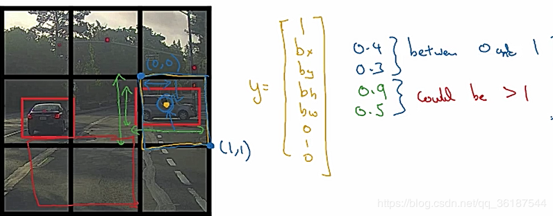
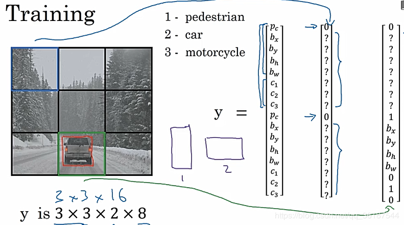
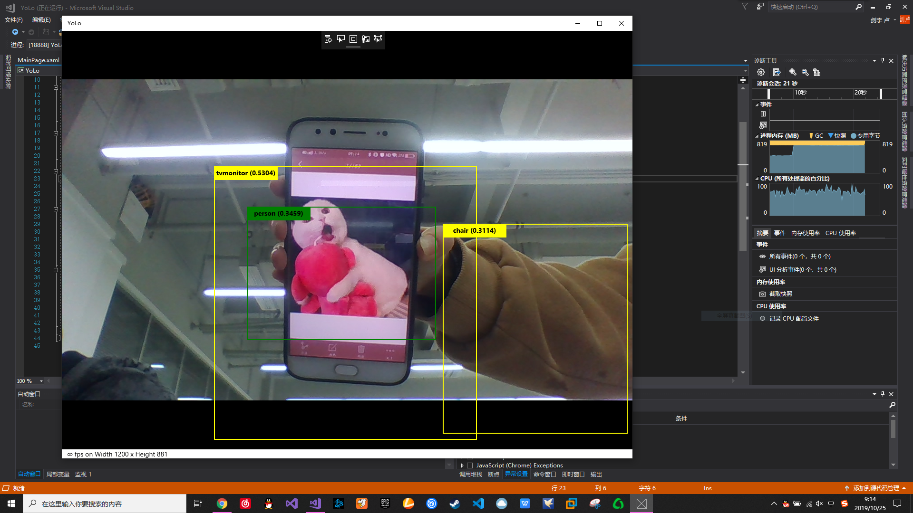

# 第七次作业
本次学习目标检测与识别YOLO-V1.2-WinML-Sample
## 一.YOLO原理
在传统的计算机视觉方法中，采用滑动窗口查找不同区域和大小的目标。因为这是消耗量较大的算法，通常假定目标的纵横比是固定的。

早期的基于深度学习的目标检测算法，如R-CNN和快速R-CNN，采用选择型搜索（Selective Search）来缩小必须测试的边界框的数量（本文的边界框指的是，在预测到疑似所识别到的目标后，在图片上把对象框出的一个矩形）。

另外一种称为Overfeat的方法，通过卷积地计算滑动窗口，以多个尺度扫描了图像。

然后有人提出了快速R-CNN算法，使用Region Proposal Network(RPN)区别将要测试的边界框。通过巧妙的设计，用于目标识别的特征点，也被RPN用于提出潜在的边界框，因此节省了大量的计算。

然而，YOLO使用了完全不同的方法解决目标检测问题。它将图像进行神经网络的一次性正向处理。SSD是另外一种将图像进行神经网络一次性正向处理的方法，但是YOLOv3比SSD实现了更高的精度，同时又较快的运算速度。YOLOv3在M40，TitanX和1080Ti这类GPU上实时效果更好。

让我们看看YOLO如何在一张图片中检测目标。首先，它把原图按比例平均分解成一张有13x13网格的图片。这169个单元会根据原图的大小而改变。对于一张416x416像素的图片，每个图片单元的大小是32x32像素。处理图片时，会以图片单元为单位，预测单位中的多个边界框。对于每个边界框，这个网络会计算所包含物体的边界框的置信度，同时计算所包含的目标是属于一个特定类别的可能性大小。非最大抑制（non-maximum suppression）可以消除低置信度的边界框，以及把同时包围着单个物体的多个高置信度的边界框消除到只剩下一个。

YOLOv3的作者，Joseph Redmon和Ali Farhadi，让YOLOv3比前一代YOLOv2更加精确和快速。YOLOv3在处理多个不同尺寸图片的场合中得到了优化。他们还通过加大了网络，并添加快捷链接将其引入剩余网络来改进网络。
## 二.YOLO算法
对象检测（目标检测）可采用滑动窗口目标检测法，但是通常的滑动窗口计算成本过大。一般的滑动窗口计算法取离散位置集合进行测试，但是实际上这样很不精准，所以采用YOLO算法。

将图片分为M×N个模块，检测目标中心点在哪个模块（所以不用担心一个目标横跨几个模块）,（bx,by,bh,bw)对应（中心点坐标，目标高和宽度）一般表示方式为百分比，表示占格子长宽的比例，y[0]表示这个模块是否包含中心点，如果为0不包含，y[1]、y[2]等就没有意义。y[5]、y[6]、y[7]表示那一种分类（如果单分类，完全可以去掉这几个参数），可以是汽车、行人、交通指示灯。当然，还有其他参数表达方式，需要再细研究。

优势：可以只用一次卷积神经网络，就能输出3×3×8（以上图为准），执行速度很快。实际上就是把这类问题变成了神经网络回归问题。

评价指标：交并比（预测框与实际框的交集大小比并集）

为了排除对同一目标多次检测，因为如果格子划分过细，可能很多格子都包含目标，所以需要非极大值抑制（非最大值抑制）：1.去除所有IOU小于一定比例如0.6的结果，2.找到IOU高的边框结果如≥0.9的，寻找与这些高IOU有很高重合度（如IOU>0.5）的的边框，去除

当一个格子采集多个对象时，采用anchor boxes，用的较少，下图可以展示，对于Y是2×8维的变量，为了防止一个格子有多个对象能够采集到各个坐标。

YOLO算法：就是利用标签Y做神经网络输出，得到最终结果。但是注意，最后需要进行一下非极大值抑制得到具体的目标检测边框。被吴恩达誉为最好用的目标检测算法。

R-CNN：带区域的卷积算法，比如下左图蓝色框是没有意义的。所以运用图像分割算法得到不同色块，在色块边界跑算法。即通过算法划分区域得到候选区域，再在区域上跑卷积。也有改进算法比如fast-RCNN,faster-RCNN
## 二.ONNX 模型
Windows 机器学习支持中的模型打开神经网络交换 (ONNX)格式。 ONNX 器以开放格式对于机器学习模型，使你可以交换模型之间各种机器学习框架和工具。

有几种方法，你可以获取的模型中的 ONNX 格式，其中包括：
1. ONNX 模型 Zoo:包含有关不同类型的任务的多个预先训练的 ONNX 模型。 下载 Windows 机器学习支持的版本，并且就准备就绪 ！
2. 从机器学习的训练框架的本机导出:多种培训框架支持到 ONNX，链接器、 Caffee2 和 PyTorch，您可以将已训练的模型保存到特定版本的 ONNX 格式等本机导出功能。 此外，服务如Azure 机器学习服务并Azure 自定义视觉还提供了本机 ONNX 导出。
3. 若要了解如何训练和导出的 ONNX 模型中使用自定义视觉在云中，请查看教程：与 Windows 机器学习 （预览版） 使用从自定义视觉 ONNX 模型。
4. 将现有模型使用 WinMLTools 转换:此 Python 包允许将从多种培训 framework 格式转换为 ONNX 模型。 作为开发人员，可以指定你想要将转换您的模型，具体取决于 Windows 应用程序所针对的哪些版本生成的 ONNX 哪个版本。 如果您不熟悉 Python，则可以使用Windows 机器学习的基于 UI 的仪表板来轻松地将转换你的模型只需几次点击即可
## 三.实现步骤
1. 创建项目：
打开VS2019，创建新项目，选择Windows窗体应用,并确定。
2. 添加模型：
在解决方案资源管理器中找到Assets文件夹，添加现有项，添加两个新文件：tiny-yolov2-1.2.onnx和TinyYOLOV3.onnx模型
3. 添加代码
4. 调试结果

## 总结
本次学习了环境感知原理，还有使用YOLO算法实现目标识别。在学习的过程中，通过老师的讲解和自己在网上查阅资料，我更加了解了YOLO的很多知识，比如它的算法，YOLO1，2，3知识，而且还让我对AI识别有了新的认识。
在实现过程中出现很多错误，因为不了解代码，直接复制粘贴，最后相机没有运行出来，但在同学的帮助下逐渐了解代码一些类的用法，虽然还有好多没懂的地方，不过，在同学的帮助下逐渐完成实现。这次课让我学习很多，也让我认识到自己对代码的理解不足，所以以后我要更加努力，加强对一些语言知识的扩充，并努力学习。
