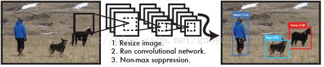
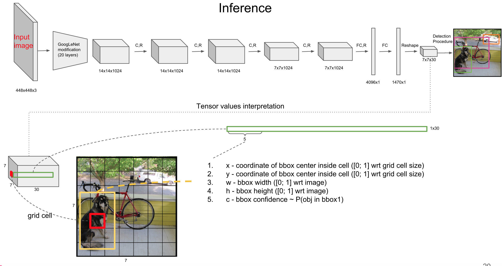
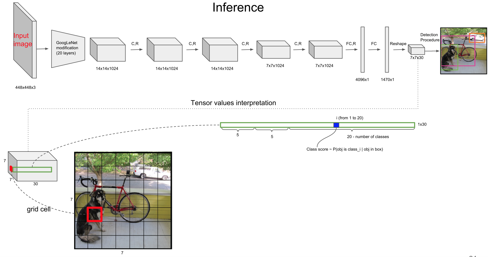
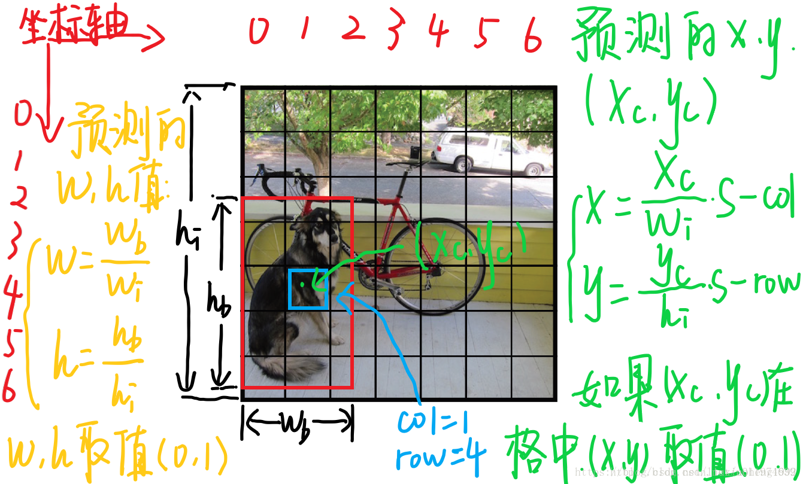
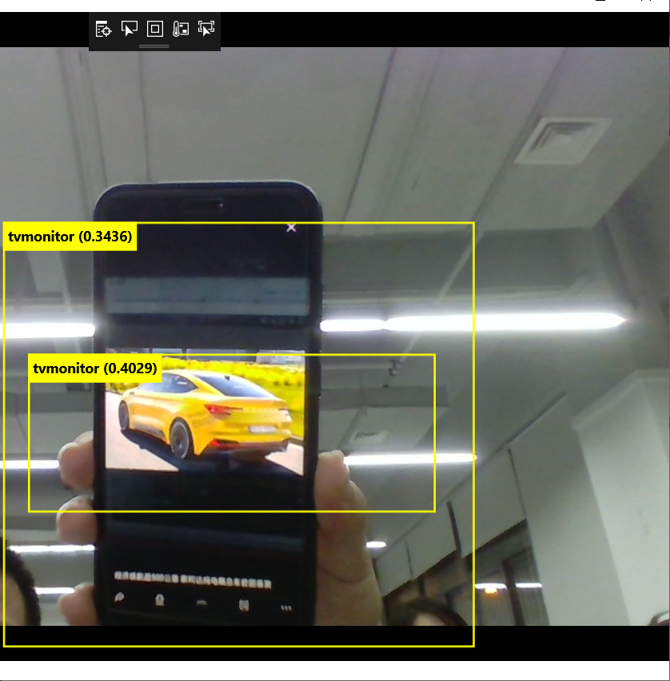

# 20191023  ----    第七次作业
# 一、基于YOLO目标检测与识别
## 1、YOLO介绍
YOLO（You Only Look Once: Unified, Real-Time Object Detection），是Joseph Redmon和Ali Farhadi等人于2015年提出的基于单个神经网络的目标检测系统。在2017年CVPR上，Joseph Redmon和Ali Farhadi又发表的YOLO 2，进一步提高了检测的精度和速度。

YOLO是一个可以一次性预测多个Box位置和类别的卷积神经网络，能够实现端到端的目标检测和识别，其最大的优势就是速度快。事实上，目标检测的本质就是回归，因此一个实现回归功能的CNN并不需要复杂的设计过程。YOLO没有选择滑动窗口（silding window）或提取proposal的方式训练网络，而是直接选用整图训练模型。这样做的好处在于可以更好的区分目标和背景区域，相比之下，采用proposal训练方式的Fast-R-CNN常常把背景区域误检为特定目标。

## 2、YOLO检测系统流程
图所示是YOLO检测系统流程：

- （1）将图像Resize到448*448；
- （2）运行CNN；
- （3）非极大抑制优化检测结果。
  

YOLO是基于Pascal VOC2012数据集的目标检测系统。它能够检测到20种Pascal的目标类别，包括：
- 人
- 鸟，猫，牛，狗，马，羊
- 飞机，自行车，船，汽车，摩托车，火车
- 瓶子，椅子，桌子，盆栽植物，沙发，电视或者显示器
  
  YOLO的总体框架示意图如下：

  
   
    
   
由上两图所示，网络是根据GoogLeNet改进的，输入图片为448*448大小，输出为7×7×(2×5+20)7×7×(2×5+20)，现在看来这样写输出维度很奇怪，下面来看一下输出是怎么定义的。

将图片分为S×SS×S个单元格(原文中S=7)，之后的输出是以单元格为单位进行的： 
1.如果一个object的中心落在某个单元格上，那么这个单元格负责预测这个物体。 
2.每个单元格需要预测B个bbox值(bbox值包括坐标和宽高，原文中B=2)，同时为每个bbox值预测一个置信度(confidence scores)。也就是每个单元格需要预测B×(4+1)个值。 
3.每个单元格需要预测C(物体种类个数，原文C=20，这个与使用的数据库有关)个条件概率值. 
所以，最后网络的输出维度为S×S×(B×5+C)S×S×(B×5+C)，这里虽然每个单元格负责预测一种物体(这也是这篇文章的问题，当有小物体时可能会有问题)，但是每个单元格可以预测多个bbox值(这里可以认为有多个不同形状的bbox，为了更准确的定位出物体，如下图所示)。
 

   因为这里是当作回归问题来解决的，所以所有的输出包括坐标和宽高最好都定义在0到1之间。
   
   每个单元格预测的B个(x,y,w,h,confidence)的向量和C的条件概率中，每个参数的含义(假设图片宽为{w_i}高为{hi}，将图片分为S×SS×S)： 

1.(x,y)是bbox的中心相对于单元格的offset 
对于下图中蓝色框的那个单元格(坐标为(xcol=1,yrow=4)(xcol=1,yrow=4))，假设它预测的输出是红色框的bbox,设bbox的中心坐标为(xc,yc)(xc,yc),那么最终预测出来的(x,y)是经过归一化处理的，表示的是中心相对于单元格的offset，计算公式如下：  
x=xcwiS−xcol,y=ychiS−yrowx=xcwiS−xcol,y=ychiS−yrow

2.(w,h)是bbox相对于整个图片的比例 
预测的bbox的宽高为wb,hbwb,hb，(w,h)表示的是bbox的是相对于整张图片的占比，计算公式如下:  
w=wbwi,h=hbhiw=wbwi,h=hbhi

3.confidence 
这个置信度是由两部分组成，一是格子内是否有目标，二是bbox的准确度。定义置信度为Pr(Object)∗IOUtruthpredPr(Object)∗IOUpredtruth。 
这里，如果格子内有物体，则Pr(Object)=1Pr(Object)=1，此时置信度等于IoU。如果格子内没有物体，则Pr(Object)=0Pr(Object)=0，此时置信度为0

4.C类的条件概率 
条件概率定义为Pr(Classi|Object)Pr(Classi|Object)，表示该单元格存在物体且属于第i类的概率。

## 3、YOLO优点

YOLO有如下特点：

- 速度快。YOLO将物体检测作为回归问题进行求解，使用单个网络完成整个检测过程。
- 召回率低，表现为背景误检率低。YOLO可以get到图像的整体信息，相比于region - proposal等方法，有着更广阔的“视野”。
泛化能力强，对其他类的东西，训练后效果也是挺好的。
## 4、程序分析
（1）先创建项目

①选择文件->新建->项目。

在弹出的窗口里选择Visual C#->Windows窗体应用。

②添加模型
右键单击解决方案资源管理器中的Assets文件夹，然后选择“ 添加” >“ 现有项”。将文件选择器指向ONNX模型的位置，然后单击添加。
该项目现在应该有两个新文件：tiny-yolov2-1.2.onnx和TinyYOLOV3.onnx训练的模型。
③界面设计
添加如下代码：
```C++
<Page
    xmlns="http://schemas.microsoft.com/winfx/2006/xaml/presentation"
    xmlns:x="http://schemas.microsoft.com/winfx/2006/xaml"
    xmlns:local="using:YoLo"
    xmlns:d="http://schemas.microsoft.com/expression/blend/2008"
    xmlns:mc="http://schemas.openxmlformats.org/markup-compatibility/2006"
    xmlns:Custom="using:Microsoft.Toolkit.Uwp.UI.Controls"
    x:Class="YoLo.MainPage"
    mc:Ignorable="d"
    Background="{ThemeResource ApplicationPageBackgroundThemeBrush}">

 
    <Grid>
        <Grid.RowDefinitions>
            <RowDefinition Height="*" />
            <RowDefinition Height="Auto" />
        </Grid.RowDefinitions>
        <Custom:CameraPreview x:Name="CameraPreview"
                          Grid.Row="0" />
        <Canvas Name="YoloCanvas"
                Grid.Row="0" />
        <TextBlock x:Name="TextBlockInformation"
                   Grid.Row="1" />
    </Grid>
    
</Page>
```
④具体实现
YoloBoundingBox.cs中加入如下代码：
```C++
using System.Drawing;

namespace TinyYOLO
{
    class YoloBoundingBox
    {
        public string Label { get; set; }
        public float X { get; set; }
        public float Y { get; set; }

        public float Height { get; set; }
        public float Width { get; set; }

        public float Confidence { get; set; }

        public RectangleF Rect
        {
            get { return new RectangleF(X, Y, Width, Height); }
        }
    }
}
```


YoloWinMlParser.cs加入下面的程序
```C++
using System;
using System.Collections.Generic;
using System.Drawing;
using System.Linq;

namespace TinyYOLO
{
    class YoloWinMlParser
    {
        public const int ROW_COUNT = 13;
        public const int COL_COUNT = 13;
        public const int CHANNEL_COUNT = 125;
        public const int BOXES_PER_CELL = 5;
        public const int BOX_INFO_FEATURE_COUNT = 5;
        public const int CLASS_COUNT = 20;
        public const float CELL_WIDTH = 32;
        public const float CELL_HEIGHT = 32;

        private int channelStride = ROW_COUNT * COL_COUNT;

        private float[] anchors = new float[]
            {
                1.08F, 1.19F, 3.42F, 4.41F, 6.63F, 11.38F, 9.42F, 5.11F, 16.62F, 10.52F
            };

        private string[] labels = new string[]
            {
                "aeroplane", "bicycle", "bird", "boat", "bottle",
                "bus", "car", "cat", "chair", "cow",
                "diningtable", "dog", "horse", "motorbike", "person",
                "pottedplant", "sheep", "sofa", "train", "tvmonitor"
            };

        public IList<YoloBoundingBox> ParseOutputs(float[] yoloModelOutputs, float threshold = .3F)
        {
            var boxes = new List<YoloBoundingBox>();

            var featuresPerBox = BOX_INFO_FEATURE_COUNT + CLASS_COUNT;
            var stride = featuresPerBox * BOXES_PER_CELL;

            for (int cy = 0; cy < ROW_COUNT; cy++)
            {
                for (int cx = 0; cx < COL_COUNT; cx++)
                {
                    for (int b = 0; b < BOXES_PER_CELL; b++)
                    {
                        var channel = (b * (CLASS_COUNT + BOX_INFO_FEATURE_COUNT));

                        var tx = yoloModelOutputs[GetOffset(cx, cy, channel)];
                        var ty = yoloModelOutputs[GetOffset(cx, cy, channel + 1)];
                        var tw = yoloModelOutputs[GetOffset(cx, cy, channel + 2)];
                        var th = yoloModelOutputs[GetOffset(cx, cy, channel + 3)];
                        var tc = yoloModelOutputs[GetOffset(cx, cy, channel + 4)];

                        var x = ((float)cx + Sigmoid(tx)) * CELL_WIDTH;
                        var y = ((float)cy + Sigmoid(ty)) * CELL_HEIGHT;
                        var width = (float)Math.Exp(tw) * CELL_WIDTH * this.anchors[b * 2];
                        var height = (float)Math.Exp(th) * CELL_HEIGHT * this.anchors[b * 2 + 1];

                        var confidence = Sigmoid(tc);
                        
                        if (confidence < threshold)
                            continue;

                        var classes = new float[CLASS_COUNT];
                        var classOffset = channel + BOX_INFO_FEATURE_COUNT;

                        for (int i = 0; i < CLASS_COUNT; i++)
                            classes[i] = yoloModelOutputs[GetOffset(cx, cy, i + classOffset)];

                        var results = Softmax(classes)
                            .Select((v, ik) => new { Value = v, Index = ik });

                        var topClass = results.OrderByDescending(r => r.Value).First().Index;
                        var topScore = results.OrderByDescending(r => r.Value).First().Value * confidence;
                        var testSum = results.Sum(r => r.Value);

                        if (topScore < threshold)
                            continue;

                        boxes.Add(new YoloBoundingBox()
                        {
                            Confidence = topScore,
                            X = (x - width / 2),
                            Y = (y - height / 2),
                            Width = width,
                            Height = height,
                            Label = this.labels[topClass]
                        });
                    }
                }
            }

            return boxes;
        }

        public IList<YoloBoundingBox> NonMaxSuppress(IList<YoloBoundingBox> boxes, int limit, float threshold)
        {
            var activeCount = boxes.Count;
            var isActiveBoxes = new bool[boxes.Count];

            for (int i = 0; i < isActiveBoxes.Length; i++)
                isActiveBoxes[i] = true;

            var sortedBoxes = boxes.Select((b, i) => new { Box = b, Index = i })
                                .OrderByDescending(b => b.Box.Confidence)
                                .ToList();            

            var results = new List<YoloBoundingBox>();

            for (int i = 0; i < boxes.Count; i++)
            {
                if (isActiveBoxes[i])
                {
                    var boxA = sortedBoxes[i].Box;
                    results.Add(boxA);

                    if (results.Count >= limit)
                        break;

                    for (var j = i + 1; j < boxes.Count; j++)
                    {
                        if (isActiveBoxes[j])
                        {
                            var boxB = sortedBoxes[j].Box;

                            if (IntersectionOverUnion(boxA.Rect, boxB.Rect) > threshold)
                            {
                                isActiveBoxes[j] = false;
                                activeCount--;

                                if (activeCount <= 0)
                                    break;
                            }
                        }
                    }

                    if (activeCount <= 0)
                        break;
                }
            }

            return results;
        }

        private float IntersectionOverUnion(RectangleF a, RectangleF b)
        {
            var areaA = a.Width * a.Height;

            if (areaA <= 0)
                return 0;

            var areaB = b.Width * b.Height;

            if (areaB <= 0)
                return 0;

            var minX = Math.Max(a.Left, b.Left);
            var minY = Math.Max(a.Top, b.Top);
            var maxX = Math.Min(a.Right, b.Right);
            var maxY = Math.Min(a.Bottom, b.Bottom);

            var intersectionArea = Math.Max(maxY - minY, 0) * Math.Max(maxX - minX, 0);

            return intersectionArea / (areaA + areaB - intersectionArea);
        }

        private int GetOffset(int x, int y, int channel)
        {
            // YOLO outputs a tensor that has a shape of 125x13x13, which 
            // WinML flattens into a 1D array.  To access a specific channel 
            // for a given (x,y) cell position, we need to calculate an offset
            // into the array
            return (channel * this.channelStride) + (y * COL_COUNT) + x;
        }

        private float Sigmoid(float value)
        {
            var k = (float)Math.Exp(value);

            return k / (1.0f + k);
        }

        private float[] Softmax(float[] values)
        {
            var maxVal = values.Max();
            var exp = values.Select(v => Math.Exp(v - maxVal));
            var sumExp = exp.Sum();

            return exp.Select(v => (float)(v / sumExp)).ToArray();
        }
    }
}
```
这两个是YOLO识别的核心代码，在YoloWinMlParser中定义YOLO识别的具体的物体：
```C++
   private string[] labels = new string[]
            {
                "aeroplane", "bicycle", "bird", "boat", "bottle",
                "bus", "car", "cat", "chair", "cow",
                "diningtable", "dog", "horse", "motorbike", "person",
                "pottedplant", "sheep", "sofa", "train", "tvmonitor"
            };
```
IntersectionOverUnion是具体识别物体的函数。
## 5、运行结果
识别人：

识别手机显示器：

识别汽车：

## 二、总结
今天这次的学习让我对AI识别图像有了一个较新的认识，老师上课演示的训练模型的过程让我更加痴迷于AI的学习。通过老师的演示及讲解，我明白了如何训练机器学习识别，在[customvision上](https://www.customvision.ai/)可以建立一个自己训练物体的工程，通过放入不同的标签及相应的图片进行训练就可以达到识别物体的目的。在调试程序的过程中，我新建了一个与demo一样名字的工程进行调试，但是最后却出现了一个错误，无法获取电脑相机权限的问题。通过查阅资料及寻求老师的帮助，我最终解决了，但是运行时相机只能开启一小会儿，我猜想可能是与自己电脑的性能有关，通过多次尝试，我确定与自己电脑的性能及CPU保护有关。
        
这次课的学习，我还是学到不少关于YOLO的知识，我收获了很多。但是在调试及代码理接上，我还需要努力，我要加强对C#知识的扩充，以及解决程序bug上要有自己的思路，要一步一步解决bug，不能心急求成。最后，在以后的AI道路上，我会不断探索，让自己更加充实。


