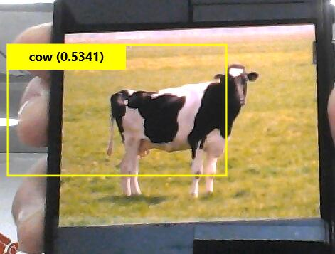

# 第七次作业
##  学习类容
今天的主要学习了yolo。
YOLO（You Only Look Once) 是可谓是第一个相对成功One-Stage物体检测，在2016年被提出，本着速度的优势一跃成为与RCNN系列并驾齐驱的物体检测框架。
### 物体检测
物体检测是计算机视觉中的经典问题之一，其任务是用框去标出图像中物体的位置，并给出物体的类别。从传统的人工设计特征加浅层分类器的框架，到基于深度学习的端到端的检测框架，物体检测一步步变得愈加成熟。
### yolo是如何工作的
先前的检测系统重新使用分类器或定位器来执行检测。他们将模型应用于多个位置和尺度的图像。图像的高分区域被认为是检测。
我们采用完全不同的方法。我们将一个单一的神经网络应用于整个图像。该网络将图像划分为区域，并预测每个区域的包围框和概率。这些包围盒是根据预测的概率来加权的。
与基于分类器的系统相比，我们的模型有几个优点。它在测试时查看整个图像，因此它的预测由图像中的全局上下文提供信息。它还使用单个网络评估进行预测，而不像这样的系统r-CNN一张图像需要数千。这使得它非常快，比R-cnn快1000倍，比R-cnn快100倍。

### 实验效果图

## 总结
跟之前做的几次实验一样，这次yolo的学习也是基于前几次的基础完成的，
同样用到Windows Machine Learning的方法，跟之前不一样的是这次是基于老师做好的sln完成的，电脑环境是好的，可以直接运行，过程中并没有遇到问题，可以运行yolo，也可以识别这些模型可以识别的物体  
 "aeroplane", "bicycle", "bird", "boat", "bottle",
    "bus", "car", "cat", "chair", "cow",
"diningtable", "dog", "horse", "motorbike"，"person",
 "pottedplant", "sheep", "sofa", "train", "tvmonitor"  
 有些找不到实体，识别照片上的也是可以的，本次实验没有去理解yolo的原理，但是还是要理解一下代码，加强对c#的学习，对模型也没有过多的了解。   
 #### yolo的优点
 1. 对比其他目标检测算法，YOLO检测速度非常快，作者用标准版本的YOLO在Titan X 的 GPU 上能达到45 FPS。更快的Fast YOLO检测速度可以达到155 FPS。
2. 不同于其他的目标检测算法，YOLO的输入是一整张图片，在检测时很好的利用了整体的信息，不容易在背景上预测出错误的物体信息。
3. YOLO可以学习到高度泛化的特征，具有更好的迁移能力，作者用YOLO在自然图像上做训练，在艺术作品上测试时，YOLO的表现比R-CNN等物体检测算法要好很多。    
#### yolo的缺点
就是物体检测的精度不是很高，上午实验的时候有时候会不停地出现边框，不是很稳定，有时候也识别不出来两个离的很近的物体，总之刚学这个，这个能出来，对我来说已经很新颖了，在未来的学习中也要越弄越好。
