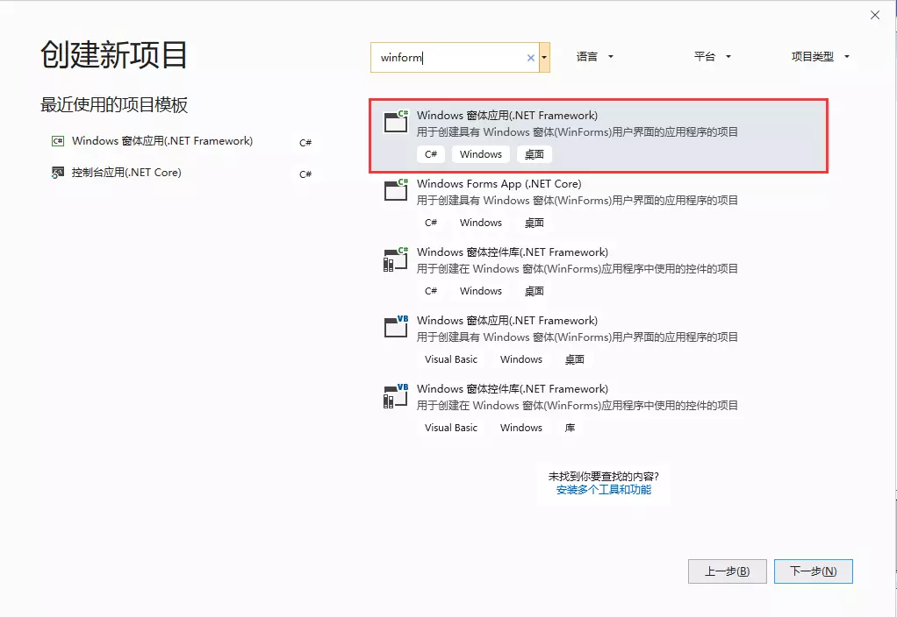
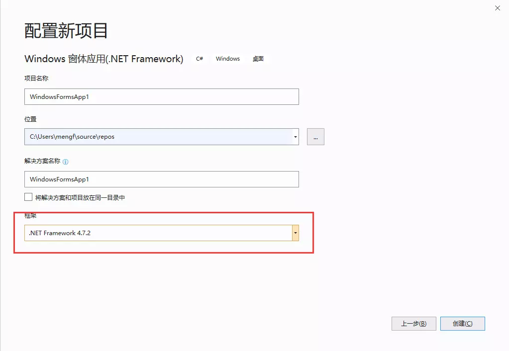
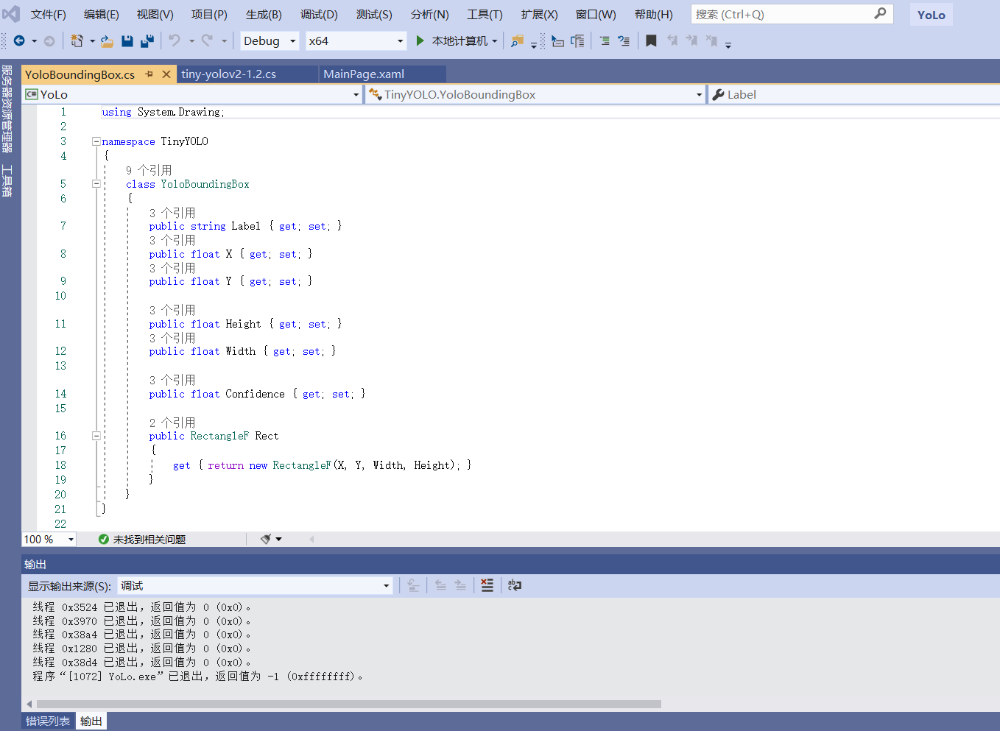
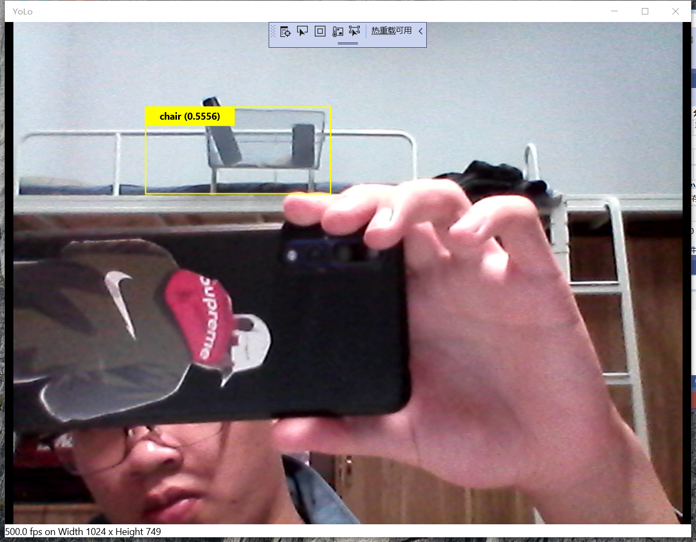
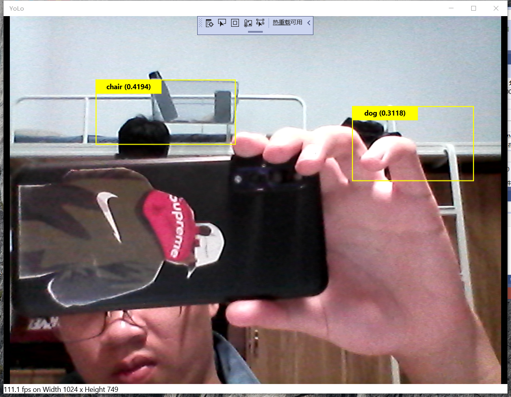

# 第七次课程
YOLO机器人物体识别  
Yolo是可以在Csharp平台下进行是图片识别的基础框

架。目前经过训练的最新框架，已经支持9000种物品类别的识

别。Yolo可识别静态图片，但主要功能可以对视频进行动态识

别，用最新Nvidia titan Gpu，最高可支持60帧。

YOLO（You Only Look Once）是一种基于深度神经网络的对

象识别和定位算法，其最大的特点是运行速度很快，可以用于实

时系统。

现在YOLO已经发展到v3版本，不过新版本也是在原有版本基础

上不断改进演化的，所以本文先分析YOLO v1版本。

步骤

1、打开vs2019，选择新建windows窗体应用(.net 

framework)程序，点击下一步。

如图

框架需选择4.7.2，否则可能会出现与Yolo兼容的情况。然后点

击下一步

 逐步添加现有现有项，添加代码

 
 
  在教室里面的预期图
  

 实际效果图
 
 

 * 总结   
  在今天的课堂上，老师首先给我们展示了yolo的运行效果，这也是我们本次课程学习的主要内容，计算机视觉的初步应用，通过上网查询资料，我知道的yolo功能的强大，它可以识别很多种物品，但是yolo也有一些缺陷，比如它可以识别静态物体，但是以动态识别为主，它识别的动态图，帧数很低，最高为60帧。代码关键函数是demo()，demo函数位于src文件夹的demo.c文件中，用于实现检测和显示检测结果。  
  在实际的使用过程中我遇到了一些问题。例如它识别物品的种类不多，对于人的识别更加精准。没有使用GPU加速的情况大概得需要7秒钟才能处理一帧。所以看到画面非常卡顿。如果物品移动速度过快则无法识别，由于电脑配置问题，在识别一个物体后，我的这个程序会卡顿，需要重启调试。这是今天我遇到的一些问题。