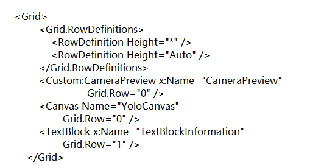
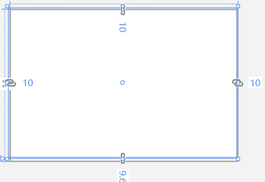
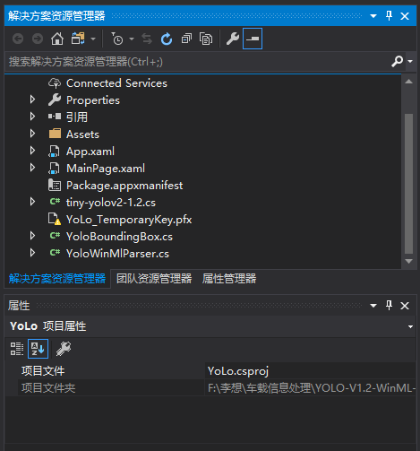

## 基于YOLO的检测
## 简介
YOLO为一种新的目标检测方法，该方法的特点是实现快速检测的同时还达到较高的准确率。可将目标检测任务看作目标区域预测和类别预测的回归问题。该方法采用单个神经网络直接预测物品边界和类别概率，实现端到端的物品检测。同时，该方法检测速非常快，基础版可以达到45帧/s的实时检测；FastYOLO可以达到155帧/s。与当前最好系统相比，YOLO目标区域定位误差更大，但是背景预测的假阳性优于当前最好的方法。 基于深度学习方法的一个特点就是实现端到端的检测。相对于其它目标检测与识别方法（比如Fast R-CNN）将目标识别任务分类目标区域预测和类别预测等多个流程，YOLO将目标区域预测和目标类别预测整合于单个神经网络模型中，实现在准确率较高的情况下快速目标检测与识别，更加适合现场应用环境。后续研究，可以进一步优化YOLO网络结构，提高YOLO准确率。YOLO类型的端到端的实时目标检测方法是一个很好的研究方向。

** YOLO核心思想：
从R-CNN到Fast R-CNN一直采用的思路是proposal+分类 （proposal 提供位置信息， 分类提供类别信息）精度已经很高，但是速度还不行。

** YOLO提供了另一种更为直接的思路： 直接在输出层回归bounding box的位置和bounding box所属的类别(整张图作为网络的输入，把 Object Detection 的问题转化成一个 Regression 问题)。

** YOLO的主要特点：
速度快，能够达到实时的要求。在 Titan X 的 GPU 上 能够达到 45 帧每秒。
使用全图作为 Context 信息，背景错误（把背景错认为物体）比较少。
泛化能力强。
## 应用布局
**MainPage.xaml**在其中的源中加入Grid代码

改布局是一个**CameraPreview**类型的，就是一个摄像机显示区域。
# 效果展示

该方框图将会获取你的摄像头，然后就能显示出里摄像头里的东西。
## 相关项目组件

**YoloWinMlParser.cs**作为可修改编写的程序，在里面能够对物体识别进行的处理,编著和定位对模板可以的识别的事物。

**YoloBoundingBox.cs**同样也是自己进行的程序编辑，这是对摄像头的尺寸加以调整。

**tiny-yolov2-1.2.cs**当我们添加onnx了文件后自动生成的。

**MainPage.xaml.cs**对于显示控件的功能进行定义的程序文件。

## 识别图片展示

## 总结
首先，Yolo 的核心思想是 one-stage 的端到端学习。输入一张图片，输出预测分类， box 个数，box 坐标，所属分类。
其次介绍YOLOv2和YOLO9000，实时检测系统。YOLOv2是最先进的，并且比其他检测系统在各种检测数据集中更快。另外，它可以以各种图像大小运行，以提供速度和精度之间的平滑权衡。
YOLO9000是一个通过联合优化检测和分类检测9000多个目标类别的实时框架。我们使用WordTree来组合来自各种来源的数据和我们的联合优化技术同时训练ImageNet和COCO。YOLO9000是关闭检测和分类之间的数据集大小差距的强大步骤。
