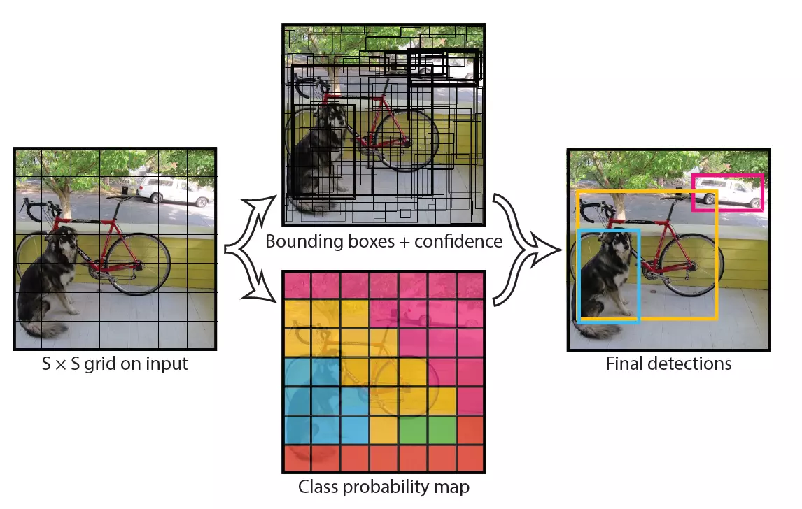

# **第七次课堂总结**
> ## 基于YOLO-V1.2在WINML下的目标检测与识别

## **概念**
* YOLO为一种新的目标检测方法，该方法的特点是实现快速检测的同时还达到较高的准确率。  
* 作者将目标检测任务看作目标区域预测和类别预测的回归问题。  
* 该方法采用单个神经网络直接预测物品边界和类别概率，实现端到端的物品检测。  
* 同时，该方法检测速非常快，基础版可以达到45帧/s的实时检测；FastYOLO可以达到155帧/s。  
* 与当前最好系统相比，YOLO目标区域定位误差更大，但是背景预测的假阳性优于当前最好的方法 
## **YOLO检测物体的流程**

* 分割成单元格
* 预测bbox与类别信息，得到最终的<nobr aria-hidden="true">specificconfidence</nobr>
* 设置阈值，滤掉低分的bbox
* 非极大值抑制得到最终的bbox

## **YOLO目标检测与识别**
* 新建ML项目，在布局文件中写好布局程序
* 添加**tiny-yolov2-1.2.onnx**文件，会生成相应的.cs文件
  
* ``` cs
   private string[] labels = new string[]
            {
                "aeroplane", "bicycle", "bird", "boat", "bottle",
                "bus", "car", "cat", "chair", "cow",
                "diningtable", "dog", "horse", "motorbike", "person",
                "pottedplant", "sheep", "sofa", "train", "tvmonitor"
            };
  ```
* 在labe中列出了能识别的物体
* ``` cs
  private float Sigmoid(float value)
        {
            var k = (float)Math.Exp(value);

            return k / (1.0f + k);
        }
  ```
* 通过激活函数**sigmoid**函数计算k的值
 对于输入的图片，**resize**到网络的输入所需要的大小，经过多重卷积处理，得到了7*7大小的**feature map**。里面的7x7的每个格子就是**grid cell**。  
* 每个**grid cell**会负责预测B个**bounding box**（问题：怎么预测出来的？），以及对于每个类的条件概率。每个**bounding box**的预测内容包括有：box的信息：**x,y,w,h**，以及本bounding box包含有某类物体的置信度。含义如下：  
* —-x,y是相对于**grid cell**的左上角来说的box的中心位置，w,h是box的宽高，相对于整张图片的款高。  
* —-**confidence**的含义：如果这个box包含了任何一种物体，则定义为该box与**ground truth**中的任何一个box的iou的大小，如果该box不包含任何一个物体，则confidence为0。 
* —-每个**grid cell**还会预测C个不同类别的条件概率。即如果这个**grid cell**是包含有物体的，那么对于可能包含的不同物体的概率情况  

``` cs
public IList<YoloBoundingBox> NonMaxSuppress(IList<YoloBoundingBox> boxes, int limit, float threshold)
        {
  ```

> ## 总结
通过本次的实验，对图像识别加深了了解，多了一种方法去了解图形识别，也为今后的的学习多了一种参考。明白了对，boundbox函数，sigmoid函数的调用，threshold函数的去噪效果。希望在报告中能够用的上场
