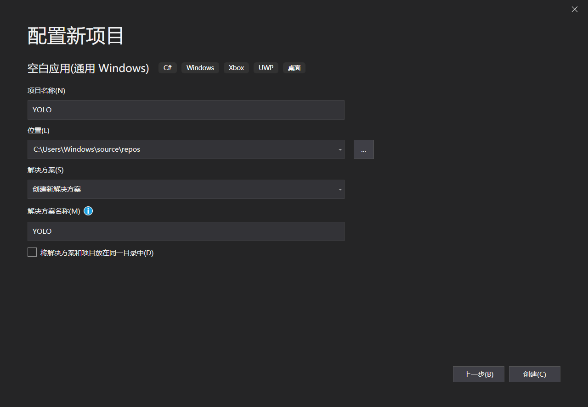
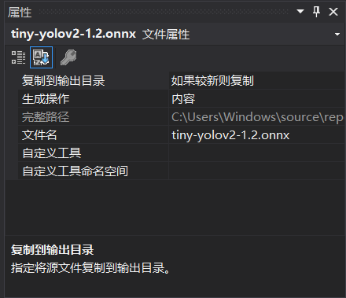
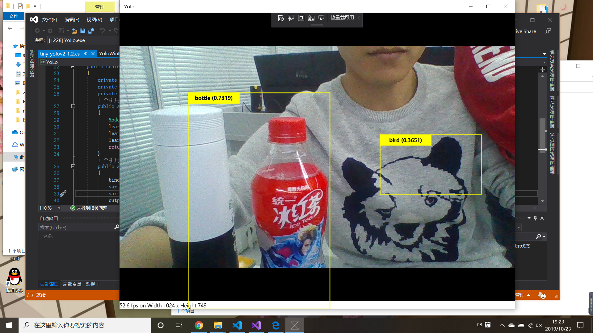
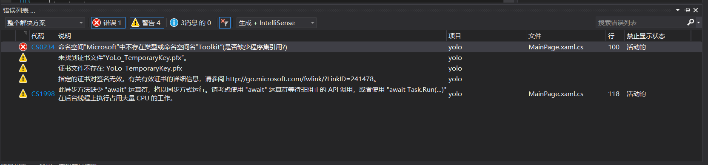
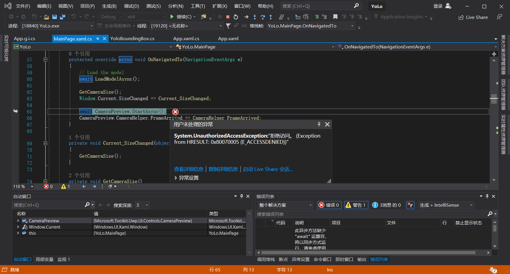

# 第七次课堂总结
&emsp;今天课上主要学习了YOLO的相关知识并用YOLO实现物体识别，,具体的内容如下：
## 一.YOLO
1. YOLO 的核心思想

YOLO 的核心思想就是利用整张图作为网络的输入，直接在输出层回归 bounding box（边界框） 的位置及其所属的类别。

2. YOLO 的实现方法

将一幅图像分成 SxS 个网格（grid cell），如果某个 object 的中心落在这个网格中，则这个网格就负责预测这个 object。 

每个网格要预测 B 个 bounding box，每个 bounding box 除了要回归自身的位置之外，还要附带预测一个 confidence 值。 

这个 confidence 代表了所预测的 box 中含有 object 的置信度和这个 box 预测的有多准这两重信息，其值是这样计算的：  

其中如果有 object 落在一个 grid cell 里，第一项取 1，否则取 0。 第二项是预测的 bounding box 和实际的 groundtruth 之间的 IoU 值。

每个 bounding box 要预测 (x, y, w, h) 和 confidence 共5个值，每个网格还要预测一个类别信息，记为 C 类。则 SxS个 网格，每个网格要预测 B 个 bounding box 还要预测 C 个 categories。输出就是 S x S x (5*B+C) 的一个 tensor。

注意：class 信息是针对每个网格的，confidence 信息是针对每个 bounding box 的。

在 test 的时候，每个网格预测的 class 信息和 bounding box 预测的 confidence信息相乘，就得到每个 bounding box 的 class-specific confidence score:

等式左边第一项就是每个网格预测的类别信息，第二、三项就是每个 bounding box 预测的 confidence。这个乘积即 encode 了预测的 box 属于某一类的概率，也有该 box 准确度的信息。

得到每个 box 的 class-specific confidence score 以后，设置阈值，滤掉得分低的 boxes，对保留的 boxes 进行 NMS 处理，就得到最终的检测结果。

3. YOLO 的实现细节
  
每个 grid 有 30 维，这 30 维中，8 维是回归 box 的坐标，2 维是 box的 confidence，还有 20 维是类别。 

其中坐标的 x, y 用对应网格的 offset 归一化到 0-1 之间，w, h 用图像的 width 和 height 归一化到 0-1 之间。
## 二.物体识别的实现
1. 下载YOLO模型
2. 新建项目
3. 引用模型
4. 修改属性
5. 调试代码
6. 运行

## 三.代码分析
private void Current_SizeChanged(object sender, WindowSizeChangedEventArgs e)

{
GetCameraSize();
}
private void GetCameraSize()

{
_canvasActualWidth = (uint)CameraPreview.ActualWidth;

_canvasActualHeight = (uint)CameraPreview.ActualHeight;

}

调用相机和调整相机大小

private string[] labels = new string[]
            {
                "aeroplane", "bicycle", "bird", "boat", "bottle",
                "bus", "car", "cat", "chair", "cow",
                "diningtable", "dog", "horse", "motorbike", "person",
                "pottedplant", "sheep", "sofa", "train", "tvmonitor"
            };
            
定义标签的名字
## 四.心得体会
&emsp;一开始运行时出现了
后来结果查找发现原因是缺少引用Microsoft.Toolkit，在引用中右键管理NuGet包，在浏览中下载缺少的引用后问题得到解决，但随之又出现
查找网络发现原因是权限不足，需要添加账户，但在反复尝试后仍未解决。将整个文件直接打开后可以运行出结果，并未出现问题，问题的根源应该还是缺少对应的文件。通过观察运行的结果发现识别的效果不是很理想，经常出现错误的识别结果，运行时占用大量cpu资源，代码仍需要进一步修改。