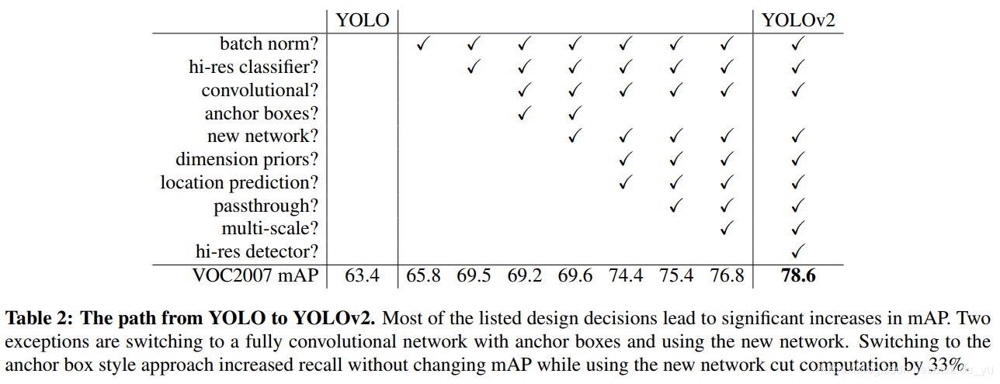
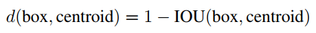
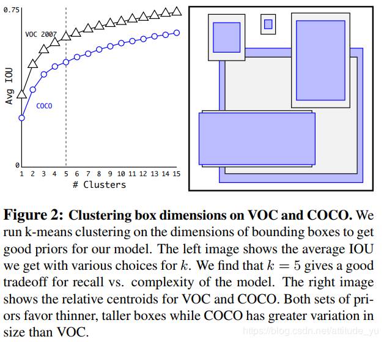
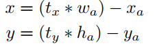
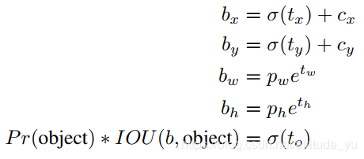
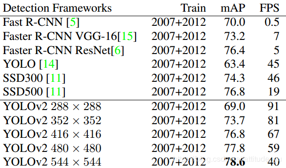
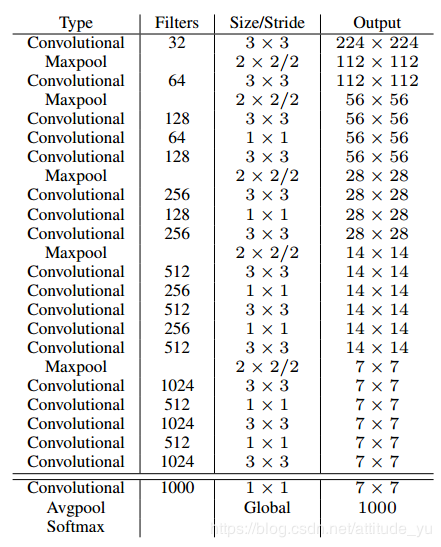
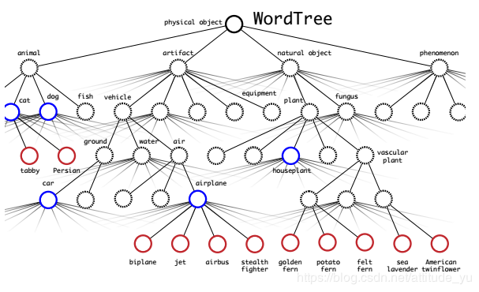
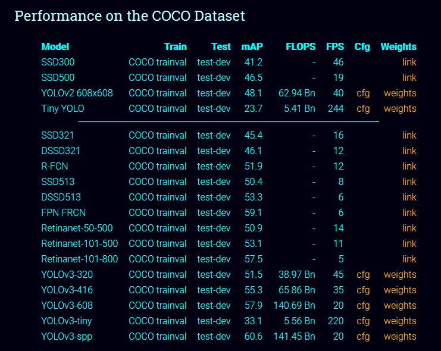

>>>>>>>>># 第七次作业
>>>>### 1.目标检测与识别
#### （1） YOLO
#### * YOLO V1
主要贡献和优势：
  虽然 Fast R-CNN 已经相当优秀，但是其仍旧不是真正意义上的一体式目标检测网络，其性能仍有提升的空间。
  针对 R-CNN 系列的分段式设计的问题，YOLO 提出一种全新的 loss 计算方式，重新定义了目标检测问题，将其定义为回归问题进行训练，同时进行定位和分类的学习。
  YOLO 的核心，在于其损失函数的设计。其一体式架构设计，计算量更少，速度更快，易于优化，且满足实时检测的需求。

 YOLO V1 具有以下优势：
1.速度极快，易于优化：只需读取一次图像，就可进行端对端优化，可满足实时需求
2.背景误识别率低：对全图进行卷积学习，综合考虑了全图的上下文信息
3.泛化性能好：也是由于综合考虑了图片全局，因此能够更好地学习数据集的本质表达，泛化性能更好
4.识别精度高

#### * YOLO v2
 与最先进的检测系统相比，YOLO v1存在各种各样的缺点。YOLO v1与Fast R-CNN相比的误差分析表明，YOLO v1产生了大量的坐标定位误差。此外，与RPN相比，YOLO召回率相对较低。因此，本文主要关注改善召回和坐标定位，同时保持的分类准确性。
 

 ### (1) better
* 1.Batch Normalization
  + 通过在YOLO v1中的所有卷积层上增加批标准化操作，mAP可提高2％。 
  + 批标准化可以显着改善收敛性，同时不需要其他形式的正则化，即可删除dropout操作而不会产生过拟合。

* 2.High Resolution Classifer
  + YOLO v1首先以224×224分辨率训练的网络参数预训练网络，然后将输入图像分辨率resize到448x448以进行检测。这意味着网络必须首先学习调整到新的输入分辨率（448），将影响学习效果。
  + YOLO v2则首先在分类网络上以224x224的分辨率预训练网络；然后，以448×448的分辨率对ImageNet上训练10个epoches进行微调；最后，使用此训练后的参数进行权重初始化。这给了网络时间去调整其filter以更好地处理更高分辨率的输入，mAP可提高接近4％。

* 3.Convolutional With Anchor Boxes
  + YOLO v1直接使用卷积特征提取器顶部的全连接层来预测边界框的坐标。
  
  + YOLO v2移除全连接层，并引用anchor boxes来预测边界框。首先，删除一个池化层，以使网络卷积层的输出具有更高的分辨率。另外，缩小输入图像为416x416，而不是448×448。此做法可使特征图的size是奇数，保证只有一个中心网格单元。这是因为考虑到图片中的目标往往占据图像的中心，所以最好在中心拥有一个位置来预测这些目标，而不是利用四个位置来预测。YOLO v1的卷积图像下采样步长为32，所以对于416x416的输入图像，可得到13×13的输出特征图。
  
  + YOLO v1，每个网格都预测2个boxes，每个boxes包含5个值，前4个值是预测框相对于网格左上角的偏移量和预测框相对于整个特征图的比例，第5个值是置信度。但是每个网格只预测一套分类概率值，供2个boxes共享。

  + YOLO v2利用anchor boxes，使得每个位置的各个anchor box都单独预测一套分类概率值。另外，使用anchor boxes，会使得精确度的小幅下降。如果没有anchor boxes，本文的中间模型将获得69.5 mAP，召回率为81％。使用anchor boxes本文的模型得到69.2 mAP，召回率为88％。尽管mAP下降，但召回率的增加意味着本文的模型有更大的提升空间。

* 4.Dimension Clusters
  + 其它论文中使用anchor boxes的尺寸是人为自定义的。而如果本文选择更好的anchor boxes，可以让网络更容易学习预测好的检测结果。
  + YOLO v2不用自定义anchor boxes尺寸，而是在训练集anchor boxes上运行k-means聚类，自动找到良好的anchor boxes尺寸。但是，如果本文使用具有欧氏距离的标准k-means，那么较大的边界框比较小的边界框会产生更多的误差。距离度量公式:
  
  
  

* 5.Direct location prediction
  + 当在YOLO v2中使用anchor boxes时，会遇到第二个问题：模型不稳定，尤其是在早期迭代过程中。其中大部分不稳定来自于预测框的（x,y）位置。在RPN中，网络预测的坐标偏移值tx和ty以及预测框的实际中心坐标（x,y）的计算公式如下：

  + YOLO v2则沿用YOLO v1的方法预测相对于网格左上角的偏移值，然后使用非线性函数限制预测值在0到1之间。假设网络预测输出特征图中每个cell有5个边界框，网络为每个边界框预测5个坐标tx，ty，tw，th和to。如果单元格从图像的左上角偏移（cx,cy），并且之前的边界框具有宽度和高度pw，ph，则预测框的坐标公式为：

*  6.Fine-Grained Features
  + YOLO v2基于13×13特征图预测检测结果，虽然这对于大型物体是足够的，但是对于定位较小物体需要更细粒度的特征。本文通过添加一个以26×26分辨率的早期特征图的passthrough层来获得细粒度的特征。
  + passthrough层将浅层特征图(26x26x512)reshape成新的特征图(13x13x2018)，之后将其与深层特征图按通道相连接，mAP提高1％。

* 7.Multi-Scale Training
  + YOLO v1使用448×448的输入分辨率，随着anchor boxes的加入，本文将分辨率更改为416×416。但是，由于本文的模型仅使用卷积层和池化层，因此可以在不同尺寸的图像上运行。由于本文的模型下采样32倍，可设置最小的图像大小是320×320，最大的是608×608。在训练过程中每10个batches，会随机选择一个新的图像尺寸大小继续训练。这意味着相同的网络可以预测不同分辨率下的检测结果。网络在较小的尺寸下运行速度更快，但mAP不如高分辨率的。因此，YOLO v2可以在速度和准确性之间轻松进行折中。
  
  
  ### (2)Faster
   本文希望检测结果准确，同时也希望检测速度更快。大多数用于检测的应用程序（如机器人或自动驾驶）都依赖于低延迟预测。
   以224×224分辨率在单个图像上进行单次传递，VGG-16的卷积层需要306.90亿次浮点运算；YOLO v1框架只有85.2亿次浮点运算。但是，它的准确性比VGG-16稍差。
* 1.Darknet-19网络结构
   + 新的分类模型作为YOLO v2的框架,与VGG模型类似，卷积层使用常用的3×3滤波器，经过池化步骤之后，通道数量加倍；使用global average pooling来预测；并在3×3卷积之间使用1x1卷积压缩通道和减少计算量；每层加入批标准化操作，加速收敛，防止过拟合。 
   + 它有19个卷积层和5个最大池化层。Darknet-19只需要55.8亿次操作来处理图像，但在ImageNet上达到72.9％的top-1精度和91.2％的top-5精度。

* 2.训练过程参数
  + 标准ImageNet 1000类分类数据集对160个epoches进行训练，使用随机梯度下降，初始学习率为0.1，衰减率10-4次方，衰减权重为0.0005，动量为0.9 ,并且使用Darknet神经网络框架。在训练过程中，对数据集使用数据增强技巧，包括随机裁剪，随机旋转等。

  ### (3)Stronger

### * YOLO 3

YOLO 一代一代的在更新改进。

* (1)第三版的新资源
  + YOLOv3YOLOv3使用一些技巧来改进训练和提高性能，包括:多尺度预测、更好的主干分类器等等。

* （2）COCO数据集的性能
  

* (3)怎么工作
  + 先前的检测系统重新利用分类器或定位器来执行检测。他们将模型应用于多个位置和比例的图像。图像的高得分区域被认为是检测。

  + 我们使用完全不同的方法。我们将单个神经网络应用于整个图像。该网络将图像分成多个区域，并预测每个区域的边界框和概率。这些边界框由预测的概率加权。

  + 与基于分类器的系统相比，我们的模型有几个优点。它在测试时观察整个图像，因此它的预测是由图像中的全局上下文提供的。它还通过单个网络评估进行预测，这与像美国有线电视新闻网这样的系统不同，后者需要数千张图像。这使得它速度极快，比美国有线电视新闻网快1000多倍，比美国有线电视新闻网快100倍。

* 检测的不仅仅只是人物，会有很多实物，比如杯子，水果等等。
  
* 参考网址：https://pjreddie.com/darknet/yolo/ （因为是全英文的，而且还带着很多我们没有接触的，就没有仔细翻译，大概的看了看，发现了如上讲述）
  
### (2)目标检测
  + 目标检测，也叫目标提取，是一种基于目标几何和统计特征的图像分割，它将目标的分割和识别合二为一，其准确性和实时性是整个系统的一项重要能力。尤其是在复杂场景中，需要对多个目标进行实时处理时，目标自动提取和识别就显得特别重要。

  + 随着 计算机技术的发展和计算机视觉原理的广泛应用，利用计算机图像处理技术对目标进行实时跟踪研究越来越热门，对目标进行动态实时跟踪定位在智能化交通系统、 智能监控系统、军事目标检测及医学导航手术中手术器械定位等方面具有广泛的应用价值。

### (3)目标识别
  + 目标识别是指一个特殊目标（或一种类型的目标）从其它目标（或其它类型的目标）中被区分出来的过程。它既包括两个非常相似目标的识别，也包括一种类型的目标同其他类型目标的识别。
  
  + 原理：
  + 目标识别的基本原理是利用雷达回波中的幅度、相位、频谱和极化等目标特征信息，通过数学上的各种多维空间变换来估算目标的大小、形状、重量和表面层的物理特性参数，最后根据大量训练样本所确定的鉴别函数，在分类器中进行识别判决。
  
  + 步骤：
  + 1.从已知目标的后向散射电磁波中提取特征
  + 2.建立已知目标的特征数据库
  + 3.通过实时信号处理器提取未知目标的特征
  + 4.将这些特征同数据库的特征进行比较并作出决策
  
  + 应用：
  + 目标识别技术已广泛应用于国民经济、空间技术和国防等领域。

  + 利用雷达和计算机对遥远目标进行辨认。现代雷达（包括热雷达和激光雷达）不但是对遥远目标进行探测和定位的工具，而且能够测量与目标形体和表面物理特性有关的参数，进而对目标分类和识别。雷达目标识别技术开始于50年代末期，美国人用单脉冲雷达跟踪并记录了苏联发射的第二颗人造地球卫星的回波，通过对回波信号的分析，确认卫星上装有角反射器。现代防空雷达已具有辨认少数典型飞机机型的能力。反弹道导弹防御雷达(见目标截获和识别雷达)能从洲际导弹的碎块和少量诱饵中识别出真弹头。在空间探测中，对月球和金星表面的地形测绘和电磁物理特性参数测量，以及判定卫星发射后太阳电池翼是否打开等，都能应用目标识别技术。

  + 在地球遥感方面，微波遥感仪器可以测定潮汐、海冰厚度和海面风速;可以对农作物分类辨识,并作长势检查和产量估计；还可以勘探矿藏和石油等地球资源。

  + 目标识别还可利用再入大气层后的大团过滤技术。当目标群进入大气层时，在大气阻力的作用下，目标群中的真假目标由于轻重和阻力的不同而分开，轻目标、外形不规则的目标开始减速，落在真弹头的后面，从而可以区别目标。目标分类与目标识别的含义稍有不同。目标分类是将被测目标与已知目标的训练样本一一比较，回答同或异（真或假）。而目标识别还要求指出目标特性的具体数值，如形体、表面粗糙度和介电常数等。因此识别比分类包含更多的目标特征信息。

>>>>>>### 总结：
#### 其实对于一步一步的学习过来，对于这些更加的有好奇和探索，就像用镜头来识别人物，实物。这些以前都没有接触过，包括以前多半都是我们看着老师的展示，老师的描述，所以觉得真的离我们很远，我们可能根本写不出来，因为老师和我们的差距太大了。
#### 可是接触了这个课程之后，觉得其实不难，自己多看看书籍、资料，这样也能自己写出这样的代码。其实距离我们不遥远的。
#### 这次作业的描写是我在网上的查询，自己观看，摘录得到的最后结果。形成了这次的作业。