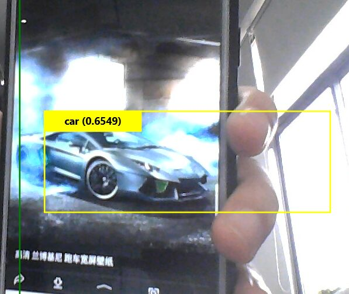

# 第七次作业
## YoLo
YOLO（You Only Look Once）是一种基于深度神经网络的对象识别和定位算法，其最大的特点是运行速度很快，可以用于实时系统.
## 目标检测
目标检测是我们用于识别图像中目标位置的技术。如果图像中有单个目标，并且我们想要检测该目标，则称为图像定位。如果图像中有多个目标，就是目标检测！
目标检测定位图像中目标的存在，并在该目标周围绘制一个边界框(bounding box)。这通常包括两个过程:预测目标的类型，然后在该目标周围绘制一个框。
这次目标检测用到的常见模型架构是YOLO。
## 对象识别和定位

对象识别和定位，可以看成两个任务：找到图片中某个存在对象的区域，然后识别出该区域中具体是哪个对象。
对象识别这件事（一张图片仅包含一个对象，且基本占据图片的整个范围），最近几年基于CNN卷积神经网络的各种方法已经能达到不错的效果了。所以主要需要解决的问题是，对象在哪里。
YOLO创造性的将候选区和对象识别这两个阶段合二为一，看一眼图片（不用看两眼哦）就能知道有哪些对象以及它们的位置。
实际上，YOLO并没有真正去掉候选区，而是采用了预定义的候选区也就是将图片划分为 7*7=49 个网格（grid），每个网格允许预测出2个边框（bounding box，包含某个对象的矩形框），总共 49*2=98 个bounding box。可以理解为98个候选区，它们很粗略的覆盖了图片的整个区域。
## 设计理念
Yolo算法采用一个单独的CNN模型实现end-to-end的目标检测，具体来说，Yolo的CNN网络将输入的图片分割成 [s*s] 网格，然后每个单元格负责去检测那些中心点落在该格子内的目标，
如上图所示，可以看到汽车这个目标的中心落在位于中间左右的一个单元格上，那么该单元格负责预测这个汽车。每个单元格会预测 B 个边界框（bounding box）以及边界框的置信度.
## 实验总结
本次实验由于文档上没有对操作过多的说明，所以我先对YOLO进行了一些了解，　YOLO不同于其它一些目标检测算法，它是将目标检测抽象为一个回归问题，直接使用一个神经网络，输入为原始图片，输出为边界框坐标、目标类别、目标置信度等，YOLO将其他模型分开的部分都综合到一个神经网络中，使得训练能够采用端到端（end-to-end）来优化。同时，这种改进不仅使得训练变得容易，也使得检测速度很快。然后，去了解下对象的识别。但在本次实验中，有一个其它问题，就是在物体的识别上会出现一些错误，就是会将马识别成狗。其次，在这次实验中，YOLO的定位也不是很准确。
总的来说这次实验比较成功，期待下次试下其它的来实现目标检测与识别，进行下比较，看看定位和识别怎么样。
