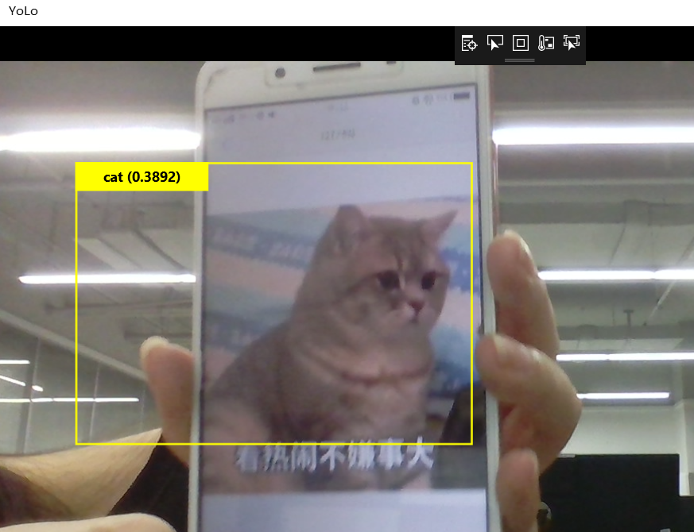

# 第七次作业
## 智能驾驶环境感知实时对象检测
### 环境感知技术
自动驾驶四大核心技术，分别是环境感知、精确定位、路径规划、线控执行。 环境感知是其中被研究最多的部分，不过基于视觉的环境感知是无法满足无人驾驶要求的。

环境感知主要包括三个方面，路面、静态物体和动态物体。 对于动态物体，不仅要检测还要对其轨迹进行追踪，并根据追踪结果，预测该物体下一步的轨迹（位置）。这在市区，尤其中国市区必不可少，最典型场景就是北京五道口：如果你见到行人就停，那你就永远无法通过五道口，行人几乎是从不停歇地从车前走过。人类驾驶员会根据行人的移动轨迹大概评估其下一步的位置，然后根据车速，计算出安全空间（路径规划），公交司机最擅长此道。无人车同样要能做到。 要注意这是多个移动物体的轨迹的追踪与预测，难度比单一物体要高得多。这就是 MODAT(Moving Object Detection and Tracking)。也是无人车最具难度的技术。 
一个模式识别系统包括特征和分类器两个主要的组成部分，二者关系密切，而在传统的方法中它们的优化是分开的。在神经网络的框架下，特征表示和分类器是联合优化的。两者密不可分。深度学习的检测和识别是一体的，很难割裂，从一开始训练数据即是如此，语义级标注是训练数据的最明显特征。绝对的非监督深度学习是不存在的，即便弱监督深度学习都是很少的。因此视觉识别和检测障碍物很难做到实时。而激光雷达云点则擅长探测检测障碍物 3D轮廓，算法相对深度学习要简单的多，很容易做到实时。激光雷达拥有强度扫描成像，换句话说激光雷达可以知道障碍物的密度，因此可以轻易分辨出草地，树木，建筑物，树叶，树干，路灯，混凝土，车辆。这种语义识别非常简单，只需要根据强度频谱图即可。而视觉来说要准确的识别，非常耗时且可靠性不高。 
### YOLO
3D中的对象检测和分类是自动驾驶（AD）中的关键任务。 LiDAR传感器用于提供周围环境的3D点云重建，而3D物体边界框实时检测任务仍然是一个强大的算法挑战。 在本文中，我们建立了二维透视图像空间中一次性回归元架构的成功，并将其扩展为从LiDAR点云生成定向三维对象边界框。 我们的主要贡献在于扩展YOLO v2的损失函数，包括偏航角，笛卡尔坐标系中的3D框中心和框的高度作为直接回归问题。 该配方可实现实时性能，这对于自动驾驶至关重要。 我们的结果显示了KITTI基准测试的有希望的数据，在Titan X GPU上实现了实时性能（40 fps）。

重磅3D目标检测YOLO3D人工智能自动驾驶之3D中的对象检测和分类简介，自动驾驶（AD）的成功在很大程度上取决于有效的环境感知。传感器技术是环境感知的推动者。基于LiDAR的环境感知系统是同质（相同传感器类型）或异构（不同传感器类型）融合系统的基本组件。 LiDAR的关键特征是其以高精度感知深度的物理能力。

环境感知中最重要的任务是对象边界框（OBB）检测和分类，其可以在2D（鸟瞰图）或3D空间中完成。与基于相机的系统不同，LiDAR点云缺少相机RGB透视场景中存在的一些特征，如颜色。这使得LiDAR的分类任务变得更加复杂。另一方面，深度由LiDAR作为自然测量给出，其能够进行3D OBB检测。 LiDAR点云的密度在物体类型的有效分类中起着至关重要的作用，尤其是行人和动物等小物体。

实时性能在AD系统中至关重要。虽然深度学习（DL）在基于相机的计算机视觉中具有众所周知的成功故事，但由于昂贵的卷积操作，这种方法在其推理路径中遭受高延迟。在对象检测的背景下，存在解决实时性能问题的丰富文献。像YOLO [1]和SSD [2]这样的单发探测器在这方面是最好的。
### 通过vs实现
首先在Visual Studio中支持的JavaScript智能感知有以下6种
* summary 	用于方法和主体内容
* param 	用于方法的参数
 param有2个参数 name和type以及内容。

name：对应参数名称

type：参数类型

Description：为要提示的内容

integer：是否为int类型(可选)[默认为false]

optional：参数是否可选(可选)[默认为false]
* field 	用于类的属性
* value 	用于getter和setter方法
* returns 	用于返回值
* reference 	引用其他JavaScript
最终运行效果图如下所示

### 总结
通过本节课的学习，我学会了如何利用vs进行环境感知，来识别周边环境，收获颇多，受益匪浅，为之后的学习打下了深厚的基础