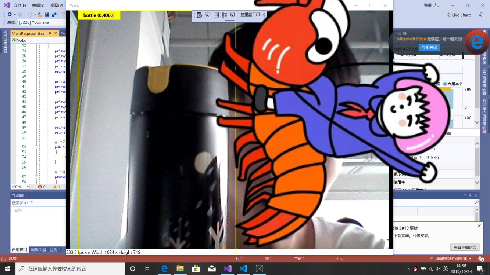

# 目标检测与识别——YOLO
***
目前，基于深度学习算法的一系列目标检测算法大致可以分为两大流派：

1.两步走（two-stage）算法：先产生候选区域然后再进行CNN分类(RCNN系列)，

2.一步走（one-stage）算法：直接对输入图像应用算法并输出类别和相应的定位(YOLO系列)

YOLO的实现方案

1）YOLO 的核心思想

YOLO 的核心思想就是利用整张图作为网络的输入，直接在输出层回归 bounding box（边界框） 的位置及其所属的类别。

2）YOLO 的实现方法

将一幅图像分成 SxS 个网格（grid cell），如果某个 object 的中心落在这个网格中，则这个网格就负责预测这个 object。每个网格要预测 B 个 bounding box，每个 bounding box 除了要回归自身的位置之外，还要附带预测一个 confidence 值 

1）结构
去掉候选区这个步骤以后，YOLO的结构非常简单，就是单纯的卷积、池化最后加了两层全连接。单看网络结构的话，和普通的CNN对象分类网络几乎没有本质的区别，最大的差异是最后输出层用线性函数做激活函数，因为需要预测bounding box的位置（数值型），而不仅仅是对象的概率。所以粗略来说，YOLO的整个结构就是输入图片经过神经网络的变换得到一个输出的张量，

# 实验成果

# 总结
 
        谈起计算机视觉时，首先想到的就是图像分类，图像分类是计算机视觉最基本的任务之一，但是在图像分类的基础上，还有更复杂的任务，如目标检测，物体定位，图像分割等，这些都与无人汽车的视觉处理方面紧密联系，只有做好这些，车辆才能在相应的场景做出正确的判断，这次学习的YOLO算法就是很好的目标检测算法，使我们摸到了图像处理的门槛，初步的了解到无人驾驶视觉处理方面的知识。