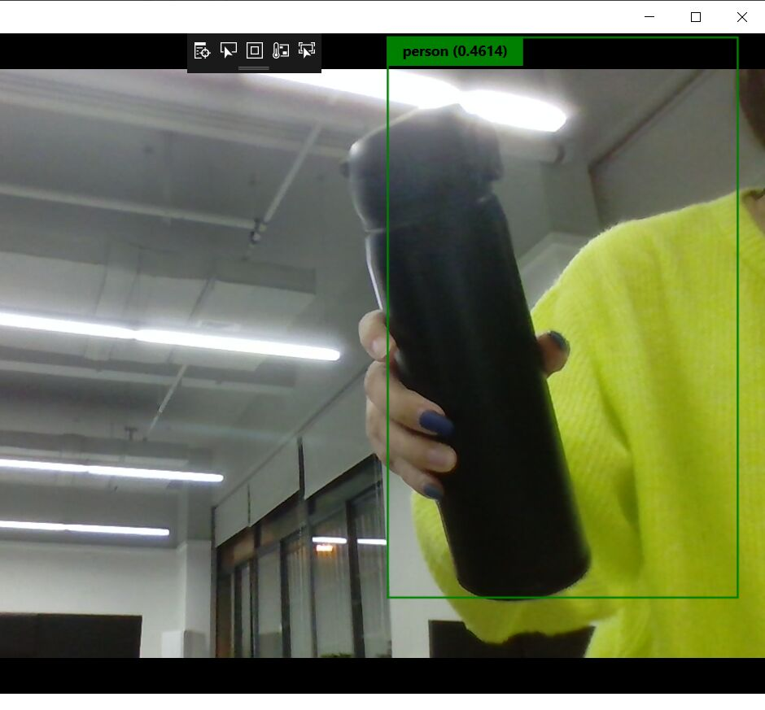

# 第七次作业
## YOLO-V1.2-WinML-Sample
更新以使用win-ml的发布预览。

使用tinyyolo的windows机器学习实现（您只查看一次）。有关yolo的详细信息，请访问发明人网站：https://pjreddie.com/darknet/yolo/

## Acknowledgements
此示例项目基于https://elbruno.com/2018/06/28/winml-how-to-create-a-windows10-app-using-yolo-for-object-detection/和https://github.com/sevans4067/winml-tinyyolo的工作

## Setup
要试用预发布的WindowsML，您需要Windows10Insider预览版（内部版本17728或更高版本）和Windows10SDK（内部版本17723或更高版本）。

如果在桌面Windows上运行，则需要将配置设置为x64。

## Model
嵌入此项目的tiny-yolov2-1.2.onnx模型是从位于https://gallery.azure.ai/model/tiny-yolov2-1-2-3的模型创建的。这个模型表示yolov2 1.2，是在pascal voc项目的类基础上构建的。有关如何将模型转换为onnx的详细信息，请参见https://github.com/onnx/onnxmltools。

Windows ML需要OnNX型号，版本1.2或更高-https://docs.microsoft.com/en-us/windows/ai/get-onnX-model

## 目标检测的方法
1.采用滑动窗口，对每个窗口分类和位置修正；2.RPN的方式先提取候选区域，特征图对应候选区域范围经过roipooling得到所需特征；3.SSD继承RPN类似的anchor机制，设定预设框并对每个预设框赋予groundtruth，全卷积网络训练目标。

yolo将输入图像划分为 𝑆×𝑆
S×S的网格，物体的中心落在哪一个网格内，这个网格就负责预测该物体的置信度，类别以及位置。

网络最后的输出是 𝑆×𝑆×30
S×S×30的数据块，yolov1是含有全连接层的，这个数据块可以通过reshape得到。也就是说，输出其实已经丢失了位置信息（在v2，v3中用全卷积网络，每个输出点都能有各自对应的感受野范围）。这么一看，yolov1根据每张图像的目标label，编码出一个 𝑆×𝑆×30
S×S×30的数据块，然后让卷积网络去拟合这个target。
## 损失函数
yolov1的损失函数全是均方误差，需要理解的是其含义。

首先要明确两个概念，一是网格中有无目标，二是网格中的一个目标只有一个box负责（responsible）另一个box也算没有目标，根据在线计算IOU的大小确定哪一个负责。

类别损失：容易理解，含有目标的网格才有类别损失，其他都不需要回传损失，也就不需要计算。默认网格只出现一种类别，这当然是有缺陷的。yolov1对于一些聚集的目标，检测效果会不好。其实聚集目标本身也算很难检测的情况吧。
## 实验结果

## 总结
通过本次实验，我对活体识别的技术有了更深入的了解，，课程的实用技术很强，因此实验就显得非常重要。刚开始做实验时，由于我的编程技术不是很好，加上基础也不是特别好，在实验过程中，遇到了许多难题，这让我感到理论知识的重要性，但是我没有放弃，在试验中发现问题，自己查阅资料。独立思考，最终解决问题，从而加深我对课本理论知识的理解。YOLO v1是一个端到端的目标检测算法，通过一个CNN网络可以输出物体的类别以及物体的位置（还有类别的置信度)，相较于其他的先进的物体检测系统，YOLO的物体定位精确度低，对小物体的检测效果不太好，但是在背景上预测出不存在的物体的情况要少一些.通过这次实验，是我学习到了不少实用的东西，更重要的是做实验的过程，思考问题的方法，真正使我们受益匪浅。