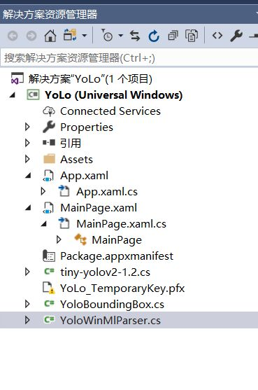
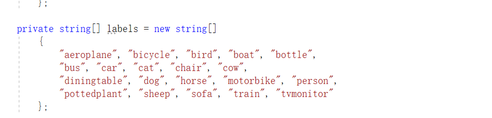
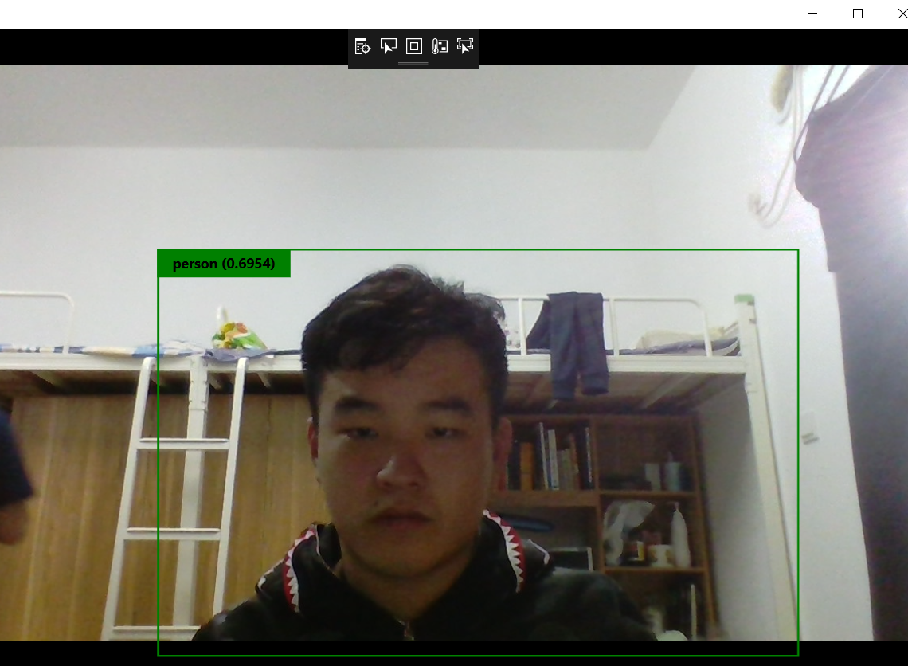

# YOLO-V1.2-WinML-Sample

## 应用布局
**MainPage.xaml**在其中的源中加入Grid代码

    <Grid>
            <Grid.RowDefinitions>
                <RowDefinition Height="*" />
                <RowDefinition Height="Auto" />
            </Grid.RowDefinitions>
            <Custom:CameraPreview x:Name="CameraPreview"
                            Grid.Row="0" />
            <Canvas Name="YoloCanvas"
                    Grid.Row="0" />
            <TextBlock x:Name="TextBlockInformation"
                    Grid.Row="1" />
        </Grid>

改布局是一个**CameraPreview**类型的，就是一个摄像机显示。其效果图
该方框图将会获取你的摄像头，然后就能显示出里摄像头里的东西。

## 文件

**YoloWinMlParser.cs**是编写的程序，里面是是对物体识别进行的处理如图所示，编著和定位对模板可以的识别的东西。

**YoloBoundingBox.cs**同样也是自己进行的程序编辑，这是对摄像头的尺寸进行的操作

**tiny-yolov2-1.2.cs**是添加onnx文件后自动生成的程序。

**MainPage.xaml.cs**是编写代码，对于显示控件的功能进行定义。

## 。代码的理解

    private void GetCameraSize()
            {
                _canvasActualWidth = (uint)CameraPreview.ActualWidth;
                _canvasActualHeight = (uint)CameraPreview.ActualHeight;
            }

    private async void CameraHelper_FrameArrived(object sender, Microsoft.Toolkit.Uwp.Helpers.FrameEventArgs e)
            {
                if (e?.VideoFrame?.SoftwareBitmap == null) return;

                SoftwareBitmap softwareBitmap = SoftwareBitmap.Convert(e.VideoFrame.SoftwareBitmap, BitmapPixelFormat.Bgra8, BitmapAlphaMode.Premultiplied);
                VideoFrame inputFrame = VideoFrame.CreateWithSoftwareBitmap(softwareBitmap);
                _input.image = ImageFeatureValue.CreateFromVideoFrame(inputFrame);

                // Evaluate the model
                _stopwatch = Stopwatch.StartNew();
                _output = await _model.EvaluateAsync(_input);
                _stopwatch.Stop();

                IReadOnlyList<float> VectorImage = _output.grid.GetAsVectorView();
                float[] ImageAry = VectorImage.ToArray();

                _boxes = _parser.ParseOutputs(ImageAry);

                await Dispatcher.RunAsync(CoreDispatcherPriority.Normal, async () =>
                {
                    TextBlockInformation.Text = $"{1000f / _stopwatch.ElapsedMilliseconds,4:f1} fps on Width {_canvasActualWidth} x Height {_canvasActualHeight}";
                    DrawOverlays(e.VideoFrame);
                });

                //Debug.WriteLine(ImageList.ToString());
            }
>其中
    await Dispatcher.RunAsync(CoreDispatcherPriority.Normal, async () =>
                {
                    TextBlockInformation.Text = $"{1000f / _stopwatch.ElapsedMilliseconds,4:f1} fps on Width {_canvasActualWidth} x Height {_canvasActualHeight}";
                    DrawOverlays(e.VideoFrame);
                });这是对帧率，界面的高宽的显示

## 实验结果
**识别出了我本人的人脸**

# 总结
这个实验的在学习的时候听起来很简单，但实际操作的过程种很有点难度，在实际操作过程种遇到了很多困难，其中一点，对于摄像头数据的获取，很难去做，试了很多次都运行不了，最后请教了几个同学才完成。该实验的损耗计算机资源非常大，其onnx模板的获取也是非常之难的，代码不需要自己进行编写，可以直接复制粘贴老师给的内容，减轻了我们不少的负担。这次的WinML文件和之前学习的内容大不相同，多了两个cs文件，需要自己去理解，然后进行编辑，有一定的难度，对于我来说，十分困难，因为我对程序代码的编辑很不熟悉。这个程序需要很强的代码编辑能力，遇到了很多困难只能说明平时的基本功很不扎实，希望以后的学习自己能够更加努力，更加用心，打好基础！