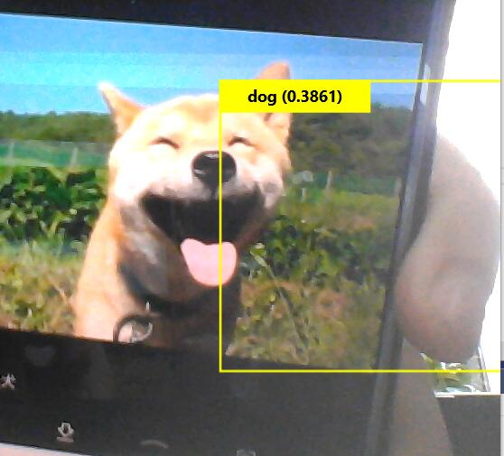

学习总结：
今天学习了用windows ML来进行实时对象检测（YOLO)
1. YOLO(You Only Look Once)简介:

    YOLO为一种新的目标检测方法，该方法的特点是实现快速检测的同时还达到较高的准确率。作者将目标检测任务看作目标区域预测和类别预测的回归问题。该方法采用单个神经网络直接预测物品边界和类别概率，实现端到端的物品检测。同时，该方法检测速非常快，基础版可以达到45帧/s的实时检测；FastYOLO可以达到155帧/s。与当前最好系统相比，YOLO目标区域定位误差更大，但是背景预测的假阳性优于当前最好的方法。

2. YOLO采用单个卷积神经网络来预测多个bounding boxes和类别概率 ，优点：

    一，非常快。YOLO预测流程简单，速度很快。我们的基础版在Titan X GPU上可以达到45帧/s； 快速版可以达到150帧/s。因此，YOLO可以实现实时检测。

    二，YOLO采用全图信息来进行预测。与滑动窗口方法和region proposal-based方法不同，YOLO在训练和预测过程中可以利用全图信息。Fast R-CNN检测方法会错误的将背景中的斑块检测为目标，原因在于Fast R-CNN在检测中无法看到全局图像。相对于Fast R-CNN，YOLO背景预测错误率低一半。

    三，YOLO可以学习到目标的概括信息（generalizable representation），具有一定普适性。我们采用自然图片训练YOLO，然后采用艺术图像来预测。YOLO比其它目标检测方法（DPM和R-CNN）准确率高很多。

    YOLO的准确率没有最好的检测系统准确率高。YOLO可以快速识别图像中的目标，但是准确定位目标（特别是小目标）有点困难。
3. YOLO是如何运作方式：
   
   

   YOLO将图像分成13×13个单元格：每个单元格负责预测5个边界框。边界框描述包围对象的矩形。YOLO还输出一个置信度，告诉我们预测的边界框实际包含某个对象的程度。

    先前的检测系统使用分类器或定位器进行检测，将模型应用于图像的多个位置和尺度，图像的高得分区域作为检测目标。

    YOLO则采取了完全不同的方法。它将单个神经网络应用于整个图像，该网络将图像分成区域，预测每个区域的边界框和概率，并依据概率大小对所有边框分配权重。
4. 环境要求：
     
   要试用预发布的Windows ML，您需要Windows 10 Insider Preview（内部版本17728或更高版本）和Windows 10 SDK（内部版本17723或更高版本）。如果在桌面Windows上运行，则需要将配置设置为x64
   
   然后用代码分析和运行
   
   运行结果：（如图）
   

   总结：通过这次实验了解了实时对象检测的原理和方法，进一步熟悉一些关于AI的相关知识及应用。
   也增强了自己的动手能力 。通过这次试验觉得AI很有趣能更加让我去深入的了解它。
    