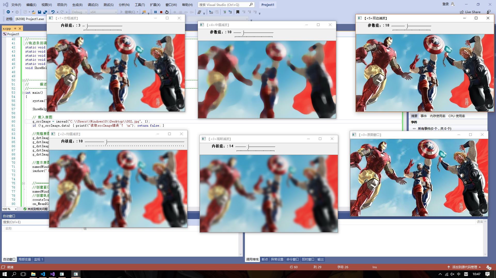
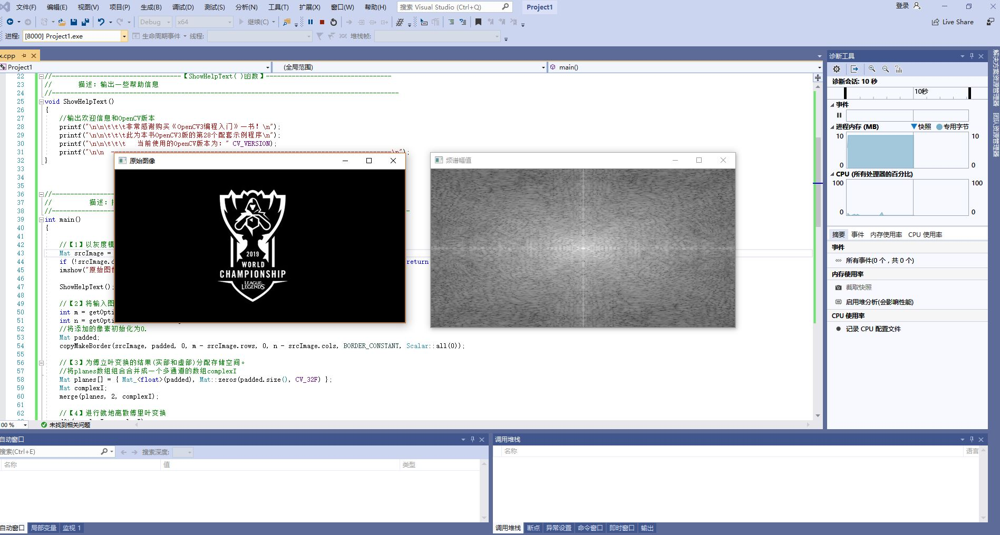

# 一、图像预处理技术
## 1.基本操作
 邻域、邻接、区域和连通

 模板运算

## 2.图象增强  
### 基本概念：
   图像增强的主要目标是通过对图像的处理，是图像比处理前更适合一个特定的应用
### 直方图均匀化：

## 3.图像复原
### 基本概念：
   对退化的图像进行处理趋向于复原没有退化的理想图像
### 滤波：

## 4.图像傅里叶变换

# 二、图像特征提取与分析
## 基本概念：根据待识别的图像，通过计算产生一组原始特征。

## 颜色直方图

## 霍夫线变换

# 三、心得体会
        通过数字图像处理技术的学习，我大致了解数字图像处理技术的概念并初步熟悉了对图像的一些处理方法。以前只知道能利用Photoshop处理图像，通过本次数字图像处理技术的学习，我能对图像进行一些简单的操作变换。同时，在学习中应该注意加强软件研究，加强边缘学科的学习，加强理论知识学习。
  
