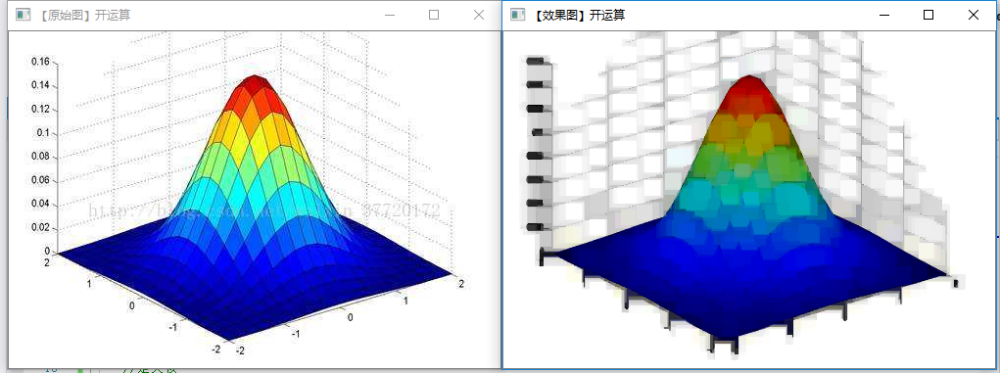

RobotVision
-----
# 第三次总结
## core组件进阶

### 访问图像中的元素
1.图像在内存中的储存方式
    图像矩阵的大小取决于所用的颜色模型，即通道数。

如果是灰度图像，矩阵如图所示：

||Cloumn 0|Cloumn 1|Cloumn ...|Cloumn m|
|---|---|----|----|---|
|Row 0|0.0|0.1|...|0.m|
|Row 1|1.0|1.1|...|1.m|
|Row ...|...0|...,1|...|...,m|
|Row n|n,0|n,1|n,...|n,m|

而对于多通道来说，矩阵中的列会包含多个子列，其子列个数与通道数相等。

||Cloumn 0|Cloumn 1|Cloumn ...|Cloumn m|
|---|---|----|----|---|
|Row 0|0.0 0.0 0.0|0.1 0.1 0.1|...,  ...,  ...|0.m 0.m 0.m|
|Row 1|1.0 1.0 1.0|1.1 1.1 1.1|...,  ...,  ...|1.m 1.m 1.m|
|Row ...|...,0...,0...,0|...1,  ...1,  ...1|...,...,...|...,m,...,m...,m|
|Row n|n,0 n,0 n,0|n,1 n,1 n,1|n,... n,... n,...|n,m n,m n,m |

opencv中子列的通道顺序是反过来的--BGR而不是RGB。

很多情况下，内存足够大时，可实现连续储存。因此，图像中的每一行就能连接起来，形成一个长行。连续储存有助于提高图像扫描速度。

### ROI区域图像叠加和图像混合
ROI区域（region of interest）
在图像处理领域，我们常常对感兴趣的区域来重点分析处理，ROI才是我们关注的重点。

定义***ROI***的两种方法：

【1】使用表示矩形区域的Rect。它指定矩形区域的左上角坐标，和矩形的长宽。一共四个参数来表示矩形。

【2】指定感兴趣行或列的范围（Range）。Range是指从开始索引到终止索引的一段连续序列。

计算数组加权和：addWeighted()函数：
void(InputArray src1,double alpha,InputArray src2,double beta,double gamma,OutputArray dst,int dtype=-1);

>+ 第一个参数，InputArray型的src1，表示需要加权的第一个数组，常常为数组赋值Mat；
>+ 第二个参数，double类型的alpha，表示第一个数组的权重；
>+ 第三个参数，InputArray类型的src2，表示它的第二个数组，它需要和第一个数组拥有相同尺寸的通道数；
>+ 第四个参数，double类型的beta，表示第二个参数的权重值。
>+ 第五个参数，double类型的gamma，一个加到权重总和上的标量值。
>+ 第六个参数，OutputArray型的dst，输出的数组，它和输入的两个数组拥有相同的尺寸和通道数；
>+ 第七个参数，int类型的dtype，输出阵列的可选深度，有默认值-1.当两个输入数组具有相同的深度时，这个参数值设置为-1（默认值），即等同于src。depth（）。

下面的数学公式两个数组加权和，得到的结果输出给第四个数。即addWeight（）的矩阵表达式：

    dst = src1[I] * alpha +src2[I]*beta + gamma;
其中I是多维数组元素的索引值。

### 图像的叠加显示&线性混合
代码展示：

    bool  ROI_AddImage()
    {

	    // 【1】读入图像
	    Mat srcImage1 = imread("dota_pa.jpg");
	    Mat logoImage = imread("dota_logo.jpg");
	    if (!srcImage1.data) { printf("读取srcImage1错误~！ \n"); return false; }
	    if (!logoImage.data) { printf("读取logoImage错误~！ \n"); return false; }

	    // 【2】定义一个Mat类型并给其设定ROI区域
	    Mat imageROI = srcImage1(Rect(200, 250, logoImage.cols, logoImage.rows));

	    // 【3】加载掩模（必须是灰度图）
	    Mat mask = imread("dota_logo.jpg", 0);

	    //【4】将掩膜拷贝到ROI
	    logoImage.copyTo(imageROI, mask);

	    // 【5】显示结果
	    namedWindow("<1>利用ROI实现图像叠加示例窗口");
	    imshow("<1>利用ROI实现图像叠加示例窗口", srcImage1);

	    return true;
    }

结果展示：

## 形态学滤波1：膨胀腐蚀
膨胀和腐蚀：
>+ 消除噪声
>+ 分割（isolate）出独立的图像元素，在图像中连接（join）相邻的元素。
>+ 寻找图像中明显的极大值区域或极小值区域；
>+ 求图像的梯度
>+ 膨胀和腐蚀是一对相反的操作：膨胀是求局部最大值，腐蚀是求局部最小值。

效果展示：
腐蚀

效果展示：
膨胀

## 形态学滤波2：开运算、闭运算、形态学梯度、顶帽、黑帽
开运算：
先腐蚀后膨胀的处理过程。
其数学表达式为：

    dst = open(src,element)=dilate(erode(src,element))
开运算用来消除小物体，在纤细点处分离物体，在平滑且较大物体的边界不明显改变其面积。

效果展示：

闭运算：
先膨胀后腐蚀的处理过程。
其数学表达式为：

    dst = clease(src,element)=erode(dilate(src,element))
闭运算能够排除小型黑洞（黑色区域）

效果展示：

形态学梯度：
膨胀图与腐蚀图之差。
其数学表达式如下：

    dst = morth - grad（src，element）=dilate（src，element）- erode（src，element）
形态学梯度用来保留物体的边缘轮廓

效果展示：

顶帽：原图与上文开运算之差运算
其数学表达式如下：

    dst = tophat（src，element）=src-open（src，element）

因为开运算带来的结果是放大了裂缝或者局部低亮度的区域。

从原来的的图减去开运算后的图，得到的效果图突出了比原来轮廓周围更明亮的区域，且这一操作与选择的核的大小有关。

顶帽运算常用来分离比邻近点亮一些的斑块。

效果展示：

黑帽：闭运算的图与原图之差
其数学表达式如下：

    dst = blackhat(src,element)=close(src,element)-src

黑帽运算后的效果图突出了比原来轮廓周围的区域更暗的区域，且这一处理与选择的核的大小有关。

效果展示：

## 满水填充
漫水填充：
将与种子点相连接的区域换成特定的颜色，通过设置连通方式或像素的范围可以控制填充的效果。通常是用来标记或分离图像的一部分对其进行处理或分析，或者通过掩码来加速处理过程。可以只处理掩码指定的部分或者对掩码上的区域进行屏蔽不处理。 

处理流程：

    1.选定种子点（x,y）
    2.检查种子点的颜色，如果该点颜色与周围连接点的颜色不相同，则将周围点颜色设置为该点颜色，如果相同则不做处理。但是周围点不一定都会变成和种子点的颜色相同，如果周围连接点在给定的范围内(lodiff - updiff)内或在种子点的象素范围内才会改变颜色。
    3.检测其他连接点，进行2步骤的处理，直到没有连接点，即到达检测区域边界停止。

效果展示：

## 关于图像金字塔
图像金字塔是图像中多尺度表达式的一种，最主要应用于图像的分割，多分辨率来解释图像的有效概念的结构。
### 高斯金字塔：用来向下取样
### 拉普拉斯金字塔：向上采样，用来从金字塔底层图像重建上层未采样图像，在数字处理中也是预测残差，可以对图像进行最大程度的还原，配合高斯金字塔一起使用

效果展示：

