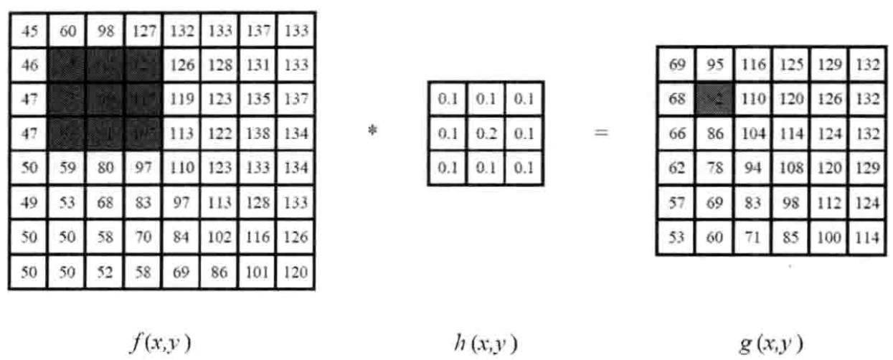
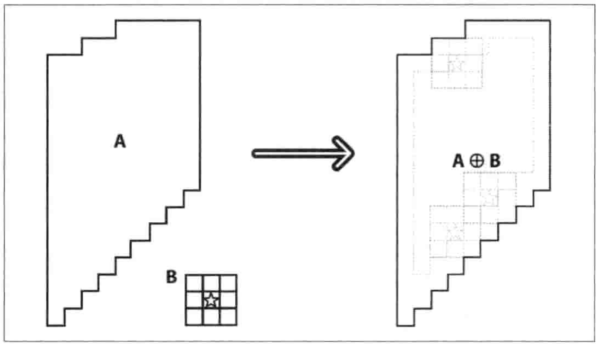
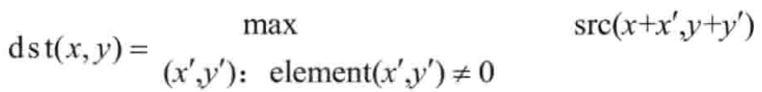
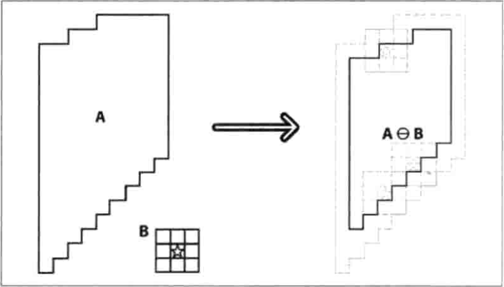
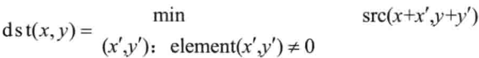
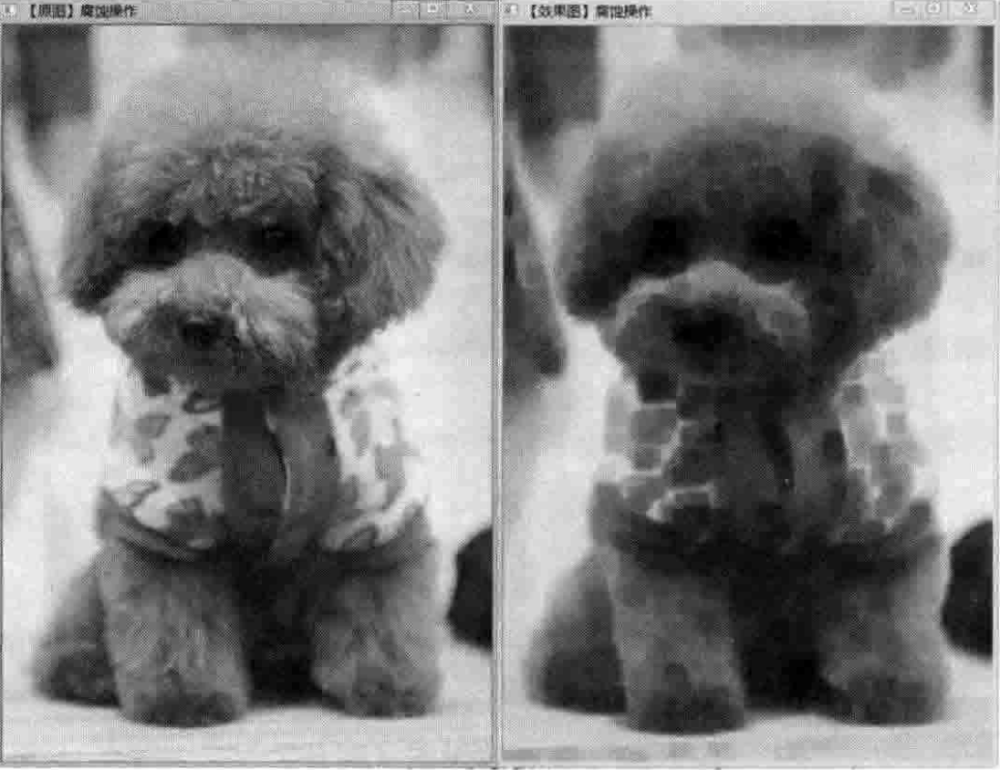
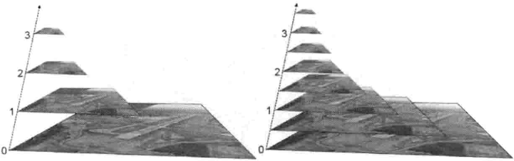

# OpenCV 图像处理

  ## HighGUI：图形用户界面

- 图像载入、显示和输出

    图像输入：

```C++
Mat imread(const string& filename, intflags=1);
```

    图像显示：

```C++
void imshow(const string& winname, InputArray mat);
```
    图像输出：

```C++
bool imwrite(const string& filename, InputArray img, const vector<int>& params=vector<int>());
 ```

- 示例程序： 见教材P70

## 线性滤波

### 图像滤波与滤波器

    - 图像滤波
  
        - 尽量保留图像细节特征的条件下对目标图像的噪声进行抑制
        - 消除图像中的噪声成分叫做图像的平滑化或滤波操作
        - 信号或图像的能量大部分集中在低频和中频段
        - 在高频段，有用的信息经常被噪声淹没
        -  低通是模糊，高通是锐化


    - 目的
        - 尽量抽出对象的特征作为图像识别的特征模式；
        - 消除图像数字化时混入的噪声

    - 要求

        - 不能损坏图像的轮廓及边缘等重要信息；
        - 使得图像清晰视觉效果好。
        - 
     - 线性滤波器
        - 低通滤波器：允许低频率通过
        - 高通滤波器：允许高频率通过
        - 带通滤波器：允许一定范围频率通过
        - 带阻滤波器：阻止一定范围频率通过并允许其他频率通过
        - 全通滤波器：允许所有频率通过，仅改变相位关系
        - 陷波滤波器：阻止一个狭窄频率（单频率）通过


### 平滑处理

    - 平滑处理（smoothing）也称模糊处理（bluring），可以用来减少图像上的噪点或者失真。

    - 平滑处理是低频增强的空间滤波技术，一般采用简单平均法进行，就是求近邻像素点的平均亮度值。

    - 邻域的大小与平滑的效果直接相关。邻域越大，平滑效果越好，但是也会使得边缘信息损失大，使得图像变得模糊。

    - 平滑处理的方法包括：

        -  方框滤波 —— BoxBlur函数
        -  均值滤波（领域平均滤波）—— Blur函数
        -  高斯滤波 —— GaussianBlur函数
        -  中值滤波 —— medianBlur函数
        -  双边滤波 —— bilateralFilter函数


### 邻域算子与线性邻域滤波
  
     领域算子（局部算子）是利用给定像素周围的像素值来决定此像素的最终输出的一种算子，线性邻域滤波是一种常用的邻域算子，像素的输出决定于输入像素的加权和，即卷积运算，如下图：



    线性滤波处理的输出像素值 g(i, j) 是输入像素值 f(i+k, j+I) 的加权和，如下：


其中，h(k, l) 我们称之为“核”，是滤波器的加权系数，及滤波器的“滤波系数”。

上式可以简写为：


- 方框滤波 （boxFilter）

方框滤波被封装在boxblur函数中，即boxblur函数的作用是使用方框滤波器来模糊一张图片。

函数原型如下：
```C++
void boxFilter( InputArray src, OutputArray dst, int ddepth, Size ksize, Point anchor=Point(-1, -1), boolnormalize=true, int borderType=BORDER_DEFAULT );
```

boxFilter()函数方框滤波所用的核表示如下:


- 均值滤波

输出图像的每一个像素是核窗口内输入图像对应像素的平均值（所有像素加权系数相等），即归一化后的方框滤波

**理论简析**

    均值滤波是典型的线性滤波算法，主要方法为邻域平均法。 即：用一片图像区域的各个像素的均值来代替原图像中的各个像素值。

    一般需要在图像上对目标像素给出一个模版（内核），该模版包括了其周围的临近像素（比如以目标像素为中心的周围8（3*3-1）个像素，构成一个滤波模版，即去掉目标像素本身）。

    再用模版中的全体像素的平均值来代替原来像素值。即对待处理的当前像素点（x, y），选择一个模版，该模版由近邻的若干像素组成，求模版中所有像素的均值.
    
    再把该均值赋予当前像素点（x, y），作为处理后图像在改点上的灰度点g(x, y)。

**均值滤波的缺陷**

    均值滤波不能很好地保护图像细节，使图像变得模糊

**OpenCV Blur函数**

    blur函数的作用是：对输入的图像src进行均值滤波后用dst输出。其原型如下：

```C++
void blur( InputArray src, OutputArray dst, int ddepth, Size ksize, Point anchor=Point(-1, -1), boolnormalize=true, int borderType=BORDER_DEFAULT );
```

- 高斯滤波
  
  高斯滤波是一种线性平滑滤波，用一个模板（或卷积、掩模）扫描图像中的每一个像素，用模板确定的邻域内像素的加权平均灰度值去代替模板中心像素点的值。

  高斯模糊技术生成的图像，视觉效果就像是经过一个半透明屏幕在观察图像，一般用在预处理阶段，以增强图像在不同比例大小下的图像效果。

  从数学角度看，图像的高斯模糊过程就是图像与正态分布做卷积。

  图像与圆形方框模糊做卷积会生成更加精确的焦外成像效果，由于高斯函数的傅立叶变换是另一个高斯函数，高斯模糊对图像来说就是一个低通滤波器。

  - 高斯滤波： GaussianBlur函数
  - 
```C++
void GaussianBlur(InputArray src, OutputArray dst, Size ksize, double sigmaX, double sigmaY=0, intborderType=BORDER_DEFAULT);
```

- 图像线性滤波综合示例：教材P170页


## 非线性滤波：中值滤波

中值滤波（median filter）是一种典型的非线性滤波技术，基本思想是用像素领域灰度值的中值来代替该像素点的灰度值，该方法在去除脉冲噪声、椒盐噪声的同时又能保留图像的边缘细节。

中值滤波是基于排序统计理论的一种能有效抑制噪声的一种非线性信号处理技术，其基本原理是把数字图像中一点的值用该点的一个领域中各点值的中值来代替，让周围的像素值接近真实值，从而消除孤立噪声点。这对于斑点噪声（speckle noise）和椒盐噪声（salt-and-pepper noise）来说尤其有用。

例如：取3*3的函数窗，计算以点[i, j]为中心的函数窗像素中值，具体算法步骤：

    （1）按强度值大小排列像素点；
    （2）选择排序像素集的中间值作为点[i, j]的新值。

- 图像滤波综合示例：见教材P181

## 形态学滤波（1）：腐蚀和膨胀

- 数学形态学

形态学（morphology）一词通常表示生物学的一个分支，研究动植物的形态和结构，图像处理中，主要指数学形态学。

数学形态学（mathematical morphology）：是一门建立在格论和拓扑学基础上的图像分析学科。主要包括：二值腐蚀和膨胀、二值开闭运算、骨架抽取、极限腐蚀、击中击不中变换、Top-hat变换、颗粒分析、流域变换、灰值腐蚀和膨胀、灰值开闭运算、灰值形态学梯度等。

简单讲，形态学操作就是基于形状的一系列图像处理操作。OpenCV为进行图像的形态学变换提供了快捷、方便的函数。最基本的形态学操作有两种：膨胀（dilate）与腐蚀（erode）。

- 膨胀与腐蚀的功能

    -  消除噪声
    - 分割（isolate）出独立的图像元素，在图像中连接（join）相邻的元素
    - 寻找图像中的明显的极大值区域或极小值区域
    -求出图像的梯度

- 膨胀

膨胀是求局部最大值的操作。从数学角度说，膨胀或者腐蚀操作是将图像与核进行卷积运算。

核可以时任意形状和大小，它拥有一个单独定义出来的参考点，成为锚点（anchor point）。多数情况下，核是一个中间带有参考点和实心正方形或圆盘。也把核视为模板或者掩码。



膨胀的数学表达式如下：



膨胀的效果图：


膨胀的dilate()函数原型：

```C++
void dilate( InputArray src, OutputArray dst, InputArray kernel, Point anchor=Point(-1, -1), int iterations=1, int borderType=BORDER_CONSTANT, const Scalar& borderValue=morphologyDefaultBorderValue() );
```

- 腐蚀

膨胀和腐蚀是一对相反的操作，腐蚀就是求局部最小值的操作。
其原理如下：



其数学表达式如下：



腐蚀的效果图：



```C++
void erode( InputArray src, OutputArray dst, InputArray kernel, Point anchor=Point(-1, -1), int iterations=1, int borderType=BORDER_CONSTANT, const Scalar& borderValue=morphologyDefaultBorderValue() );
```


- getStructuringElement函数

    kernel参数，一般采用getStructuringElement函数来返回指定形状与尺寸的结构元素（内核矩阵）。返回的第一个参数表示内核的形状，有三种形状可以选择：矩形MORPH_RECT、交叉形MORPH_CROSS和椭圆形MORPH_ELLIPSE。返回的第二和第三个参数分别是内核的尺寸与锚点的位置。锚点的位置，默认值为Point(-1, -1)，表示锚点位于中心。

getStructuringElement函数调用示例如下：
```C++
int g_nStructElementSize = 3; //结构元素的尺寸

// 获取自定义核
Mat  element = getStructuringElement ( MORPH_RECT, Size(2*g_nStructElementSize+1, 2*g_nStructElementSize+1), Point(2*g_nStructElementSize+1, 2*g_nStructElementSize+1))

```

- 腐蚀与膨胀综合示例：见教材P195

## 形态学滤波（2）：开运算、闭运算、形态学梯度、顶帽、黑帽

- morphologyEx函数
  
    采用基本的膨胀与腐蚀技术，来执行更高级的形态学变换，如开闭运算、形态学梯度、顶帽、黑帽等。

- 开运算（opening operation）

    即先腐蚀后膨胀的过程。开运算可以用来消除小物体，在纤细点处分离物体，并且在平滑较大物体的边界的同时不明显改变其面积。

- 闭运算 （closing operation）

    即先膨胀后腐蚀的过程。闭运算能够排除小型黑洞（黑色区域）。

- 形态学梯度 （morphological gradient）

    求膨胀图与腐蚀图之差。可以将团块（blob）的边缘突出出来，用来保留物体的边缘轮廓。

- 形态学滤波综合示例：见教材P208

## 漫水填充（floodfill）

漫水填充是用特定颜色填充连通区域，通过设置可连通像素的上下限以及连通方式来表达不同的填充效果的方法。

漫水填充经常用来标记或分离图像的一部分，也可以用来从收入图像获取掩码。

- 基本思想
    自动选中了和种子点相连的区域，接着将该区域替换成指定的颜色。基本过程是查找和种子点连通的颜色相近的点，把和初始种子像素颜色相近的点压进栈作为新种子。

- floodFil函数
  
  版本一：

```C++
int floodFill( InputOutputArray image, Point seedPoint, Scalar newVal, Rect* rect=0, Scalar loDiff=Scalar(), Scalar upDiff=Scalar(), int flags=4 );
```
 版本二：

```C++
int floodFill( InputOutputArray image, InputOutputArray mask, Point seedPoint, Scalar newVal, Rect* rect=0, Scalar loDiff=Scalar(), Scalar upDiff=Scalar(), int flags=4 );
```

- 漫水填充综合示例：见教材P216


## 阈值化

阈值可以被视为最简单的图像分割方法。

- 固定阈值操作：Threshold()函数
  
- 自适应阈值操作：adaptiveThreshold()函数

- 阈值操作示例：见教材P240

## 图像金字塔

本节学习使用OpenCV函数pyrUp()和pyrDown()对图像进行向上和向下采样，以及了解用于缩放图像尺寸的resize()函数的用法。

pyrUp()和pyrDown()在imgproc模块中的Image Filtering子模块里，resize()在imgproc的Geomotric Image Transformations子模块里。

- 关于图像金字塔

图像金字塔是图像中多尺度表达的一种，主要用于图像的分割，是一种以多分辨率来解释图像的有效且概念简单的结构。

图像金字塔最初用于机器视觉和图像压缩，金字塔底部是待处理图像的高分辨率表示，顶部是低分辨率近似。



一般有两种类型的图像金字塔：

（1）高斯金字塔（Gaussian pyramid）：用于向下采样，主要的图像金字塔。

（2）拉普拉斯金字塔（Laplacian pyramid）：用来从金字塔狄低层图像重建上层未采样图像，在数字图像处理中也即是预测残差，可以对图像进行最大程度的还原，配合高斯金字塔一起使用。

- 向上采样：pyrUp()函数

```C++
void pyrUp( InputArray src, OutputArray dst, const Size& dstsize=Size(), int borderType=BORDER_DEFAULT );
```

- 向下采样：pyrDown()函数

```C++
void pyrDown( InputArray src, OutputArray dst, const Size& dstsize=Size(), int borderType=BORDER_DEFAULT );
```

- 尺寸调整：resize()函数

```C++
void resize( InputArray src, OutputArray dst, Size dsize, double fx=0, double fy=0, int interpolation=INTER_LINEAR );
```

- 图像金字塔与图片尺寸缩放综合示例：见教材P234

