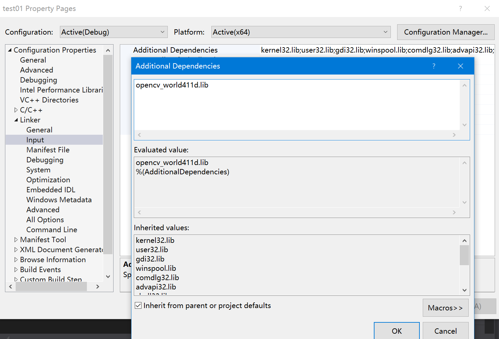

# VS2019与OpenCV4.11的详细配置

## 1、安装vs2019 Community

[下载地址](https://visualstudio.microsoft.com/)


安装后打开，启动界面如下：


## 2、安装OpenCV 4.1.1版本

从[OpenCV官网](https://www.opencv.org)下载，并安装到某个给定目录下（路径无中文），如下


## 3、配置OpenCV环境变量

在我的电脑上右键“属性”，点击“高级系统环境”


在用户变量中，点击Path变量并编辑，添加dll所在路径


确定后，并重启以使得环境变量生效。


# 4、在vs 2019中新建项目

选择路径“File->New->Project”：


依次选择Language为C++，Platform为Windows，Project type为desktop,


选择Windows Desktop Wizard，并选择Next,


点击Create,并下弹出的对话框中选择，Application type 为Console, 选择Empty Project,


点击OK，在Source files里面右键，添加New item:


添加test01.cpp源文件。

右键test01这个Project,选择Properties:


选择VC++ Directories，在Include Directories中，


添加C:\Programs\OpenCV\opencv411\build\include和C:\Programs\OpenCV\opencv411\build\include\opencv2这两个目录：


在Library Directories中添加C:\Programs\OpenCV\opencv411\build\x64\vc15\lib：


在Linker->Input目录下，点击Additional Dependencies并添加opencv_world411d.lib静态库：



点击OK并确定退出。

## 5、测试OpenCV代码

在test01.cpp中添加以下代码：

```C++
#include <iostream>
#include <opencv2/opencv.hpp>

using namespace cv;

int main()
{
	Mat img = imread("D:\\Works\\Data\\Bear\\001.jpg");

	imshow("test01", img);

	waitKey(0);
}
```
并编译执行,得到：


- 结果分析
程序运行正常

## 总结

- 环境变量：用户变量需重启
- VS 2019与OpenCV配置：头文件、静态库和动态库
- 测试：x64默认
- 问题：怎么克服