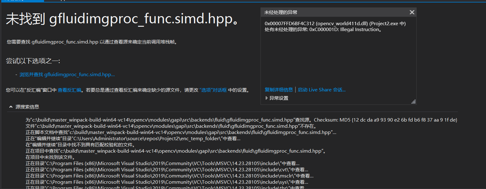
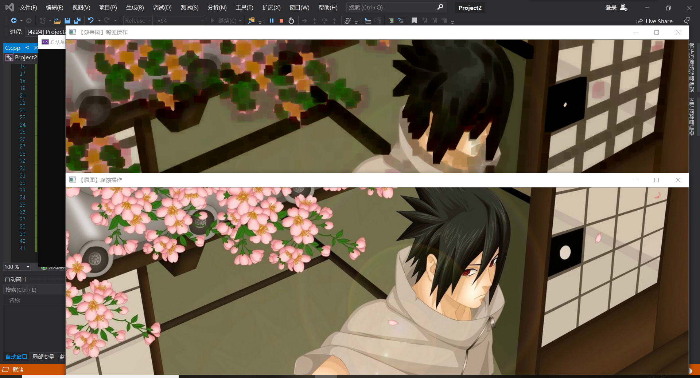
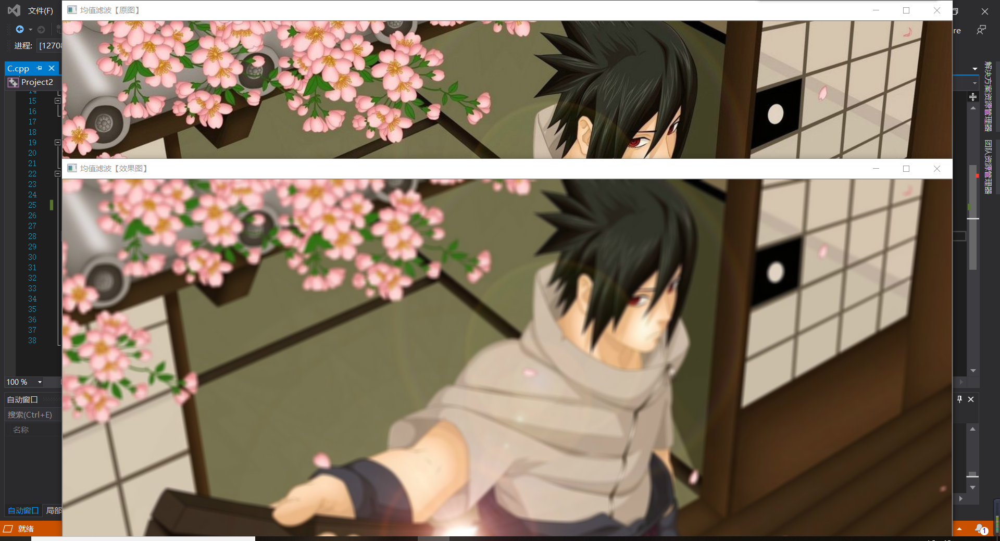
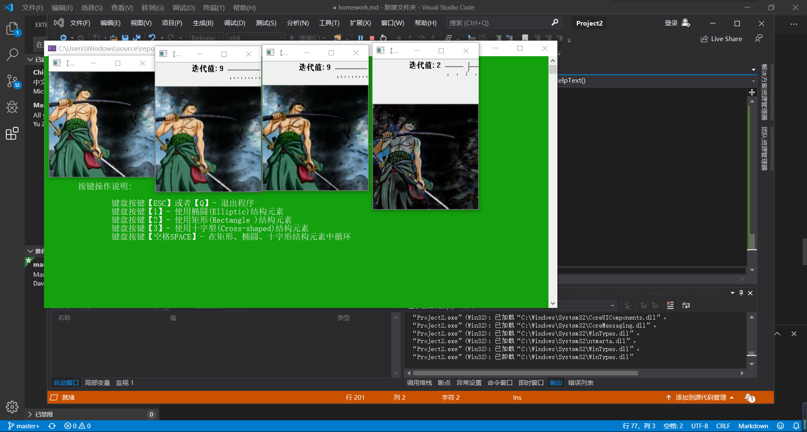

# 前三次作业
## 第一次作业  
&emsp;第一次课主要配置了Visual Studio下的Opencv环境，分为以下几个步骤:
>1. 下载VS到电脑上
>2. 下载opencv
>3. 在用户变量及系统变量中添加D:\opencv\opencv\build\x64\vc15\bin
>>
>4. 新建VS项目并添加源文件
>5. 在项目属性中加入opencv的相关路径
>>
>>
>6. 运行测试程序

运行测试程序得到如下结果：  
>
&emsp;心得体会：在配置Visual Studio下的Opencv环境时，我遇到了这样的问题:
>

后来经过搜索，发现将以下三个文件从D:\opencv\opencv\build\x64\vc15\bin中加到C:\Windows\System32中，并将Debug模式改为release模式可以成功运行测试程序
bug的原因仍待深入研究。

## 第二次作业
&emsp;第一次课由于迟迟找不到bug的原因，于是配置了qt下的opencv环境，在qt中实现了图像显示，图像腐蚀，图像模糊与图像的边缘检测，由于系统后来进行了重装，仅保留了一张截图。

&emsp;后来将系统重装后并重新调试了环境，在VS中运行代码得到了以下结果：
>1. 图像腐蚀
>2. 图像模糊
>3. 边缘检测

代码总结：
1. 图像腐蚀：getStructuringElement()函数实现腐蚀效果，主要通过图像中的暗色部分腐蚀图像中的高亮部分，达到图像腐蚀的效果,这个函数的第一个参数表示内核的形状，有三种形状可以选择。
>1. 矩形：MORPH_RECT;
>2. 交叉形：MORPH_CROSS;
>3. 椭圆形：MORPH_ELLIPSE;

第二和第三个参数分别是内核的尺寸以及锚点的位置。一般在调用erode以及dilate函数之前，先定义一个Mat类型的变量来获得getStructuringElement函数的返回值。对于锚点的位置，有默认值Point（-1,-1），表示锚点位于中心点。element形状唯一依赖锚点位置，其他情况下，锚点只是影响了形态学运算结果的偏移。

2. 图像模糊：  
  通过调用blur( srcImage, dstImage, Size(7, 7))函数，通过均值滤波对图像进行降噪处理,均值滤波是指使用模板核算子覆盖区域内所有像素的加权平均，它用一个点邻域内像素的平均灰度值来代替这个点的灰度，常见的核算子有3x3，此时模板区域内的元素有9个，均值滤波就是也就是指当前中心像素点的值用1/9(a1+a2+...+a9)来代替。

均值滤波处理比较简单，因此计算速度比较快，但是均值滤波本身存在着固有的缺陷（振铃效应明显），因此不能很好地保护图像的细节，在图像去噪的同时也破坏了图像的细节部分，从而使得图像变得模糊，导致不能很好地去除噪声点。

OpenCV中使用blur()函数来实现均值滤波，也称为归一化滤波器，函数的声明如下：
>void blur( InputArray src, OutputArray dst, Size ksize, Point anchor=Point(-1,-1), int borderType=BORDER_DEFAULT );
3. 边缘检测：  
 通过cvtColor(srcImage, grayImage, COLOR_BGR2GRAY)函数先将图像灰度化，再调用blur( grayImage, edge, Size(3,3) )降噪，最后通过Canny算子实现边缘检测。
 >InputArray src: 输入图像即要进行颜色空间变换的原图像，可以是Mat类

 >OutputArray dst: 输出图像即进行颜色空间变换后存储图像，也可以Mat类

>int code: 转换的代码或标识，即在此确定将什么制式的图片转换成什么制式的图片

>int dstCn = 0: 目标图像通道数，如果取值为0，则由src和code决定

函数的作用是将一个图像从一个颜色空间转换到另一个颜色空间，但是从RGB向其他类型转换时，必须明确指出图像的颜色通道，前面我们也提到过，在opencv中，其默认的颜色制式排列是BGR而非RGB。所以对于24位颜色图像来说，前8-bit是蓝色，中间8-bit是绿色，最后8-bit是红色。常见的R,G,B通道的取值范围为：
>0-255 :CV_8U类型图片

>0-65535: CV_16U类型图片

>0-1: CV_32F类型图片

对于线性变换来说，这些取值范围是无关紧要的。但是对于非线性转换，输入的RGB图像必须归一化到其对应的取值范围来或得最终正确的转换结果，例如从RGB->L*u*v转换。

心得体会：通过本次课程，我初步了解了opencv,配置完成opencv后，成功完成了四个简单的图像处理程序，了解了一些函数的具体应用方法，知道了函数背后的意义，对接下来的学习有很大的作用。

## 第三次作业
&emsp;这次课老师讲解了vs code的使用方法，并在vs code中安装了markdown插件，演示了markdown的操作方法，并指导我们在github上完成了注册，clone了老师的文件到本地电脑上，了解了上传文件的方法，随后又学习了图像处理方面的有关知识，从滤波，漫水填充，膨胀腐蚀，开闭梯度，图像金字塔与缩放，阈值化等方面进行了深入讲解，具体代码的调试与运行结果如下：
>1.滤波综合 

>2.膨胀腐蚀 

>3.漫水填充 

>4.图像金字塔与缩放 

>5.开闭梯度 

代码总结：
1. 空域滤波是一种邻域处理方法，通过直接在图像空间中对邻域内像素进行处理，达到平滑或锐化图像的作用。此外，在图像识别中，通过滤波还可以抽出图像的特征作为图像识别的特征模式。

空域滤波是图像处理领域中广泛使用的主要工具。空域滤波主要可以分为线性滤波和非线性滤波，其中，线性滤波和频域滤波存在一一对应的关系。但是，空域滤波可以用于非线性滤波，但是频域滤波不能用于非线性滤波。

从根源上讲，滤波这一词语来自于频域，信号处理中频域滤波指的是允许或者限制一定的频率成分通过。但空域滤波直接在图像空间中增强图像的某些特征或者减弱图像的某些特征。

空域滤波的作用域是像素及其邻域，通常使用空域模板对邻域内的像素进行处理从而产生该像素的输出值。

线性空域滤波指的是像素的输出值是计算该像素邻域内像素值的线性组合，系数矩阵在这里我们称之为模板。由信号处理的原理可以得出，线性滤波可以用卷积来实现。因此，在数字图像处理中，线性滤波通常是利用滤波模板与图像的空域进行卷积来实现的，在线性滤波中滤波模板也称为卷积模板。

根据空域卷积的定义可以知道，卷积首先需要将模板进行反褶，也就是将模板绕模板中心旋转180°，但是在数字图像处理中，卷积模板通常是关于原点对称的，因此通常不需要考虑反褶过程。模板卷积的主要步骤包括如下几个步骤，

>将模板在图像中进行遍历，将模板中心和各个像素位置重合；

>将模板的各个系数与模板对应像素值进行相乘；

>将所有的乘积相加，并将求和结果赋值于模板中心对应的像素;

2. 图像的膨胀与腐蚀其实也是一种类似的卷积操作。其卷积操作非常简单，对于图像的每个像素，取其一定的邻域，计算最大值/最小值作为新图像对应像素位置的像素值。其中，取最大值就是膨胀，取最小值就是腐蚀。

3. 漫水填充的基本思想是自动选中了和种子点相连的区域，接着将该区域替换成指定的颜色，经常用来标记或者分离图像的一部分进行处理或分析。漫水填充也可以用来从输入图像获取掩码区域，掩码会加速处理过程，或者只处理掩码指定的像素点。其中掩膜Mask用于进一步控制那些区域将被填充颜色。

4. resize( )为OpenCV中专职调整图像大小的函数，此函数将源图像精确地转换为指定尺寸的目标图像。如果源图像中设置了ROI（Region Of Interest ，感兴趣区域），那么resize( )函数会对源图像的ROI区域进行调整图像尺寸的操作，来输出到目标图像中。若目标图像中已经设置ROI区域，不难理解resize( )将会对源图像进行尺寸调整并填充到目标图像的ROI中。

5. 调用void morphologyEx(InputArray src, OutputArray dst, int op, InputArray kernel, ...)，其中：

第一个参数 输入

第二个参数 输出

第三个参数 操作类型

MORTH_OPEN                函数做开运算

MORTH_CLOSE              函数做闭运算

MORTH_GRADIENT       函数做形态学梯度运算

MORTH_TOPHAT            函数做顶帽运算

MORTH_BLACKHAT       函数做黑帽运算

MORTH_DILATE              函数做膨胀运算

MORTH_ERODE             函数做腐蚀运算

心得体会：本节课进一步学习了opncv的相关知识，学习了利用opencv进行图像处理的方法，通过几个图像处理的相关例子，加深了对opencv的理解，几次课的学习可能效率不是很高，对于opencv的进一步理解我还是处于探索阶段，需要接下来的课程进行深度学习。